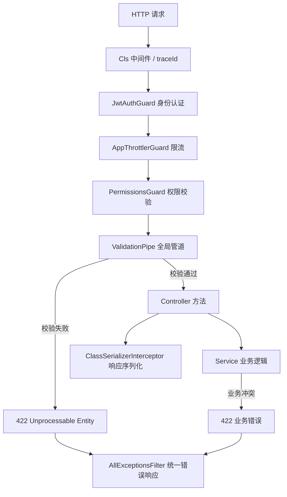

# DTO 与管道验证

本文梳理 `apps/back` 中 **请求入参校验** 的完整逻辑：从 HTTP 请求进入 NestJS，到 Controller 拿到「已校验、已转换」的 DTO 实例，中间经历了哪些环节、用了哪些工具、错误如何返回。

---

## 1. 先建立直觉：DTO 和管道各自做什么？

可以把一次 API 请求想象成「快递入库」：

| 概念                            | 类比                | 在本项目中的作用                                                   |
| ------------------------------- | ------------------- | ------------------------------------------------------------------ |
| **原始请求体 / 查询参数**       | 快递箱里杂乱的物品  | `@Body()`、`@Query()` 拿到的仍是普通 JS 对象，字段类型可能是字符串 |
| **DTO（Data Transfer Object）** | 入库清单 + 验收标准 | 用 TypeScript 类描述「允许接收哪些字段、各自规则是什么」           |
| **ValidationPipe（验证管道）**  | 入库质检员          | 在请求进入 Controller **之前**，按 DTO 规则做校验与转换            |
| **class-validator**             | 质检规则手册        | 提供 `@IsEmail()`、`@MaxLength()` 等装饰器                         |
| **class-transformer**           | 预处理台            | 把 plain object 转成 DTO 实例，并做类型转换（如 `"1"` → `1`）      |

**核心原则：格式校验尽量放在 DTO + 管道；业务规则（如「邮箱是否已注册」）放在 Service。**

---

## 2. 请求处理链路（全局视角）

一次带 DTO 的请求，在本项目中的大致顺序如下：



与 DTO 验证直接相关的只有 **ValidationPipe** 这一步；它注册在 `main.ts`，对所有 Controller 全局生效：

```21:22:apps/back/src/main.ts
  // dto入参校验
  app.useGlobalPipes(new ValidationPipe(validationOptions));
```

Controller 侧用法非常简洁——只需声明 DTO 类型，NestJS 会自动注入已校验实例：

```19:34:apps/back/src/user/user.controller.ts
  @Post()
  @Permissions(PERMISSIONS.USER_CREATE)
  create(@Body() createUserDto: CreateUserDto) {
    return this.userService.create(createUserDto);
  }

  @Get('page')
  @Permissions(PERMISSIONS.USER_READ)
  findPage(@Query() query: QueryPageDto) {
    return this.userService.searchPage(query);
  }
```

---

## 3. 技术栈分工

本项目依赖：

- **`class-validator`**：声明「这个字段必须满足什么规则」
- **`class-transformer`**：声明「原始值如何转换成目标类型」
- **`@nestjs/swagger` 的 mapped types**：在 DTO 之间复用字段定义（`PartialType`、`PickType` 等）

三者配合关系：

```
原始 JSON / Query
    ↓  class-transformer（@Type、@Transform）
DTO 类实例（字段已转型）
    ↓  class-validator（@IsXxx、@MaxLength…）
校验通过 → 进入 Controller
校验失败 → 422 + errors
```

---

## 4. 全局验证配置：`validation-options.ts`

项目把 ValidationPipe 的选项集中维护在 `apps/back/src/utils/validate/validation-options.ts`，避免散落在各处。

### 4.1 四个关键开关

| 选项                   | 值     | 含义                                                                   |
| ---------------------- | ------ | ---------------------------------------------------------------------- |
| `whitelist`            | `true` | 只保留 DTO 类上**显式声明**的字段，其余字段静默丢弃                    |
| `forbidNonWhitelisted` | `true` | 若请求携带 DTO 未声明的字段，**直接报错**（比静默丢弃更严格）          |
| `transform`            | `true` | 自动将 plain object 转为 DTO 类实例，并执行 `@Type()` / `@Transform()` |
| `errorHttpStatusCode`  | `422`  | 校验失败返回 HTTP 422（语义：格式正确但语义无法处理）                  |

组合效果：

- **安全**：客户端不能通过多余字段「夹带私货」（如伪造 `isAdmin: true`）。
- **类型可靠**：Controller 里拿到的 `page` 是 `number`，而不是 query 里原始的字符串 `"1"`。

### 4.2 统一错误结构

校验失败时，通过 `exceptionFactory` 构造 `UnprocessableEntityException`，并按 **字段名 → 错误信息数组** 组织：

```typescript
// 校验失败时的响应体（经 AllExceptionsFilter 包装后）
{
  "statusCode": 422,
  "message": "Unprocessable Entity Exception",
  "errors": {
    "email": ["email must be an email"],
    "password": ["password is not strong enough"]
  },
  "traceId": "...",
  "timestamp": "...",
  "path": "/user"
}
```

`generateErrors` 会递归处理嵌套对象（如数组元素、嵌套 DTO），保证复杂结构也有对应字段路径。

> **注意**：管道校验错误与 Service 层业务错误使用相同的 HTTP 状态码（422），但 `errors` 的结构一致——都是 `{ 字段: 错误信息 }`，便于前端统一处理。

---

## 5. 项目中 DTO 的组织方式

所有 DTO 按业务模块放在 `apps/back/src/<模块>/dto/` 下，命名体现用途：

| 命名模式                           | 典型用途                 | 示例                                |
| ---------------------------------- | ------------------------ | ----------------------------------- |
| `CreateXxxDto`                     | POST 创建                | `CreateUserDto`、`CreateRoleDto`    |
| `UpdateXxxDto`                     | PATCH 部分更新           | `UpdateUserDto`（基于 Create 派生） |
| `QueryXxxPageDto` / `QueryPageDto` | GET 分页查询             | `QueryAuditPageDto`                 |
| `QueryXxxListDto`                  | GET 列表 / 筛选          | `QueryUserListDto`                  |
| `DeleteXxxDto`                     | DELETE 批量删除          | `DeleteUserDto`                     |
| 共用字段基类                       | 多接口复用同一套字段规则 | `UserRegistrationFieldsDto`         |

### 5.1 用 Swagger 工具类型复用 DTO

项目大量使用 `@nestjs/swagger` 提供的类型组合，**同时继承校验装饰器**（比手写重复字段更易维护）：

**① `IntersectionType` — 合并多个 DTO**

```typescript
// create-user.dto.ts：注册字段 + 角色 ID 列表
export class CreateUserDto extends IntersectionType(
  UserRegistrationFieldsDto,
  CreateUserRoleIdsDto,
) {}
```

**② `PartialType` — 全部字段变可选（用于 PATCH）**

```typescript
// update-user.dto.ts
export class UpdateUserDto extends PartialType(CreateUserDto) {}
```

**③ `PickType` — 只取部分字段**

```typescript
// email-password-login.dto.ts：登录只需 email + password
export class EmailPasswordLoginDto extends PickType(UserRegistrationFieldsDto, [
  'email',
  'password',
] as const) {}
```

**④ `OmitType` — 排除部分字段**

```typescript
// 注册接口：排除某些管理端字段（当前为空数组，等价于完整复用）
export class EmailPasswordRegisterDto extends OmitType(UserRegistrationFieldsDto, [] as const) {}
```

---

## 6. 常见校验模式（附项目实例）

### 6.1 必填 / 可选

```typescript
@IsNotEmpty()
@IsEmail()
email: string;

@IsOptional()
@IsString()
@MaxLength(64)
nickname?: string;
```

- `@IsOptional()`：字段缺失或为 `null` / `undefined` 时，跳过后续校验。
- 无 `@IsOptional()` 且类型非 optional → 视为必填。

### 6.2 字符串格式与长度

| 装饰器                | 用途     | 项目示例                        |
| --------------------- | -------- | ------------------------------- |
| `@IsEmail()`          | 邮箱格式 | 用户注册、登录                  |
| `@IsUrl()`            | URL 格式 | 头像地址                        |
| `@MaxLength(n)`       | 最大长度 | 昵称 64、描述 255               |
| `@Matches(regex)`     | 正则     | 手机号 `^1[3-9]\d{9}$`          |
| `@IsStrongPassword()` | 密码强度 | 至少 8 位，含大小写、数字、符号 |

### 6.3 数值与分页

Query 参数在 HTTP 中默认是字符串，必须配合 `@Type(() => Number)`：

```typescript
@IsOptional()
@Type(() => Number)
@IsInt()
@Min(1)
page?: number = 1;

@IsOptional()
@Type(() => Number)
@IsInt()
@Min(1)
@Max(100)
pageSize?: number = 10;
```

各模块对 `pageSize` 上限略有不同（如审计最大 100，用户分页最大 10000），在各自 DTO 中独立声明。

### 6.4 数组与 UUID

```typescript
@IsArray()
@ArrayMinSize(1)
@IsUUID('all', { each: true })
ids: string[];

@IsOptional()
@IsArray()
@IsUUID('4', { each: true })
menuIds?: string[];
```

- `{ each: true }`：对数组**每个元素**应用校验。
- `'4'` / `'all'`：UUID 版本约束。

### 6.5 枚举

```typescript
@IsEnum(MenuType)
@IsNotEmpty()
type: MenuType;
```

### 6.6 日期字符串

```typescript
@IsOptional()
@IsDateString()
startTime?: string;
```

接受 ISO 8601 格式（如 `2026-07-02T00:00:00.000Z`）。

---

## 7. 类型转换：`@Type` 与 `@Transform`

### 7.1 `@Type(() => Number)` — 基础类型转换

用于 query / body 中的数字、嵌套对象。ValidationPipe 的 `transform: true` 是前提。

### 7.2 `@Transform` — 自定义转换逻辑

**① 统一小写（邮箱）**

项目封装了 `lowerCaseTransformer`，避免同一邮箱因大小写重复注册：

```typescript
@Transform(lowerCaseTransformer)
@IsNotEmpty()
@IsEmail()
email: string;
```

**② Query 中的布尔值**

URL 里布尔只能是字符串 `"true"` / `"false"`，需要手动转换：

```typescript
@Transform(({ value }) => {
  if (value === 'true') return true;
  if (value === 'false') return false;
  return value;
})
@IsBoolean()
isSystem?: boolean;
```

**③ 业务语义归一化（菜单 parentId）**

前端可能传 `0`、`'0'`、`null`、`''` 表示顶层节点，在 DTO 层统一成 `null`：

```typescript
@Transform(normalizeParentId)
@IsUUID('4')
@IsOptional()
parentId?: string | null;
```

---

## 8. 条件校验：`@ValidateIf`

当字段是否必填取决于其他字段时，使用 `@ValidateIf`：

```typescript
// path：DIRECTORY / MENU 类型需要，BUTTON 不需要
@ValidateIf((o) => o.type !== MenuType.BUTTON)
@IsString()
@IsOptional()
path?: string;

// code：仅 BUTTON 类型必填
@ValidateIf((o) => o.type === MenuType.BUTTON)
@IsNotEmpty({ message: 'BUTTON 类型必须填写权限码 code' })
@IsString()
code: string;
```

这样可以做到「同一 DTO 类，不同菜单类型走不同规则」，而不必拆成多个 DTO。

---

## 9. 错误如何返回给客户端

全局异常过滤器 `AllExceptionsFilter` 捕获所有异常，统一包装响应体：

```typescript
{
  statusCode: number;
  message: string | string[];
  errors?: string;      // 管道 / 业务校验的字段错误会落在这里
  traceId?: string;
  timestamp: string;
  path: string;
}
```

- 4xx（含 422 校验失败）记 **warn** 日志。
- 5xx 记 **error** 日志并带堆栈。
- 所有错误响应携带 `traceId`，便于与日志关联排查。

---

## 10. 与响应序列化的关系（容易混淆）

`main.ts` 中还注册了全局 `ClassSerializerInterceptor`：

```24:26:apps/back/src/main.ts
  // 响应体序列化：
  // 作用： 响应返回客户端前，按 class-transformer 装饰器序列化对象，控制哪些字段能出去。
  app.useGlobalInterceptors(new ClassSerializerInterceptor(app.get(Reflector)));
```

| 机制                       | 方向     | 作用                                                              |
| -------------------------- | -------- | ----------------------------------------------------------------- |
| ValidationPipe + DTO       | **入参** | 校验并清洗客户端传来的数据                                        |
| ClassSerializerInterceptor | **出参** | 控制返回给客户端的字段（如 Entity 上 `@Exclude()` 隐藏 password） |

两者都使用 `class-transformer`，但处理的是请求链路的不同阶段，不要混为一谈。

---

## 11. 排除属性

假设我们想自动排除用户实体中的密码属性。我们按如下方式注解该实体：

```js

import { Exclude } from 'class-transformer';

export class UserEntity {
  id: number;
  firstName: string;
  lastName: string;

  @Exclude()
  password: string;

  constructor(partial: Partial<UserEntity>) {
    Object.assign(this, partial);
  }
}

```

## 12. 参考文档

1. [NestJS — Validation（验证管道）](https://docs.nestjs.com/techniques/validation)
2. [NestJS — Pipes（管道）](https://docs.nestjs.com/pipes)
3. [class-validator 装饰器列表](https://github.com/typestack/class-validator#validation-decorators)
4. [class-transformer](https://github.com/typestack/class-transformer)
5. [serialization](https://docs.nestjs.com/techniques/serialization)

---
