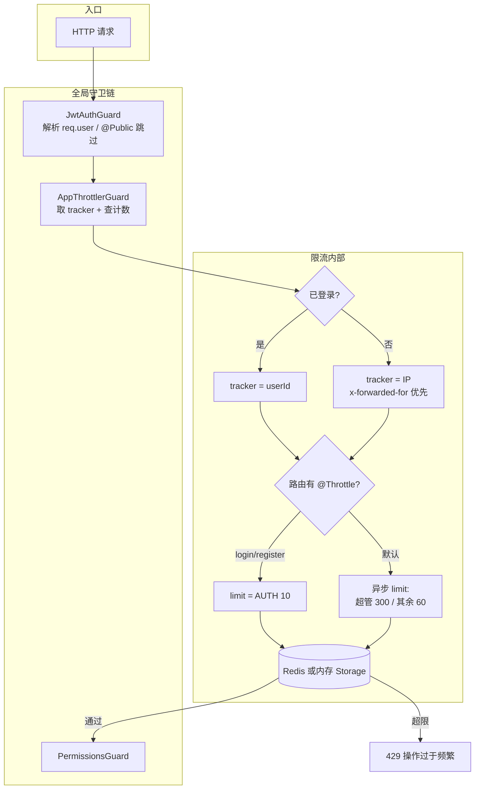

# QPS / 接口限流

本文梳理 `apps/back` 中基于 `@nestjs/throttler` 的**全局限流**实现：计数维度（userId / IP）、分档限额、Redis/内存存储切换，以及登录注册的路由级收紧。读完应能回答：请求在哪被拦、按什么 key 计数、超限返回什么、多实例时如何共享计数。

> 说明：项目里常说「QPS 限流」，实际落地是 **滑动时间窗口内的请求次数上限**（默认 60 秒），不是严格的「每秒查询数」计量。
>
> 延伸阅读：
>
> - [邮箱密码登录](../邮箱（账号）、密码登录注册功能/邮箱密码登录.md#7-全局守卫与请求顺序) — 守卫链与登录/注册 `@Throttle`
> - [权限管理](../权限管理/权限管理.md#8-全局守卫与请求顺序) — 限流之后的 403
> - [统一请求与异常响应](../统一请求与异常响应/doc.md) — 429 与统一错误体
> - [环境变量管理](../环境变量管理/doc.md) — `REDIS_*`、`SUPER_ADMIN_ROLE_NAME`

---

## 1. 整体架构

限流是**横切能力**：不绑定某个业务 Controller，而是通过全局 Guard 对几乎所有 HTTP 请求计数；敏感认证接口再用装饰器单独收紧。

| 层次     | 模块 / 文件                                | 职责                                                          |
| -------- | ------------------------------------------ | ------------------------------------------------------------- |
| 模块装配 | `ThrottleModule`（`@Global`）              | 注册 `ThrottlerModule.forRootAsync`、导出 `AppThrottlerGuard` |
| 全局守卫 | `AppThrottlerGuard`                        | 决定「谁」被计数（tracker）                                   |
| 限额策略 | `throttle.constants.ts` + `limit` 异步函数 | TTL、分档 limit、错误文案                                     |
| 存储     | `createThrottlerStorage`                   | Redis 已启用 → Redis；否则进程内 Map                          |
| 路由覆盖 | `AuthController` 上 `@Throttle`            | login / register 更严的限额                                   |
| 依赖     | `UserService.getRoleNames`、`seeds` 配置   | 判断是否超级管理员                                            |



**设计要点：**

- **先认证、再限流**：`JwtAuthGuard` 排在限流前面，已登录请求才能按 `userId` 计数，避免同一 NAT 下多人互相挤占额度。
- **路由级覆盖全局**：`@Throttle` 优先于 `ThrottlerModule.forRootAsync` 的默认 `throttlers`（源码注释已标明）。
- **超管放宽、认证收紧**：普通用户 60/分钟；`super_admin`（可配置）300/分钟；login/register 固定 10/分钟。
- **存储可降级**：未开 Redis 时用内存存储，单机可用；多实例部署应开 Redis，否则各进程独立计数。

---

## 2. 请求处理链路（全局视角）

`AppModule` 中 `APP_GUARD` **先注册先执行**：

```119:134:apps/back/src/app.module.ts
    // 全局守卫执行顺序（先注册先执行）：
    // 1. JwtAuthGuard → 身份认证（401），@Public() 跳过；限流前解析 req.user
    // 2. AppThrottlerGuard → 限流（已登录按 userId，未登录按 IP）
    // 3. PermissionsGuard → 权限校验（403），@SkipPermissions() / @Public() 跳过
    {
      provide: APP_GUARD,
      useClass: JwtAuthGuard,
    },
    {
      provide: APP_GUARD,
      useClass: AppThrottlerGuard,
    },
    {
      provide: APP_GUARD,
      useClass: PermissionsGuard,
    },
```

| 步骤 | 组件                                  | 失败语义                              |
| ---- | ------------------------------------- | ------------------------------------- |
| 1    | `JwtAuthGuard`                        | 401（`@Public()` 跳过，但仍进入限流） |
| 2    | `AppThrottlerGuard`                   | **429** Too Many Requests             |
| 3    | `PermissionsGuard`                    | 403                                   |
| 之后 | ValidationPipe → Controller → Service | 422 / 业务错误等                      |

`@Public()` 接口（如 login、register、refresh）不走 JWT 校验，但仍会经过限流：此时 `req.user` 通常尚未设置（login 的 `LocalAuthGuard` 在方法级、全局限流之后），因此按 **IP** 计数，正好适合防刷。

---

## 3. 核心机制

### 3.1 常量分档（窗口与上限）

```1:16:apps/back/src/throttle/throttle.constants.ts
/** 限流窗口（毫秒），与 rbac-plan 6.4 一致：按分钟计数 */
export const THROTTLE_TTL_MS = 60000;

/** 未登录敏感接口（login / register） */
export const THROTTLE_LIMIT_AUTH = 10;
// export const THROTTLE_LIMIT_AUTH = 1;

/** 已登录普通用户 */
export const THROTTLE_LIMIT_DEFAULT = 60;
// export const THROTTLE_LIMIT_DEFAULT = 1;

/** 超级管理员角色（支持批量管理操作） */
export const THROTTLE_LIMIT_ADMIN = 300;
// export const THROTTLE_LIMIT_ADMIN = 2;

export const THROTTLE_ERROR_MESSAGE = '操作过于频繁，请稍后再试';
```

| 场景                      | 常量                     | 默认值    | 生效方式                     |
| ------------------------- | ------------------------ | --------- | ---------------------------- |
| 时间窗口                  | `THROTTLE_TTL_MS`        | 60_000 ms | 全局 + 路由 `@Throttle` 共用 |
| 登录 / 注册               | `THROTTLE_LIMIT_AUTH`    | 10        | 仅 `AuthController` 装饰器   |
| 未登录其它接口 / 普通用户 | `THROTTLE_LIMIT_DEFAULT` | 60        | 全局 `limit` 异步函数        |
| 超级管理员                | `THROTTLE_LIMIT_ADMIN`   | 300       | 全局 `limit` 异步函数        |
| 超限文案                  | `THROTTLE_ERROR_MESSAGE` | 见上      | `errorMessage`               |

开发调试时可临时把注释掉的 `= 1` 打开，便于本地验证 429。

### 3.2 Tracker：按谁计数

```5:28:apps/back/src/throttle/app-throttler.guard.ts
export class AppThrottlerGuard extends ThrottlerGuard {
  /**
   * 已登录用户按 userId 计数，避免同一 NAT 下互相影响；
   * 未登录请求按客户端 IP 计数（兼容 x-forwarded-for）。
   */
  protected getTracker(req: Record<string, unknown>): Promise<string> {
    console.log('接口节流验证');

    const user = req.user as { userId?: string } | undefined;
    if (user?.userId) {
      return Promise.resolve(user.userId);
    }

    const forwarded = req.headers?.['x-forwarded-for'];
    if (typeof forwarded === 'string') {
      const ip = forwarded.split(',')[0]?.trim();
      if (ip) return Promise.resolve(ip);
    }

    const socket = req.socket as { remoteAddress?: string } | undefined;
    const ip = (req.ip ?? socket?.remoteAddress ?? 'unknown') as string;
    return Promise.resolve(ip);
  }
}
```

| 对比项   | 已登录                            | 未登录                                                                   |
| -------- | --------------------------------- | ------------------------------------------------------------------------ |
| tracker  | `req.user.userId`                 | `x-forwarded-for` 首段 → `req.ip` → `socket.remoteAddress` → `'unknown'` |
| 目的     | 用户维度限流，NAT 隔离            | 防未登录刷接口                                                           |
| 前置条件 | 全局 `JwtAuthGuard` 已写入 `user` | `@Public` 或无 token                                                     |

网关部署时需正确转发 `x-forwarded-for`，否则多客户端可能落到同一 socket IP。

### 3.3 动态 limit：是否超级管理员

全局默认策略在 `ThrottleModule` 中配置：无 `userId` → `DEFAULT`；有则查角色名，包含 `SUPER_ADMIN_ROLE_NAME`（默认 `super_admin`）→ `ADMIN`，否则 `DEFAULT`。

```34:57:apps/back/src/throttle/throttle.module.ts
        throttlers: [
          // 路由上的 @Throttle > ThrottleModule.forRootAsync 里的全局配置
          {
            ttl: THROTTLE_TTL_MS,
            limit: async (context: ExecutionContext) => {
              const req = context.switchToHttp().getRequest<{ user?: { userId: string } }>();
              const userId = req.user?.userId;
              if (!userId) {
                return THROTTLE_LIMIT_DEFAULT;
              }

              const { SUPER_ADMIN_ROLE_NAME } = configService.getOrThrow(seedsConfigKey, {
                infer: true,
              });
              const roleNames = await userService.getRoleNames(userId);
              if (roleNames.includes(SUPER_ADMIN_ROLE_NAME)) {
                return THROTTLE_LIMIT_ADMIN;
              }
              return THROTTLE_LIMIT_DEFAULT;
            },
          },
        ],
        errorMessage: THROTTLE_ERROR_MESSAGE,
```

角色查询：

```283:290:apps/back/src/user/user.service.ts
  /** 获取用户角色名称列表 */
  async getRoleNames(userId: string): Promise<string[]> {
    const user = await this.userRepository.findOne({
      where: { id: userId },
      relations: { roles: true },
    });
    return (user?.roles ?? []).map((r) => r.name);
  }
```

注意：每次进入限流且已登录时，可能触发一次角色查询（与权限缓存路径不同，此处直接查库）。

### 3.4 存储：Redis 或内存

```13:21:apps/back/src/throttle/throttle-storage.factory.ts
export function createThrottlerStorage(redisService: RedisService): ThrottlerStorage {
  const client = redisService.getClient();
  if (!client || !redisService.isEnabled) {
    return new ThrottlerStorageService();
  }

  // 传入已有 client，不会另建连接，也不会在 destroy 时 disconnect
  return new ThrottlerStorageRedisService(client);
}
```

| 条件                                | 实现                                                          | 适用             |
| ----------------------------------- | ------------------------------------------------------------- | ---------------- |
| `REDIS_ENABLED=true` 且 client 可用 | `@nest-lab/throttler-storage-redis`，复用 `RedisService` 连接 | 多实例共享计数   |
| 未启用 / 无 client                  | `@nestjs/throttler` 内置 `ThrottlerStorageService`（进程内）  | 本地开发、单进程 |

---

## 4. 项目内组织方式

```
apps/back/src/throttle/
├── throttle.module.ts          # 全局模块 + forRootAsync
├── app-throttler.guard.ts      # tracker 定制
├── throttle.constants.ts       # TTL / limit / 文案
└── throttle-storage.factory.ts # Redis / 内存工厂
```

依赖关系：

```mermaid
flowchart LR
  AppModule --> ThrottleModule
  AppModule --> AppThrottlerGuard
  ThrottleModule --> ThrottlerModule
  ThrottleModule --> UserModule
  ThrottleModule --> RedisService
  AuthController -->|@Throttle| 常量AUTH
```

业务侧目前**只有**认证模块显式覆盖限额，其它管理接口走全局默认策略。

---

## 5. 路由级收紧：login / register

```27:47:apps/back/src/auth/auth.controller.ts
  @Post('register')
  @Public()
  // 文档：Swagger UI 不要求 token
  @ApiOperation({ security: [] })
  @Throttle({ default: { limit: THROTTLE_LIMIT_AUTH, ttl: THROTTLE_TTL_MS } })
  register(@Body() registerDto: EmailPasswordRegisterDto) {
    return this.authService.register(registerDto);
  }
  // ...
  @Post('login')
  @Public()
  @ApiOperation({ security: [] })
  @ApiBody({ type: EmailPasswordLoginDto })
  @UseGuards(LocalAuthGuard)
  @Throttle({ default: { limit: THROTTLE_LIMIT_AUTH, ttl: THROTTLE_TTL_MS } })
  login(@Request() request: { user: Omit<User, 'password'> }) {
    return this.authService.login(request.user);
  }
```

| 接口                        | `@Public` | 计数维度                   | limit                                 |
| --------------------------- | --------- | -------------------------- | ------------------------------------- |
| `POST /auth/register`       | 是        | IP                         | 10 / 分钟                             |
| `POST /auth/login`          | 是        | IP                         | 10 / 分钟                             |
| `POST /auth/refresh` 等其它 | 视装饰器  | 有 user 则 userId，否则 IP | 全局 60（超管路由若已登录才可能 300） |

`refresh` **未**加 `@Throttle` AUTH 档，走全局默认。

---

## 6. 超限响应与相邻模块边界

| 对比项     | 限流 (`AppThrottlerGuard`)             | 认证 (`JwtAuthGuard`) | 权限 (`PermissionsGuard`)          |
| ---------- | -------------------------------------- | --------------------- | ---------------------------------- |
| 触发时机   | 守卫链第 2 步                          | 第 1 步               | 第 3 步                            |
| 典型状态码 | **429**                                | 401                   | 403                                |
| 文案来源   | `THROTTLE_ERROR_MESSAGE`               | JWT/Session 相关      | 权限不足                           |
| 是否可跳过 | 项目未使用 `@SkipThrottle`（全站生效） | `@Public()`           | `@SkipPermissions()` / `@Public()` |

429 经 `AllExceptionsFilter` 统一包装为项目错误响应体；细节见 [统一请求与异常响应](../统一请求与异常响应/doc.md)。

与 Redis 权限缓存的边界：

| 能力       | 限流                            | 权限缓存            |
| ---------- | ------------------------------- | ------------------- |
| Redis 用途 | 请求计数存储                    | 用户权限码 / 菜单等 |
| 关闭 Redis | 内存限流仍可用                  | 每次查库            |
| 连接       | 共用 `RedisService.getClient()` | 同上                |

---

## 7. 功能点速查

1. **全局限流开关形态**：注册 `AppThrottlerGuard` 为 `APP_GUARD`，默认全站计数。
2. **窗口**：固定 60 秒（`THROTTLE_TTL_MS`）。
3. **三档额度**：AUTH 10 / DEFAULT 60 / ADMIN 300。
4. **计数 key**：登录用户 `userId`；否则客户端 IP（含代理头）。
5. **超管识别**：`UserService.getRoleNames` + `SUPER_ADMIN_ROLE_NAME`。
6. **认证防刷**：login、register 用 `@Throttle` 覆盖为 AUTH。
7. **存储切换**：`createThrottlerStorage` 按 Redis 启用状态选择实现。
8. **失败语义**：超限 → 429 +「操作过于频繁，请稍后再试」。

---

## 8. 参考文档

1. [NestJS Rate Limiting](https://docs.nestjs.com/security/rate-limiting) — `@Throttle`、`ThrottlerGuard`、Storage
2. [@nestjs/throttler](https://github.com/nestjs/throttler) — 包行为与配置项
3. [@nest-lab/throttler-storage-redis](https://github.com/jmcdo29/nest-lab/tree/main/packages/throttler-storage-redis) — Redis Storage
4. [apps/back/README.md](../../../apps/back/README.md) — 限流额度速查表
5. [权限管理](../权限管理/权限管理.md) — 守卫顺序与 403
6. [邮箱密码登录](../邮箱（账号）、密码登录注册功能/邮箱密码登录.md) — `@Public` 与认证接口
