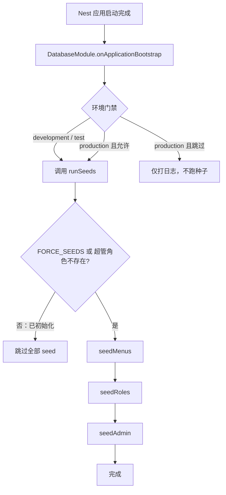

# 种子数据（Seeds）

本文梳理 `apps/back` 中 **应用启动时自动写入的初始化数据**（菜单树、超级管理员角色、系统账号）：从 `DatabaseModule` 何时触发，到 `runSeeds` 的幂等策略与三步执行顺序。

读完本文，你应能回答：

- 开发 / 生产环境分别何时跑种子？失败会不会拖垮启动？
- 为什么顺序必须是「菜单 → 角色 → 账号」？
- `FORCE_SEEDS` 与「已初始化则跳过」如何配合？
- 菜单数据从哪来，和 RBAC 权限码是什么关系？

> 延伸阅读：
>
> - [权限管理](../权限管理/权限管理.md) — `menuList` / `PERMISSIONS`、`super_admin` 守卫豁免
> - [环境变量管理](../环境变量管理/doc.md) — `seeds` 配置域注册与消费方式
> - [密码加密方案总结](../邮箱（账号）、密码登录注册功能/密码加密方案总结.md) — 管理员密码 bcrypt 写入
> - [docs/plan/rbac-plan.md](../../plan/rbac-plan.md) — RBAC 方案设计（含种子演进）

---

## 1. 直觉：种子在做什么

可以把种子理解成「系统开箱时的出厂设置」——不是业务接口，而是 **Nest 应用 bootstrap 完成后** 往 MySQL 写入的最小可用数据，让你立刻能用超级管理员登录，并看到与代码一致的菜单/权限树。

| 层次     | 模块 / 文件                   | 职责                                                   |
| -------- | ----------------------------- | ------------------------------------------------------ |
| 触发入口 | `DatabaseModule`              | `OnApplicationBootstrap` 按环境决定是否调用 `runSeeds` |
| 编排     | `seeds/index.ts` → `runSeeds` | 幂等门禁 + 固定顺序调度三个 seed                       |
| 菜单     | `seeds/menu/index.seed.ts`    | 将 `permission.constants.ts` 的 `menuList` upsert 入库 |
| 角色     | `seeds/role/index.seed.ts`    | 创建/恢复 `SUPER_ADMIN_ROLE_NAME`，绑定全部菜单        |
| 账号     | `seeds/admin/index.seed.ts`   | 创建/恢复超级管理员用户并绑定该角色                    |
| 配置     | `config/seeds`                | 邮箱、密码、角色名、`RUN_SEEDS` / `FORCE_SEEDS`        |



**设计要点：**

- **启动钩子，非 HTTP 链路**：种子不走 Guard / Pipe / Controller；失败只记日志，**不阻断服务启动**。
- **顺序不可打乱**：角色依赖菜单已入库；账号依赖角色已存在。
- **单一数据源**：菜单树来自 `permission.constants.ts` 的 `menuList`，与 `@Permissions()` 使用的 `PERMISSIONS` 同源。
- **幂等优先**：默认「超管角色已存在则整批跳过」；需要补新菜单节点时用 `FORCE_SEEDS` 强制重跑。

---

## 2. 启动触发链路

种子挂在应用生命周期上，在 `AppModule` 中与业务模块一并导入：

```107:107:apps/back/src/app.module.ts
    DatabaseModule,
```

`DatabaseModule` 实现 `OnApplicationBootstrap`，在 TypeORM 等依赖就绪后执行：

```34:55:apps/back/src/seeds/database.module.ts
  async onApplicationBootstrap() {
    const { nodeEnv } = this.configService.getOrThrow(appConfigKey, { infer: true });
    const seedsCfg = this.configService.getOrThrow(seedsConfigKey, { infer: true });
    const authCfg = this.configService.getOrThrow(authConfigKey, { infer: true });

    const shouldRun = nodeEnv !== Environment.Production || seedsCfg.RUN_SEEDS === true;

    if (!shouldRun) {
      this.logger.log('生产环境跳过种子数据（如需执行请设置 RUN_SEEDS=true）');
      return;
    }

    try {
      await runSeeds(this.dataSource, {
        ...seedsCfg,
        BCRYPT_SALT_ROUNDS: authCfg.BCRYPT_SALT_ROUNDS,
      });
    } catch (err) {
      this.logger.error('种子数据执行失败', err);
      // 种子失败不阻断服务启动，仅记录错误
    }
  }
```

| 环境                   | 是否进入 `runSeeds`                       |
| ---------------------- | ----------------------------------------- |
| `development` / `test` | 每次启动都会进入                          |
| `production`           | 仅当 `seedsCfg.RUN_SEEDS === true` 时进入 |

进入 `runSeeds` **不等于**一定会写库——内部还有「已初始化则跳过」门禁（见下一节）。

密码哈希轮次来自 `auth` 配置域的 `BCRYPT_SALT_ROUNDS`，由 `DatabaseModule` 拼进 `SeedsRunConfig` 后传给 `seedAdmin`，seed 函数本身不读 `process.env`。

---

## 3. 配置项（`config/seeds`）

| 配置键                  | 默认值（代码）        | 用途                                                |
| ----------------------- | --------------------- | --------------------------------------------------- |
| `SUPER_ADMIN_EMAIL`     | `Super_admin1@qq.com` | 系统账号登录标识（写入 `users.email`）              |
| `SUPER_ADMIN_PASSWORD`  | 同邮箱默认值          | 明文密码，首次创建时 bcrypt 后入库                  |
| `SUPER_ADMIN_ROLE_NAME` | `super_admin`         | 内置角色名；与 `PermissionsGuard` 豁免名一致        |
| `RUN_SEEDS`             | `true`                | 生产环境是否允许进入 `runSeeds`                     |
| `FORCE_SEEDS`           | `false`               | 为 `true` 时跳过「已初始化」检测，强制执行三步 seed |

类型定义见 `SeedsConfigType`：

```1:15:apps/back/src/config/seeds/config.type.ts
// 种子数据配置类型
export type SeedsConfigType = {
  /** 超级管理员登录标识（存于 users.email 字段） */
  SUPER_ADMIN_EMAIL: string;

  /** 超级管理员登录密码（明文，写入前会 bcrypt 加密） */
  SUPER_ADMIN_PASSWORD: string;

  /** 超级管理员角色名称，与 PermissionsGuard 豁免逻辑保持一致 */
  SUPER_ADMIN_ROLE_NAME: string;

  RUN_SEEDS: boolean;

  FORCE_SEEDS: boolean;
};
```

`runSeeds` 实际消费的配置类型为：

```11:16:apps/back/src/seeds/index.ts
export type SeedsRunConfig = Pick<
  SeedsConfigType,
  'SUPER_ADMIN_EMAIL' | 'SUPER_ADMIN_PASSWORD' | 'SUPER_ADMIN_ROLE_NAME' | 'FORCE_SEEDS'
> &
  Pick<AuthConfigType, 'BCRYPT_SALT_ROUNDS'>;
```

> 注意：`config/seeds/config.ts` 里对 `RUN_SEEDS` / `FORCE_SEEDS` 使用了 `typeof process.env.X === 'boolean'` 判断。`process.env` 的值在 Node 中恒为字符串，该分支通常不会命中，因而会落到代码内默认值（`RUN_SEEDS=true`、`FORCE_SEEDS=false`）。运维上仍应按「生产用 `RUN_SEEDS` 门禁、补数据用 `FORCE_SEEDS`」理解设计意图；若需从 `.env` 字符串可靠开关，应改为与其它域一致的 `'true'` 字符串解析（见 [环境变量管理 §5](../环境变量管理/doc.md#5-常见模式新增一项环境变量)）。

---

## 4. `runSeeds`：幂等门禁与执行顺序

```29:49:apps/back/src/seeds/index.ts
export async function runSeeds(dataSource: DataSource, config: SeedsRunConfig): Promise<void> {
  const roleRepo = dataSource.getRepository(Role);
  const forceSeed = config.FORCE_SEEDS === true;

  if (!forceSeed) {
    const superAdminExists = await roleRepo.findOne({
      where: { name: config.SUPER_ADMIN_ROLE_NAME },
      select: { id: true },
      withDeleted: false,
    });
    if (superAdminExists) {
      console.log('⏭  种子数据已初始化，跳过执行（设置 FORCE_SEEDS=true 可强制重跑）');
      return;
    }
  }

  console.log('🌱 开始执行种子数据...');
  const menuMap = await seedMenus(dataSource);
  await seedRoles(dataSource, menuMap, config);
  await seedAdmin(dataSource, config);
  console.log('🎉 种子数据执行完毕');
}
```

| 条件                                              | 行为                                 |
| ------------------------------------------------- | ------------------------------------ |
| `FORCE_SEEDS !== true` 且库中已有未软删的超管角色 | **整批跳过**（菜单/角色/账号都不跑） |
| `FORCE_SEEDS === true`                            | 忽略「已初始化」检测，执行三步       |
| 超管角色不存在，或仅软删除残留                    | 视为未初始化，执行三步               |

**为何用「超管角色是否存在」当首次检测？**  
角色是菜单与账号之间的枢纽：有角色通常意味着系统已走过初始化；检测成本低，且与 `SUPER_ADMIN_ROLE_NAME` 配置对齐。

**强制重跑的典型场景：** 代码里 `menuList` 新增了节点，希望补进库并刷新 `super_admin` 的菜单绑定——设 `FORCE_SEEDS=true` 启动一次即可（菜单按 `code` upsert，不会覆盖后台已改过的同 `code` 记录字段，见下节）。

---

## 5. 三步种子详解

### 5.1 菜单：`seedMenus`

- **数据来源**：`@/permission/permission.constants` 的 `menuList`（含 `PERMISSIONS` 按钮码）。
- **策略**：按 `code` 幂等 upsert；已存在（含软删则先 `recover`）则**直接返回已有记录，不覆盖**管理后台对标题/排序等的修改；不存在则创建。
- **结构**：`seedMenusRecursive` 递归任意深度，维护 `parentId`，并用 `sort ?? 下标+1` 补默认排序。
- **返回值**：`Map<code, Menu>`，供后续 seed 按 code 取引用（当前 `seedRoles` 参数名为 `_menuMap`，实际用 `menuRepo.find()` 绑定全量菜单）。

```57:74:apps/back/src/seeds/menu/index.seed.ts
/**
 * 按 code 幂等写入菜单记录
 * - code 存在：直接返回已有记录（不覆盖用户在管理后台的修改）
 * - code 不存在：创建新记录
 */
async function upsertMenu(menuRepo: Repository<Menu>, data: Partial<Menu>): Promise<Menu> {
  if (data.code) {
    const existing = await menuRepo.findOne({ where: { code: data.code }, withDeleted: true });
    if (existing) {
      // 若已软删除则恢复
      if (existing.deletedAt) {
        await menuRepo.recover(existing);
      }
      return existing;
    }
  }
  return menuRepo.save(menuRepo.create(data));
}
```

### 5.2 角色：`seedRoles`

- **只预置一个系统角色**：名称来自 `SUPER_ADMIN_ROLE_NAME`（默认 `super_admin`），`isSystem: true`。
- **不预置** admin / editor / viewer 等演示角色，避免演示数据进入生产。
- **已存在**：若软删则 `recover`；无论新建还是恢复，都将 `menus` 设为**当前库中全部菜单**后 `save`（强制重跑时可自动补上新增菜单节点）。
- **与守卫的关系**：`PermissionsGuard` 对拥有该角色名的用户直接放行；绑定全量菜单主要用于权限管理界面回显。详见 [权限管理 §7](../权限管理/权限管理.md#7-超级管理员-super_admin)。

### 5.3 账号：`seedAdmin`

- **依赖**：必须先能查到超管角色，否则抛错（提示先执行 role seed）。
- **已存在同邮箱用户**：恢复软删（若有）、强制绑定超管角色、状态设为 `ACTIVE`，**不重置密码**。
- **首次创建**：`bcrypt` 使用 `BCRYPT_SALT_ROUNDS` 哈希明文密码；`emailVerified: true`，`nickname: '超级管理员'`。

```39:48:apps/back/src/seeds/admin/index.seed.ts
  if (existing) {
    // 已存在：恢复软删除并确保角色绑定正确
    if (existing.deletedAt) {
      await userRepo.recover(existing);
    }
    existing.roles = [superAdminRole];
    existing.status = UserStatus.ACTIVE;
    await userRepo.save(existing);
    console.log(`✅ 系统账号已存在并更新：${email}`);
    return;
  }
```

生产环境务必用环境变量覆盖默认邮箱/密码，首次登录后尽快改密。

---

## 6. 目录组织

```
apps/back/src/seeds/
├── database.module.ts   # 启动钩子 + 环境门禁 + 注入配置
├── index.ts             # runSeeds 编排与 SeedsRunConfig
├── menu/index.seed.ts   # 菜单树
├── role/index.seed.ts   # 超管角色
└── admin/index.seed.ts  # 系统账号

apps/back/src/config/seeds/
├── config.ts            # registerAs + 校验
├── config.type.ts
└── index.ts             # re-export
```

约定：每个领域一个 `*.seed.ts`，由 `runSeeds` 统一调度；配置只经 `ConfigService` → `DatabaseModule` 注入，seed 函数保持可测、不直接碰 `process.env`。

---

## 7. 边界对比

| 对比项   | 种子（Seeds）                       | 业务 CRUD（Menu/Role/User API） |
| -------- | ----------------------------------- | ------------------------------- |
| 触发时机 | 应用 bootstrap                      | HTTP 请求                       |
| 鉴权     | 无（进程内写库）                    | JwtAuthGuard + PermissionsGuard |
| 数据来源 | `menuList` + env 配置               | 请求 DTO                        |
| 幂等策略 | code / 邮箱 / 角色名查找 + 软删恢复 | 业务层校验与事务                |
| 失败后果 | 打错误日志，服务继续跑              | 统一异常过滤器返回 HTTP 错误    |

| 对比项              | 默认跳过（已初始化）     | `FORCE_SEEDS=true`                          |
| ------------------- | ------------------------ | ------------------------------------------- |
| 检测依据            | 未软删的超管角色是否存在 | 不检测，直接跑三步                          |
| 菜单已存在同 `code` | （整批不跑）             | upsert：保留已有行，不覆盖字段              |
| 超管角色            | （整批不跑）             | 恢复软删并刷新「全部菜单」绑定              |
| 超管账号            | （整批不跑）             | 已存在则修角色/状态，不改密码；不存在则创建 |

---

## 8. 运维建议

| 场景                 | 建议                                                                                     |
| -------------------- | ---------------------------------------------------------------------------------------- |
| 本地开发             | 保持默认即可；删库或清角色后重启会自动再种                                               |
| 生产首次部署         | 确认超管邮箱/密码已用 env 覆盖；按设计用 `RUN_SEEDS` 控制是否进入 `runSeeds`，跑通后关闭 |
| 代码新增菜单节点     | 临时 `FORCE_SEEDS=true` 启动一次，确认日志出现「菜单种子完成」后改回                     |
| 误删超管角色（软删） | 非 force 时检测不到未删角色，会重新执行三步并 `recover`                                  |
| 改超管密码           | 种子不会覆盖已存在用户的密码；走业务改密或直接改库                                       |

---

## 9. 参考文档

1. [NestJS Lifecycle Events](https://docs.nestjs.com/fundamentals/lifecycle-events) — `OnApplicationBootstrap` 时机
2. [TypeORM Soft Delete / Recover](https://typeorm.io/entity-manager-api) — 种子中的 `withDeleted` / `recover`
3. [权限管理](../权限管理/权限管理.md) — 菜单模型与 `super_admin` 豁免
4. [环境变量管理](../环境变量管理/doc.md) — `seeds` 配置域
5. [密码加密方案总结](../邮箱（账号）、密码登录注册功能/密码加密方案总结.md) — bcrypt 与 `BCRYPT_SALT_ROUNDS`
