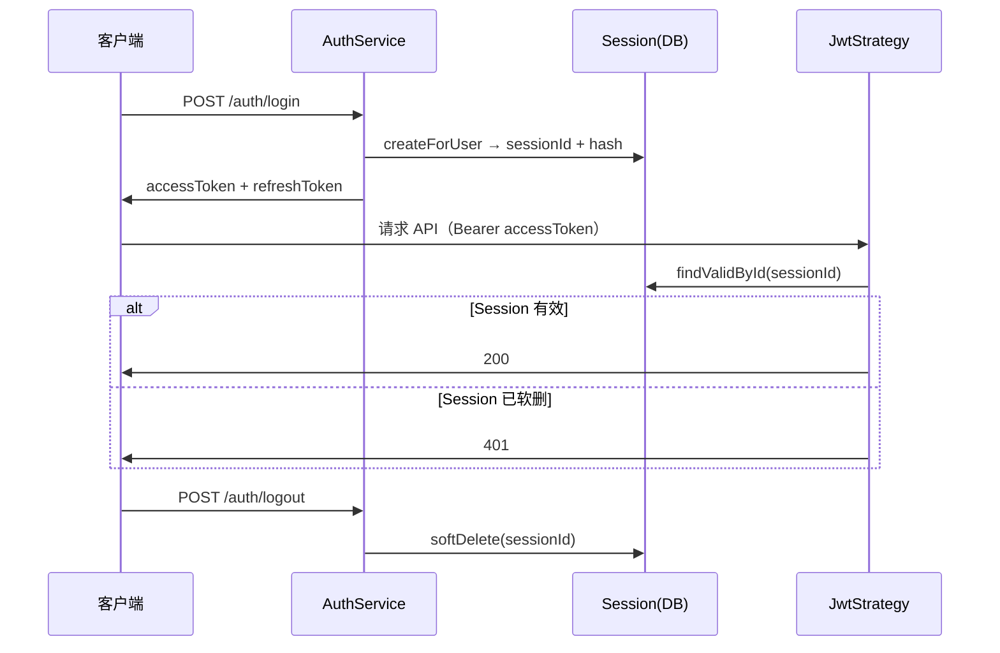

# Session 认证方案总结

本文结合本仓库 `apps/back` 的 JWT + Session 实现，说明 Session 的作用、常见方案对比，以及选型建议。

---

## 1. Session 是什么？为什么要 Session？

### 1.1 JWT 的局限

JWT 是**无状态**的：服务端只验签、看过期时间，签发后无法在过期前单方面作废。

| 场景                 | 只有 JWT 时的问题                              |
| -------------------- | ---------------------------------------------- |
| 用户点击「退出登录」 | 客户端删 token 即可，但别人手里的 token 仍可用 |
| 修改密码 / 封号      | 旧 token 在过期前仍然有效                      |
| 设备丢失             | 无法让该设备上的 token 立刻失效                |
| 多设备登录           | 难以区分设备，无法单设备登出                   |

### 1.2 Session 的作用

Session 在服务端维护「这一次登录是否仍然有效」的记录，给无状态 JWT 补上**可撤销、可管理**的能力。

本项目的 `Session` 实体（`apps/back/src/session/entities/session.entity.ts`）：

| 字段        | 含义                                                   |
| ----------- | ------------------------------------------------------ |
| `id`        | 会话唯一标识，写入 JWT payload 的 `sessionId`          |
| `userId`    | 关联用户                                               |
| `hash`      | 与 `refreshToken` 绑定的随机哈希，用于刷新校验与防重放 |
| `deletedAt` | 软删除表示会话已失效（登出）                           |

### 1.3 本项目中的 Session 流程

#### 登录

1. 校验邮箱、密码
2. `SessionService.createForUser()` 创建会话（生成 `sessionId` + `hash`）
3. 签发 `accessToken`（payload 含 `userId`、`sessionId`）和 `refreshToken`（额外含 `hash`）

#### 访问受保护接口

1. `JwtStrategy` 验签 JWT
2. 用 `sessionId` 查库：`findValidById()`
3. Session 已软删 → 401「会话已过期」，即使 JWT 本身未过期

#### 刷新 Token

1. `JwtRefreshStrategy` 校验 `sessionId` 与 `hash` 是否匹配
2. 轮换 `hash`，签发新的 token 对
3. 旧 `refreshToken` 因 hash 不匹配而失效

#### 登出

1. `SessionService.invalidate()` 软删除当前 session
2. 之后 access / refresh token 均无法继续使用

支持 `invalidateAllForUser()`：使用户所有设备一并下线。

### 1.4 流程示意



### 1.5 代价

每次受保护请求需查一次数据库。换来的是登出、踢人、改密后的即时失效。高并发时可把活跃 Session 缓存到 Redis。

---

## 2. 两种常见 Session 方案对比

### 2.1 方案 A：Cookie Session（会话数据放在 Cookie 里）

**原理**：登录后把用户信息写入 Cookie（通常签名或加密）；下次请求浏览器自动携带，服务端解密/验签后直接得到用户身份。**不一定有数据库 session 表**。

**优点**

- 实现简单，无状态，不依赖 Redis/DB
- 性能好，无需每次查库
- 水平扩展简单，多实例无需共享 session 存储

**缺点**

- Cookie 约 4KB 大小限制
- 难以服务端主动作废（登出、踢人需额外机制）
- 敏感信息不宜放入 Cookie
- CSRF 风险更高，需 `SameSite`、CSRF Token 等防护

**适用场景**

- 小型后台、内部工具
- 会话字段少（如仅 `userId`、`role`）
- 单体应用、对「立刻踢下线」要求不高
- 传统服务端渲染（同域 + Cookie）

---

### 2.2 方案 B：Cookie/Token + 表存储（服务端 Session）

**原理**：客户端只携带 `sessionId`（Cookie 或 JWT），会话状态存在 DB / Redis；每次请求根据 id 查表校验。

**优点**

- 可主动撤销：登出、封号、改密后旧会话立即失效
- 支持多设备管理：一条记录对应一次登录
- 客户端载体可很小，业务数据不暴露
- 可存储较多会话状态

**缺点**

- 每次鉴权多一次存储查询
- 多实例需共享 Redis/DB
- 需定期清理过期 session

**适用场景**

- 需要登出即失效、踢人、多设备管理
- 安全要求较高的业务系统
- 会话状态较多或需频繁变更

---

### 2.3 核心对比

| 维度         | Cookie 存会话数据   | Cookie/Token + 表存储           |
| ------------ | ------------------- | ------------------------------- |
| 状态存放位置 | 主要在客户端 Cookie | 主要在服务端表/Redis            |
| 服务端踢人   | 难                  | 易（删/软删 session）           |
| 性能         | 高，无 I/O          | 每次鉴权多一次查询              |
| 水平扩展     | 简单                | 需共享存储                      |
| 数据量       | 受 Cookie 4KB 限制  | 几乎不限                        |
| 登出语义     | 多为客户端删 Cookie | 服务端作废 + 客户端删 token     |
| CSRF         | 需重点防护          | Bearer JWT 时 CSRF 压力相对较小 |

---

## 3. 本项目的定位：JWT + Session 表

本项目属于**方案 B 的变体**：用 JWT 代替 Cookie 传递 `sessionId`，会话生命周期由 `sessions` 表管理。

```
登录 → 建 sessions 记录 → JWT 携带 sessionId（refresh 额外携带 hash）
请求 → 验 JWT → 查 sessions 表是否有效
登出 → 软删 session → JWT 未过期也会 401
```

与经典「Cookie + 表」的区别仅在**载体**：

| 对比项     | 经典 Cookie + 表          | 本项目                         |
| ---------- | ------------------------- | ------------------------------ |
| 客户端携带 | Cookie 自动带 `sessionId` | `Authorization: Bearer` 带 JWT |
| 典型场景   | 同域 SSR                  | 前后端分离、移动端 API         |
| 会话可撤销 | 是                        | 是                             |

这种模式有时称为 **stateful JWT** 或 **session-backed JWT**：保留 JWT 的便携性，同时具备服务端 Session 的可撤销能力。

---

## 4. 选型建议

```text
选 Cookie Session（数据在 Cookie）
  └─ 小项目 / 内部系统 / 会话字段少 / 不太在意服务端立即踢人

选 Cookie + 表（经典服务端 Session）
  └─ 同域 Web、SSR、使用 Cookie，且需要登出/踢人/多设备管理

选 JWT + 表（本项目）
  └─ 前后端分离、App、跨域 API；既要 JWT 便携，又要 session 可撤销
```

| 项目类型             | 常见选择                                           |
| -------------------- | -------------------------------------------------- |
| 个人博客、小管理后台 | Cookie Session                                     |
| 电商 / SaaS 后台     | Cookie + Redis Session，或 JWT + Session 表        |
| 移动端 + Web API     | JWT + Session 表                                   |
| 纯 API、微服务       | JWT + Redis 黑名单，或 OAuth2 refresh + session 表 |

---

## 5. 相关代码路径

| 模块               | 路径                                                    |
| ------------------ | ------------------------------------------------------- |
| Session 实体       | `apps/back/src/session/entities/session.entity.ts`      |
| Session 服务       | `apps/back/src/session/session.service.ts`              |
| 认证服务           | `apps/back/src/auth/auth.service.ts`                    |
| Access Token 策略  | `apps/back/src/auth/strategies/jwt.strategy.ts`         |
| Refresh Token 策略 | `apps/back/src/auth/strategies/jwt-refresh.strategy.ts` |
| 认证接口           | `apps/back/src/auth/auth.controller.ts`                 |

---

## 6. 一句话总结

- **Session** 不是重复 JWT，而是给 JWT 补上服务端可控的开关。
- **Cookie 存数据**：轻、快、难踢人，适合简单场景。
- **Cookie/Token + 表**：多一次查询，但能登出、踢人、管多设备，适合正式业务。
- **本项目** 用 JWT 传 `sessionId`，用 `sessions` 表管生命周期，是前后端分离下的常见折中方案。
