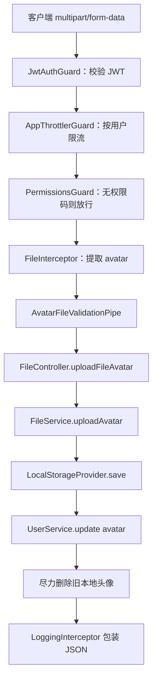
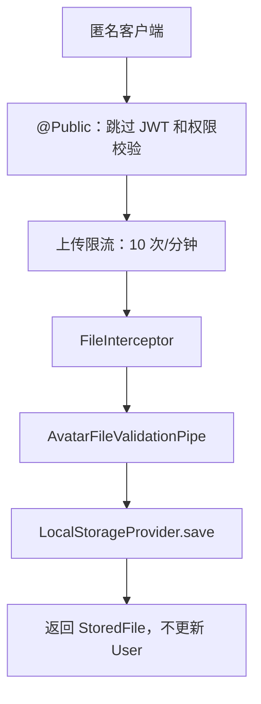
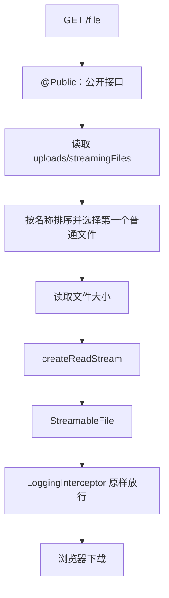

# 文件上传与流式下载

本文梳理 `apps/back` 中 `FileModule` 已落地的文件能力：头像的 multipart 上传、文件内容校验、本地磁盘存储、用户头像 URL 回写、静态资源访问，以及 `StreamableFile` 流式下载演示。读完后应能回答：文件从请求进入后经过哪些组件、最终写到哪里、认证上传与公开上传有什么区别，以及普通 JSON 响应和文件流响应为何不能使用同一种包装方式。

> 延伸阅读：
>
> - [统一请求与异常响应](../统一请求与异常响应/doc.md#10-待扩展传输方式) — JSON envelope、异常响应和文件流的边界
> - [DTO 与管道验证](../dto与管道验证/doc.md#2-请求处理链路全局视角) — 全局 `ValidationPipe` 在请求链路中的位置
> - [QPS / 接口限流](../qps限流/index.md#5-路由级收紧login--register) — 路由级 `@Throttle()` 的覆盖规则
> - [环境变量管理](../环境变量管理/doc.md#5-常见模式新增一项环境变量) — `fileStorage` 配置域的组织方式
> - [文件上传实施计划](../../plan/文件上传实施计划.md) — 功能落地前的方案背景

---

## 1. 整体架构与核心原则

文件模块可以类比为一条流水线：Controller 接住 multipart 请求，Multer 拆出文件，Pipe 检查文件内容，Service 编排业务，StorageProvider 决定文件最终保存在哪里。

| 层次      | 项目组件                    | 职责                                               |
| --------- | --------------------------- | -------------------------------------------------- |
| HTTP 入口 | `FileController`            | 声明 multipart 字段、认证策略、限流和 Swagger 契约 |
| 文件解析  | `FileInterceptor('avatar')` | 通过 Multer 从请求中提取单个文件                   |
| 文件校验  | `AvatarFileValidationPipe`  | 校验文件是否存在、大小、MIME 和图片签名            |
| 业务编排  | `FileService`               | 保存文件、更新用户头像、失败回滚和旧文件清理       |
| 存储契约  | `StorageProvider`           | 定义 `save`、`delete`、`keyFromUrl`                |
| 当前实现  | `LocalStorageProvider`      | 生成安全文件名并写入本地磁盘                       |
| 公开访问  | `useStaticAssets`           | 把上传根目录映射到 `/uploads/`                     |
| 流式响应  | `StreamableFile`            | 以二进制流下载 `streamingFiles` 中的文件           |

**核心原则：**

- **文件内容与业务分离**：Controller 不直接写磁盘，Service 也不关心具体文件系统 API。
- **客户端文件名不可信**：本地存储不采用 `originalname`，而是生成 UUID 文件名。
- **先保存、再回写、失败补偿**：数据库更新失败时删除刚写入的新文件。
- **文件流不包装成 JSON**：上传接口返回 JSON；静态文件和 `StreamableFile` 返回原始二进制。
- **当前只有本地实现**：接口保留了替换存储后端的边界，但 `oss` 驱动尚未实现。

存储契约如下：

```1:24:apps/back/src/file/storage/storage.interface.ts
export const STORAGE_PROVIDER = Symbol('STORAGE_PROVIDER');

export type SaveFileInput = {
  buffer: Buffer;
  mimeType: string;
  size: number;
  purpose: 'avatar';
};

export interface StorageProvider {
  save(input: SaveFileInput): Promise<StoredFile>;
  delete(key: string): Promise<void>;
  keyFromUrl(url: string): string | null;
}
```

---

## 2. 请求处理链路

### 2.1 认证头像上传



`POST /file/upload/avatar` 没有 `@Public()`，因此会先经过全局 JWT 守卫。它也没有声明 `@Permissions()`，所以通过身份认证的用户无需额外 RBAC 权限码，只能使用 `request.user.userId` 更新自己的头像。

```39:62:apps/back/src/file/file.controller.ts
@Post('upload/avatar')
@UseInterceptors(FileInterceptor('avatar'))
@Throttle({ default: AVATAR_UPLOAD_THROTTLE })
// @Public()
@ApiOperation({ summary: '上传并更新当前用户头像' })
@ApiConsumes('multipart/form-data')
// ... Swagger schema
uploadFileAvatar(
  @Request() request: { user: { userId: string } },
  @UploadedFile(AvatarFileValidationPipe) file: Express.Multer.File,
) {
  return this.fileService.uploadAvatar(request.user.userId, file);
}
```

> `// @Public()` 当前只是注释，不会改变运行行为。该接口实际需要 JWT。

### 2.2 公开头像上传



`POST /file/upload/avatar/public` 复用相同的 Multer 和 Pipe，但只保存文件并返回 URL，不关联用户，也不会自动清理该文件。

### 2.3 流式下载



目录不存在或没有普通文件时，Controller 在流开始前抛出 `NotFoundException`，由全局异常过滤器返回 404 JSON。找到文件后则设置：

- `Content-Type: application/octet-stream`
- `Content-Disposition: attachment`
- `Content-Length: 文件实际大小`

---

## 3. 配置与运行目录

文件配置通过 `fileStorageConfigKey = 'fileStorage'` 注册到全局 `ConfigModule`。

| 环境变量                    | 默认值                            | 含义                                     |
| --------------------------- | --------------------------------- | ---------------------------------------- |
| `STORAGE_DRIVER`            | `local`                           | 当前仅 `local` 可用                      |
| `UPLOAD_DIR`                | `uploads`                         | 本地上传根目录，相对路径基于进程工作目录 |
| `UPLOAD_PUBLIC_BASE_URL`    | `http://localhost:{PORT}/uploads` | 写入数据库和接口返回的公开 URL 前缀      |
| `UPLOAD_MAX_SIZE_BYTES`     | `2097152`                         | 单个头像最大 2 MiB                       |
| `UPLOAD_ALLOWED_MIME_TYPES` | `image/jpeg,image/png,image/webp` | 允许的 MIME 白名单                       |

```31:50:apps/back/src/config/fileStorage/config.ts
export const fileStorageConfigKey = 'fileStorage';

export const fileStorageConfig = registerAs<StorageConfigType>(fileStorageConfigKey, () => {
  // ...
  return {
    STORAGE_DRIVER: (process.env.STORAGE_DRIVER as StorageDriver) || StorageDriver.Local,
    UPLOAD_DIR: process.env.UPLOAD_DIR?.trim() || 'uploads',
    UPLOAD_PUBLIC_BASE_URL:
      process.env.UPLOAD_PUBLIC_BASE_URL?.trim().replace(/\/+$/, '') ||
      `http://localhost:${port}/uploads`,
    UPLOAD_MAX_SIZE_BYTES: process.env.UPLOAD_MAX_SIZE_BYTES
      ? parseInt(process.env.UPLOAD_MAX_SIZE_BYTES, 10)
      : 2 * 1024 * 1024,
    UPLOAD_ALLOWED_MIME_TYPES: allowedMimeTypes,
  };
});
```

`main.ts` 把上传根目录整体映射到 `/uploads/`：

```23:29:apps/back/src/main.ts
const { port } = configService.getOrThrow(appConfigKey, { infer: true });
const storageConfig = configService.getOrThrow(fileStorageConfigKey, { infer: true });

// 本地上传文件公开在固定前缀；生产部署时需要为上传目录挂载持久卷。
app.useStaticAssets(resolve(storageConfig.UPLOAD_DIR), {
  prefix: '/uploads/',
});
```

因此默认情况下：

```text
物理文件：uploads/avatars/{uuid}.png
公开地址：http://localhost:4000/uploads/avatars/{uuid}.png
```

> 注意：`MulterModule` 当前没有配置 `dest` 或 `diskStorage`。NestJS 官方文档中的 `dest: './upload'` 是配置示例，不是默认值。本项目使用 Multer 默认内存存储，之后由 `LocalStorageProvider` 主动写盘。

---

## 4. 项目内组织方式

```text
apps/back/src/
├─ config/fileStorage/
│  ├─ config.ts                         # 环境变量读取与校验
│  └─ config.type.ts                    # StorageDriver / StorageConfigType
└─ file/
   ├─ file.controller.ts                # HTTP 入口
   ├─ file.service.ts                   # 上传业务编排
   ├─ file.module.ts                    # Multer 与 StorageProvider 装配
   ├─ file.constants.ts                 # 上传路由限流参数
   ├─ pipes/
   │  └─ avatar-file-validation.pipe.ts # 文件内容校验
   └─ storage/
      ├─ storage.interface.ts           # 存储抽象
      └─ local-storage.provider.ts       # 本地文件系统实现
```

`FileModule` 做两件关键装配：

1. 从配置读取 Multer 的 `fileSize` 和文件数量限制。
2. 根据 `STORAGE_DRIVER` 为 `STORAGE_PROVIDER` 提供具体实现。

```20:47:apps/back/src/file/file.module.ts
MulterModule.registerAsync({
  imports: [ConfigModule],
  inject: [ConfigService],
  useFactory: (configService: ConfigService<AllConfigType>) => {
    const config = configService.getOrThrow(fileStorageConfigKey, { infer: true });
    return {
      limits: {
        fileSize: config.UPLOAD_MAX_SIZE_BYTES,
        files: 1,
      },
    };
  },
}),
// ...
{
  provide: STORAGE_PROVIDER,
  inject: [ConfigService],
  useFactory: (configService: ConfigService<AllConfigType>) => {
    const { STORAGE_DRIVER } = configService.getOrThrow(fileStorageConfigKey, { infer: true });
    if (STORAGE_DRIVER === StorageDriver.Local) {
      return new LocalStorageProvider(configService);
    }
    throw new Error(`存储驱动 ${STORAGE_DRIVER} 尚未实现`);
  },
},
```

---

## 5. 接口一览

| 方法与路径                        | 认证         | 文件字段 | 成功行为                             | 成功响应          |
| --------------------------------- | ------------ | -------- | ------------------------------------ | ----------------- |
| `POST /file/upload/avatar`        | JWT          | `avatar` | 保存文件并更新当前用户头像           | 201 JSON envelope |
| `POST /file/upload/avatar/public` | 公开         | `avatar` | 只保存文件                           | 201 JSON envelope |
| `GET /file`                       | 公开         | 无       | 下载 `streamingFiles` 中的第一个文件 | 200 二进制流      |
| `GET /uploads/*`                  | 公开静态资源 | 无       | 由 Express 读取上传目录              | 200 原始文件      |

### 5.1 认证上传：保存、回写与补偿

认证上传先读取用户，用于保留旧头像信息，然后保存新文件：

```17:38:apps/back/src/file/file.service.ts
async uploadAvatar(userId: string, file: Express.Multer.File): Promise<StoredFile> {
  const user = await this.userService.findOne(userId);
  const storedFile = await this.storageProvider.save({
    buffer: file.buffer,
    mimeType: file.mimetype,
    size: file.size,
    purpose: 'avatar',
  });

  try {
    await this.userService.update(userId, { avatar: storedFile.url });
  } catch (error) {
    await this.deleteWithoutMaskingError(storedFile.key);
    throw error;
  }

  const previousKey = user.avatar ? this.storageProvider.keyFromUrl(user.avatar) : null;
  if (previousKey && previousKey !== storedFile.key) {
    await this.deleteWithoutMaskingError(previousKey);
  }

  return storedFile;
}
```

这段代码包含两种清理：

| 场景               | 清理对象       | 失败策略                                    |
| ------------------ | -------------- | ------------------------------------------- |
| 用户数据库更新失败 | 刚保存的新文件 | 尽力删除，然后继续抛出原始异常              |
| 用户数据库更新成功 | 旧的本地头像   | 尽力删除；失败只记录 warn，不让上传结果失败 |

`User.avatar` 保存的是公开 URL，而不是二进制内容：

```48:50:apps/back/src/user/entities/user.entity.ts
/** 头像 URL */
@Column({ type: 'varchar', length: 512, nullable: true })
avatar: string | null;
```

### 5.2 公开上传：只保存、不关联

`uploadAvatarPublic()` 只调用存储层，不查用户、不更新 `users.avatar`：

```41:49:apps/back/src/file/file.service.ts
async uploadAvatarPublic(file: Express.Multer.File): Promise<StoredFile> {
  const storedFile = await this.storageProvider.save({
    buffer: file.buffer,
    mimeType: file.mimetype,
    size: file.size,
    purpose: 'avatar',
  });
  return storedFile;
}
```

该接口适合本地学习或临时联调，不应直接视为生产上传方案：匿名调用者上传的文件没有 owner、引用记录和自动过期机制。

### 5.3 流式下载演示

`GET /file` 固定读取 `apps/back/uploads/streamingFiles`，只选择按名称排序后的第一个普通文件。它没有接收文件名，因此目前是 `StreamableFile` 学习演示，而不是通用下载 API。

```88:124:apps/back/src/file/file.controller.ts
@Get()
@ApiOperation({ summary: '流式下载 streamingFiles 目录中的文件' })
@ApiProduces('application/octet-stream')
@Public()
async getFile(): Promise<StreamableFile> {
  // 检查目录并选择第一个普通文件
  // ...
  return new StreamableFile(createReadStream(filePath), {
    type: 'application/octet-stream',
    disposition: `attachment; filename="${fallbackFileName}"; filename*=UTF-8''${encodeURIComponent(fileName)}`,
    length: fileStats.size,
  });
}
```

### 5.4 静态访问和流式下载不是同一条链路

| 对比项                    | `/uploads/*`       | `GET /file`           |
| ------------------------- | ------------------ | --------------------- |
| 提供者                    | Express 静态中间件 | Nest Controller       |
| 是否经过 Controller       | 否                 | 是                    |
| 是否使用 `StreamableFile` | 否                 | 是                    |
| Content-Disposition       | 静态服务默认行为   | 明确设置为 attachment |
| 404 形态                  | 静态服务默认响应   | 项目统一异常 JSON     |
| 当前访问控制              | 公开               | `@Public()`           |

---

## 6. 文件校验的三层分工

### 6.1 Multer：请求级资源限制

Multer 在 Pipe 之前执行，当前限制一个文件且不超过配置大小。超过 `limits.fileSize` 时请求会在进入 Controller 前被拒绝，当前 e2e 期望状态码为 413。

### 6.2 AvatarFileValidationPipe：文件语义校验

Pipe 依次检查：

1. 是否存在 `avatar` 文件。
2. 文件大小是否超过配置值。
3. 文件头能否识别为 JPEG、PNG 或 WebP。
4. 检测结果是否与客户端提交的 MIME 一致。
5. MIME 是否位于配置白名单中。

```26:44:apps/back/src/file/pipes/avatar-file-validation.pipe.ts
transform(file: Express.Multer.File | undefined): Express.Multer.File {
  if (!file) {
    this.throwAvatarError('请选择要上传的头像文件');
  }
  if (file.size > this.maxSize) {
    this.throwAvatarError(`头像大小不能超过 ${this.maxSize} 字节`);
  }

  const detectedMimeType = this.detectImageMimeType(file.buffer);
  if (
    !detectedMimeType ||
    detectedMimeType !== file.mimetype.toLowerCase() ||
    !this.allowedMimeTypes.has(detectedMimeType)
  ) {
    this.throwAvatarError('仅支持 JPEG、PNG 或 WebP 图片，且文件内容必须与类型一致');
  }

  file.mimetype = detectedMimeType;
  return file;
}
```

失败时返回 422，并把错误放在 `errors.avatar`。这个参数级 Pipe 专门处理 `@UploadedFile()`；它与处理 JSON body、query 和 params DTO 的全局 `ValidationPipe` 职责不同。

### 6.3 LocalStorageProvider：最终类型约束

即使前面的 Pipe 被其他调用路径绕过，存储层仍只为三种 MIME 映射扩展名：

```13:46:apps/back/src/file/storage/local-storage.provider.ts
const MIME_EXTENSIONS: Readonly<Record<string, string>> = {
  'image/jpeg': '.jpg',
  'image/png': '.png',
  'image/webp': '.webp',
};

// ...
const key = `${input.purpose}s/${randomUUID()}${extension}`;
const filePath = this.resolveKey(key);
await mkdir(dirname(filePath), { recursive: true });
await writeFile(filePath, input.buffer, { flag: 'wx' });
```

---

## 7. 本地存储的安全边界

### 7.1 文件命名

存储 key 形如：

```text
avatars/550e8400-e29b-41d4-a716-446655440000.png
```

原文件名不会进入物理路径，因此客户端无法通过 `originalname` 注入 `../` 或覆盖同名文件。`writeFile(..., { flag: 'wx' })` 进一步保证意外重名时不覆盖已有文件。

### 7.2 路径穿越检查

删除文件或从 URL 反解 key 时，`resolveKey()` 会拒绝绝对路径、无扩展名路径和逃逸上传根目录的相对路径：

```75:92:apps/back/src/file/storage/local-storage.provider.ts
private resolveKey(key: string): string {
  if (!key || isAbsolute(key) || extname(key).length === 0) {
    throw new Error('无效的文件存储 key');
  }

  const filePath = resolve(this.rootDirectory, key);
  const relativePath = relative(this.rootDirectory, filePath);
  if (
    relativePath === '' ||
    relativePath === '..' ||
    relativePath.startsWith(`..${sep}`) ||
    isAbsolute(relativePath)
  ) {
    throw new Error('文件存储 key 超出上传目录');
  }

  return join(this.rootDirectory, relativePath);
}
```

### 7.3 只清理本存储管理的 URL

`keyFromUrl()` 只接受以当前 `UPLOAD_PUBLIC_BASE_URL` 开头的 URL。用户原来若使用外部头像地址，上传新头像时不会尝试删除外部资源。

---

## 8. 认证、权限与限流

全局顺序仍然是：

```text
JwtAuthGuard → AppThrottlerGuard → PermissionsGuard → Interceptor/Pipe → Controller
```

文件模块的差异如下：

| 接口                              | JWT              | PermissionsGuard                | 路由限流          |
| --------------------------------- | ---------------- | ------------------------------- | ----------------- |
| `POST /file/upload/avatar`        | 必须             | 无 `@Permissions()`，认证后放行 | 10 次/分钟        |
| `POST /file/upload/avatar/public` | `@Public()` 跳过 | `@Public()` 跳过                | 10 次/分钟，按 IP |
| `GET /file`                       | `@Public()` 跳过 | `@Public()` 跳过                | 使用全局默认值    |

```1:8:apps/back/src/file/file.constants.ts
import { THROTTLE_TTL_MS } from '@/throttle/throttle.constants';

/** 头像上传单独限流，避免频繁占用内存和磁盘。 */
export const AVATAR_UPLOAD_THROTTLE = {
  limit: 10,
  ttl: THROTTLE_TTL_MS,
} as const;
```

---

## 9. 响应与错误语义

### 9.1 上传成功：JSON envelope

上传接口返回 `StoredFile`，再由全局 `LoggingInterceptor` 包装：

```json
{
  "code": 201,
  "message": "ok",
  "data": {
    "key": "avatars/550e8400-e29b-41d4-a716-446655440000.png",
    "url": "http://localhost:4000/uploads/avatars/550e8400-e29b-41d4-a716-446655440000.png",
    "size": 12345,
    "mimeType": "image/png"
  }
}
```

### 9.2 文件流：不包装

`LoggingInterceptor` 检测到 `StreamableFile` 后直接返回，否则二进制流会被错误包装进 `{ code, message, data }`。

```89:100:apps/back/src/common/interceptors/logging.interceptor.ts
return next.handle().pipe(
  map((data): ApiEnvelope<unknown> | StreamableFile => {
    if (data instanceof StreamableFile) {
      return data;
    }
    return {
      code: res.statusCode,
      message: 'ok',
      data,
    };
  }),
```

### 9.3 状态码速查

| 状态码 | 触发位置                        | 典型场景                       |
| ------ | ------------------------------- | ------------------------------ |
| 201    | Controller + LoggingInterceptor | 上传成功                       |
| 401    | `JwtAuthGuard`                  | 认证上传未携带有效 token       |
| 404    | 流式下载 Controller             | 目录不存在或目录中没有普通文件 |
| 413    | Multer limits                   | 文件超过上传上限               |
| 422    | `AvatarFileValidationPipe`      | 缺文件、类型不符、内容签名不符 |
| 429    | `AppThrottlerGuard`             | 上传请求超过路由限额           |
| 500    | 存储或数据库                    | 写盘、数据库更新等未预期错误   |

---

## 10. 测试覆盖

| 测试文件                              | 已覆盖                                            |
| ------------------------------------- | ------------------------------------------------- |
| `avatar-file-validation.pipe.spec.ts` | 合法 PNG、伪造 MIME、缺文件、超大小               |
| `local-storage.provider.spec.ts`      | 保存/读取/删除、公开 URL 反解、路径穿越           |
| `file.service.spec.ts`                | 用户头像更新、数据库失败回滚、外部旧 URL 不删除   |
| `file-upload.e2e-spec.ts`             | 认证成功、401、缺文件 422、伪造内容 422、超限 413 |

当前自动化测试没有覆盖公开上传、真实静态资源访问、流式下载响应头、目录为空，以及同一用户并发上传。

---

## 11. 已知边界与生产注意事项

当前实现适合学习和小规模本地开发，但需要明确以下边界：

1. **公开上传会产生孤儿文件**  
   `/file/upload/avatar/public` 没有用户归属和过期清理机制。生产环境应移除、限制调用来源，或增加文件记录和定时回收。

2. **整个上传根目录都被静态公开**  
   `useStaticAssets` 映射的是完整 `UPLOAD_DIR`，所以 `uploads/streamingFiles` 中的文件也能绕过 `GET /file`，直接通过 `/uploads/streamingFiles/{filename}` 访问。

3. **流式下载目录没有复用 `UPLOAD_DIR`**  
   下载目录由 `__dirname` 固定推导；头像存储则基于 `resolve(UPLOAD_DIR)`。自定义绝对上传目录时，两者可能指向不同位置。

4. **Multer 当前使用内存存储**  
   每个文件会完整进入 `file.buffer`。2 MiB 限制降低了风险，但提高上限或高并发时应考虑临时磁盘、并发限制或对象存储直传。

5. **并发头像更新存在竞态**  
   同一用户同时发起多个上传时，数据库最终只保留一个 URL，其他已经写入的文件可能成为孤儿文件。

6. **图片签名校验不是完整图片解码**  
   当前只检查 JPEG、PNG、WebP 的基础文件头，没有校验像素尺寸和完整文件结构。

7. **流式下载不支持 Range**  
   大文件中断后不能断点续传；生产下载接口需要处理 `Range`、206 和 `Content-Range`。

8. **`File` entity 和 DTO 仍是占位代码**  
   当前没有文件元数据表，因此无法查询 owner、用途、创建时间和引用状态。

---

## 12. 前端对接要点

上传时使用 `FormData`，字段名必须是 `avatar`：

```typescript
const formData = new FormData();
formData.append('avatar', file);

await request('/file/upload/avatar', {
  method: 'POST',
  body: formData,
});
```

注意事项：

- 不要手动把 `Content-Type` 设置为 `application/json`。
- 浏览器会自动生成带 boundary 的 `multipart/form-data`。
- 认证上传需要 `Authorization: Bearer <token>`。
- 上传成功后重新获取 `/auth/me`，其 `user.avatar` 已是新的公开 URL。
- 流式下载返回二进制，不按 JSON envelope 解析。

---

## 13. 参考文档

1. [NestJS File upload](https://docs.nestjs.com/techniques/file-upload) — `FileInterceptor`、Multer 配置和文件 Pipe
2. [NestJS Streaming files](https://docs.nestjs.com/techniques/streaming-files) — `StreamableFile` 与响应头设置
3. [Multer](https://github.com/expressjs/multer) — multipart 解析、memoryStorage 和 limits
4. [统一请求与异常响应](../统一请求与异常响应/doc.md) — 项目的成功/错误响应契约
5. [DTO 与管道验证](../dto与管道验证/doc.md) — Pipe 与全局 ValidationPipe
