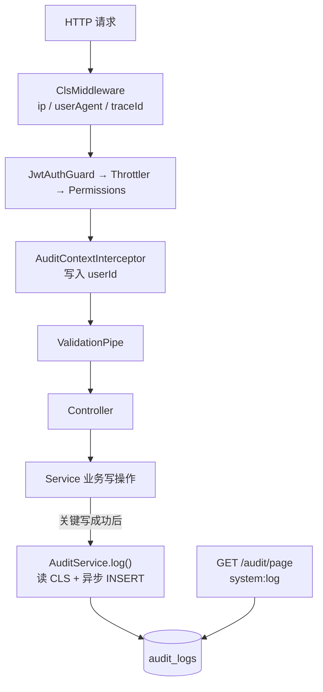

# 审计日志

本文梳理 `apps/back` 中已落地的**操作审计（Audit Log）**完整逻辑：CLS 如何把「操作人 / IP / UA」传到 Service、业务如何显式 `log()`、异步落库如何设计，以及分页查询接口与权限边界。读完应能回答：

- 审计记的是什么？和 Winston 应用日志有何区别？
- `userId` / `ip` / `userAgent` 从哪来、其它请求能不能读到？
- 业务侧怎样正确调用 `AuditService.log()`？写入失败会影响主流程吗？
- 管理端如何查询？需要什么权限？

> **适用范围：** MySQL `audit_logs` 表的写入与查询。应用运行日志（Winston / Loki）不在本文范围。
>
> 延伸阅读：
>
> - [日志记录](./日志记录.md) — 应用日志、`traceId`、与审计的分工
> - [权限管理](../权限管理/权限管理.md) — RBAC、`PERMISSIONS`、`@Permissions`
> - [邮箱密码登录](../邮箱（账号）、密码登录注册功能/邮箱密码登录.md) — JWT 与 `req.user`
> - [RBAC 方案规划 §6.2](../../plan/rbac-plan.md#62-操作审计日志) — 设计取舍与 FAQ

---

## 1. 整体架构

可以把审计想象成「安保监控录像」：权限闸机决定「能不能进」，审计录像记录「谁进了、对哪扇门做了什么」。

| 角色           | 对应组件                          | 一句话                                      |
| -------------- | --------------------------------- | ------------------------------------------- |
| 请求级便签本   | `nestjs-cls`（AsyncLocalStorage） | 本次请求专属：`userId` / `ip` / `userAgent` |
| 便签本写入员 A | `ClsModule` middleware            | 请求一进门就记 IP、UA                       |
| 便签本写入员 B | `AuditContextInterceptor`         | Guard 通过后记操作人 `userId`               |
| 录像按钮       | 业务 Service 显式 `log()`         | 关键写操作后调用，不自动拦截所有接口        |
| 录像带         | MySQL `audit_logs`                | 只插入、不更新、不软删                      |
| 回放台         | `GET /audit/page`                 | 需 `system:log` 权限分页筛选                |

| 层次     | 模块 / 文件                                   | 职责                                                  |
| -------- | --------------------------------------------- | ----------------------------------------------------- |
| 全局 CLS | `app.module.ts` → `ClsModule`                 | 写 `audit.ip` / `audit.userAgent`（及日志 `traceId`） |
| 全局拦截 | `AuditContextInterceptor`                     | 写 `audit.userId`                                     |
| 全局模块 | `AuditModule`（`@Global`）                    | 导出 `AuditService`，注册实体与查询接口               |
| 写入     | `AuditService.log()`                          | 读 CLS → 组实体 → fire-and-forget INSERT              |
| 脱敏     | `sanitizeAuditSnapshot()`                     | detail 快照剔除 `password`                            |
| 查询     | `AuditController` + `searchPage()`            | 分页 + 多条件筛选                                     |
| 调用方   | `UserService` / `RoleService` / `MenuService` | 写操作成功后打点                                      |



**设计要点：**

- **权限管「能不能」，审计管「做了什么」**：二者互补，不互相替代。
- **显式打点，非全量拦截**：只有业务认为需要追责的写操作才 `log()`，避免读接口刷爆表。
- **CLS 解耦 HTTP 与 Service**：不把 `req` / `auditCtx` 传进每个方法签名。
- **best-effort 异步写入**：主业务先返回；审计 INSERT 失败只打错误，不回滚已成功操作。
- **请求隔离**：CLS 按请求隔离；并发请求 A/B 互不覆盖（单例 Service 不能用实例字段存当前用户）。

---

## 2. 请求处理链路（审计视角）

与认证/权限完整链路见 [权限管理](../权限管理/权限管理.md)、[邮箱密码登录](../邮箱（账号）、密码登录注册功能/邮箱密码登录.md)。此处只突出审计相关顺序：

```text
HTTP
  → [1] ClsMiddleware：写入 audit.ip / audit.userAgent（及 log.traceId）
  → [2] JwtAuthGuard → AppThrottlerGuard → PermissionsGuard
  → [3] AuditContextInterceptor：若有 req.user.userId，写入 audit.userId
  → [4] ValidationPipe → Controller → Service
  → [5] 写操作成功后：auditService.log({ action, resourceId?, detail? })
        → 无 userId 则跳过；有则异步 INSERT audit_logs
```

全局守卫顺序（先注册先执行）：

```119:134:apps/back/src/app.module.ts
    // 全局守卫执行顺序（先注册先执行）：
    // 1. JwtAuthGuard → 身份认证（401），@Public() 跳过；限流前解析 req.user
    // 2. AppThrottlerGuard → 限流（已登录按 userId，未登录按 IP）
    // 3. PermissionsGuard → 权限校验（403），@SkipPermissions() / @Public() 跳过
    {
      provide: APP_GUARD,
      useClass: JwtAuthGuard,
    },
    {
      provide: APP_GUARD,
      useClass: AppThrottlerGuard,
    },
    {
      provide: APP_GUARD,
      useClass: PermissionsGuard,
    },
```

`AuditContextInterceptor` 在 Guard **之后**执行，因此能读到已解析的 `req.user`：

```15:22:apps/back/src/audit/audit-context.interceptor.ts
  intercept(context: ExecutionContext, next: CallHandler): Observable<unknown> {
    console.log('AuditContextInterceptor 审计日志');

    const req = context.switchToHttp().getRequest<{ user?: { userId?: string } }>();
    if (req.user?.userId) {
      this.cls.set(AUDIT_CLS_KEYS.userId, req.user.userId);
    }
    return next.handle();
  }
```

---

## 3. CLS 请求上下文

### 3.1 为什么需要 CLS？

`userId` / `ip` / `userAgent` 来自 HTTP 层，写入发生在 Service 层。若不用 CLS，每个 Service 方法都要额外传 `auditCtx`，业务与请求细节耦合。Nest Service 默认单例，也不能把「当前用户」挂在 `this` 上——并发请求会互相覆盖。

`nestjs-cls` 基于 `AsyncLocalStorage`：每个请求一份独立上下文，请求结束即失效。**其它并发请求读不到本次的 CLS 值。**

### 3.2 键名与写入时机

```1:6:apps/back/src/audit/audit.constants.ts
/** nestjs-cls 上下文键 */
export const AUDIT_CLS_KEYS = {
  userId: 'audit.userId',
  ip: 'audit.ip',
  userAgent: 'audit.userAgent',
} as const;
```

| 键                | 写入方                    | 时机         | 数据来源                                                   |
| ----------------- | ------------------------- | ------------ | ---------------------------------------------------------- |
| `audit.ip`        | `ClsModule` setup         | 请求进入     | `x-forwarded-for` 首段 → `req.ip` → `socket.remoteAddress` |
| `audit.userAgent` | 同上                      | 请求进入     | `req.headers['user-agent']`                                |
| `audit.userId`    | `AuditContextInterceptor` | Guard 通过后 | `req.user.userId`（未登录则不写）                          |

中间件写入 IP / UA：

```61:69:apps/back/src/app.module.ts
          const forwarded = req.headers['x-forwarded-for'];
          const ip =
            (typeof forwarded === 'string' ? forwarded.split(',')[0]?.trim() : undefined) ??
            req.ip ??
            req.socket?.remoteAddress ??
            null;
          cls.set(AUDIT_CLS_KEYS.ip, ip);
          // 将用户 IP 和 User-Agent 也设置到上下文，供审计模块读取。
          cls.set(AUDIT_CLS_KEYS.userAgent, req.headers['user-agent'] ?? null);
```

同一 `ClsModule` 还写入应用日志用的 `traceId`（`LOG_CLS_TRACE_ID`），与审计字段并存、互不替代。详见 [日志记录](./日志记录.md)。

### 3.3 边界对比

| 对比项         | CLS（请求上下文）            | `audit_logs` 行（库表）      |
| -------------- | ---------------------------- | ---------------------------- |
| 生命周期       | 单次请求内                   | 长期保留                     |
| 其它请求可读？ | **否**                       | **是**（有权限可查）         |
| 用途           | 给 `log()` 自动补操作人/环境 | 合规追溯、管理后台回放       |
| 丢失策略       | 请求结束即丢                 | 只插入；写入失败不影响主业务 |

---

## 4. 数据模型与模块组织

### 4.1 实体 `AuditLog`

表名 `audit_logs`，设计为**只插入**：

```7:41:apps/back/src/audit/entities/audit-log.entity.ts
@Entity('audit_logs')
export class AuditLog {
  @PrimaryGeneratedColumn('uuid')
  id: string;

  /** 操作人 id */
  @Column({ type: 'varchar', length: 36 })
  userId: string;

  /** 权限码格式，如 user:delete */
  @Column({ type: 'varchar', length: 128 })
  action: string;

  /** 资源模块，如 user / role / menu */
  @Column({ type: 'varchar', length: 64 })
  resource: string;

  /** 被操作的资源 ID，批量操作时可留空并在 detail 中记录 ids */
  @Column({ type: 'varchar', length: 36, nullable: true })
  resourceId: string | null;

  /** 操作前后数据快照（JSON） */
  @Column({ type: 'json', nullable: true })
  detail: Record<string, unknown> | null;

  /** 来源 IP */
  @Column({ type: 'varchar', length: 45, nullable: true })
  ip: string | null;

  /** 浏览器 / 客户端信息 */
  @Column({ type: 'varchar', length: 512, nullable: true })
  userAgent: string | null;

  @CreateDateColumn()
  createdAt: Date;
}
```

| 字段         | 说明                                                   |
| ------------ | ------------------------------------------------------ |
| `action`     | 与权限码对齐，如 `user:delete`（来自 `PERMISSIONS.*`） |
| `resource`   | 由 `action.split(':')[0]` 自动推导，如 `user`          |
| `resourceId` | 单资源操作填 ID；批量可 `null`，在 `detail.ids` 记列表 |
| `detail`     | JSON 快照，常用 `before` / `after` / `ids`             |

生产环境建议：DB 账号对该表仅 `INSERT` + `SELECT`，防止被改历史。

### 4.2 目录结构

```text
apps/back/src/audit/
  ├── entities/audit-log.entity.ts   # 表实体
  ├── dto/query-audit-page.dto.ts    # 分页查询入参
  ├── audit.constants.ts             # CLS 键
  ├── audit-context.interceptor.ts   # 写入 userId
  ├── audit.service.ts               # log() + searchPage() + sanitize
  ├── audit.controller.ts            # GET /audit/page
  └── audit.module.ts                # @Global，导出 AuditService
```

`AuditModule` 为 `@Global()`，业务模块注入 `AuditService` 时无需再 `imports`（模块本身已在 `AppModule` 注册）。它 `forwardRef` 引入 `PermissionModule`，供查询接口使用权限装饰器。

---

## 5. 写入：`AuditService.log()`

### 5.1 行为约定

```29:48:apps/back/src/audit/audit.service.ts
  log(input: AuditLogInput): void {
    const userId = this.cls.get<string>(AUDIT_CLS_KEYS.userId);
    if (!userId) return;

    const resource = input.action.split(':')[0] ?? 'unknown';
    const entry = this.auditLogRepository.create({
      userId,
      action: input.action,
      resource,
      resourceId: input.resourceId ?? null,
      detail: input.detail ?? null,
      ip: this.cls.get<string>(AUDIT_CLS_KEYS.ip) ?? null,
      userAgent: this.cls.get<string>(AUDIT_CLS_KEYS.userAgent) ?? null,
    });
    console.log('entry', entry);

    void this.auditLogRepository.save(entry).catch((err: unknown) => {
      console.error('[AuditLog] 写入失败:', err);
    });
  }
```

| 约定                     | 含义                                    |
| ------------------------ | --------------------------------------- |
| 返回 `void`              | 调用方**不要** `await`                  |
| 无 `userId` 跳过         | 未登录 / 拦截器未写入时不落库           |
| `void save().catch(...)` | fire-and-forget；失败只 `console.error` |
| 不抛回业务               | 删用户已成功则接口仍成功返回            |

时间线示意：

```text
softDelete 完成 → auditService.log() 被调用 → return 响应 →（后台）INSERT audit_logs
```

若合规要求「每条操作必须有审计」，需改为 `await`、同事务或消息队列——当前实现优先响应速度（best-effort）。

### 5.2 业务调用模式

`action` 使用 `PERMISSIONS` 常量，与 RBAC 权限码同源：

```80:84:apps/back/src/user/user.service.ts
    this.auditService.log({
      action: PERMISSIONS.USER_CREATE,
      resourceId: saved.id,
      detail: { after: sanitizeAuditSnapshot(saved as unknown as Record<string, unknown>) },
    });
```

| 场景 | `detail` 习惯            | `resourceId`                 |
| ---- | ------------------------ | ---------------------------- |
| 创建 | `{ after }`              | 新实体 id                    |
| 更新 | `{ before, after }`      | 目标 id                      |
| 单删 | `{ before }`             | 目标 id                      |
| 批删 | `{ ids, before: [...] }` | 单条时填 id，多条可为 `null` |

当前已打点模块：`UserService`、`RoleService`、`MenuService`（增删改类写操作）。

### 5.3 快照脱敏

```80:87:apps/back/src/audit/audit.service.ts
/** 剔除敏感字段，供 detail 快照使用 */
export function sanitizeAuditSnapshot<T extends Record<string, unknown>>(
  data: T,
): Omit<T, 'password'> {
  // eslint-disable-next-line @typescript-eslint/no-unused-vars
  const { password: _password, ...rest } = data;
  return rest;
}
```

写入 `detail` 前应走 `sanitizeAuditSnapshot`，避免密码等敏感字段进库。应用日志侧另有 Winston `redact`（字段名匹配掩码），机制不同，见 [日志记录 §5](./日志记录.md#5-敏感信息脱敏)。

---

## 6. 查询接口

| 项          | 说明                                                  |
| ----------- | ----------------------------------------------------- |
| 方法 / 路径 | `GET /audit/page`                                     |
| 权限        | `@Permissions(PERMISSIONS.SYSTEM_LOG)` → `system:log` |
| 未登录      | Guard → **401**                                       |
| 无权限      | Guard → **403**                                       |
| 入参非法    | ValidationPipe → **422**                              |

查询 DTO 支持：`page` / `pageSize`（最大 100）、`userId`、`action`、`resource`、`resourceId`、`startTime` / `endTime`（ISO 8601）。结果按 `createdAt DESC`，返回 `{ data, total, page, pageSize, totalPage }`。

```15:20:apps/back/src/audit/audit.controller.ts
  /** 分页查询操作审计日志 */
  @Get('page')
  @Permissions(PERMISSIONS.SYSTEM_LOG)
  findPage(@Query() query: QueryAuditPageDto) {
    return this.auditService.searchPage(query);
  }
```

---

## 7. 应用日志 vs 审计日志

| 维度     | 应用日志（Winston）                  | 审计日志（本文）                       |
| -------- | ------------------------------------ | -------------------------------------- |
| 目的     | 排障、可观测                         | 合规、追责                             |
| 存储     | 控制台 / 文件 / Loki                 | MySQL `audit_logs`                     |
| 写入     | Interceptor / Filter / `Logger` 自动 | 业务显式 `AuditService.log()`          |
| 可丢失性 | 可采样、可过期                       | 需完整保留（当前实现仍为 best-effort） |
| 共享点   | 同一套 CLS（`traceId` + 审计键）     | 同左                                   |

> 延伸阅读：[日志记录 §7](./日志记录.md#7-应用日志-vs-审计日志)、[日志方案规划 §1.3](../../plan/日志方案规划.md#13-应用日志-vs-审计日志重要区分)

---

## 8. 业务侧约定（怎么加审计）

1. 在**写操作成功之后**、`return` 之前调用 `this.auditService.log(...)`。
2. `action` 用 `PERMISSIONS.xxx`，不要手写散落字符串。
3. `detail` 先 `sanitizeAuditSnapshot`；批量操作用 `detail.ids`，必要时 `resourceId` 留空。
4. **不要** `await log()`；也不要依赖「审计一定写入成功」做业务分支。
5. 读接口、纯查询一般不打审计，避免噪声。

---

## 9. 参考文档

1. [nestjs-cls](https://github.com/Papooch/nestjs-cls) — 请求级 AsyncLocalStorage 上下文
2. [NestJS Interceptors](https://docs.nestjs.com/interceptors) — 全局拦截器与请求链路
3. [项目：日志记录](./日志记录.md) — 应用日志与 `traceId`
4. [项目：权限管理](../权限管理/权限管理.md) — RBAC 与权限码
5. [项目：RBAC 方案规划 §6.2](../../plan/rbac-plan.md#62-操作审计日志) — 设计 FAQ（为何 CLS、为何异步）
6. [项目：日志方案规划](../../plan/日志方案规划.md) — 应用日志 vs 审计区分
