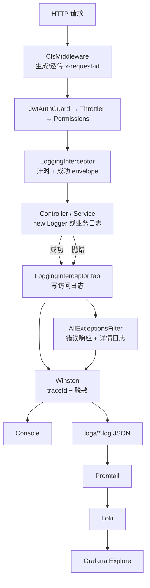

# 日志记录

本文梳理 `apps/back` 中已落地的**应用日志（Application Log）**完整逻辑：Winston 如何落地、`traceId` 如何串联一次请求、HTTP 访问日志与异常日志如何分工，以及本地文件如何被 `deploy/observability` 采到 Grafana。读完应能回答：

- 一次请求的日志从哪写、写到哪、谁负责哪一类日志？
- 如何用 `x-request-id` / `traceId` 把多条日志串起来？
- 应用日志和审计日志（`AuditModule`）有何区别？
- 本机如何打开文件日志，并在 Grafana 里用 LogQL 查到它们？

> **适用范围：** 应用运行日志（控制台 / 文件 / Loki）。审计库表写入不在本文范围。
>
> 延伸阅读：
>
> - [审计日志](./审计日志.md) — `AuditModule`、CLS 操作人上下文、异步写入 `audit_logs`
> - [统一请求与异常响应](../统一请求与异常响应/doc.md) — `LoggingInterceptor` 成功 envelope 与 `AllExceptionsFilter` 错误体
> - [环境变量管理](../环境变量管理/doc.md) — `LOG_*` 配置域校验方式
> - [日志方案规划](../../plan/日志方案规划.md) — 分阶段设计与本机 Loki 落地计划（§7.1）
> - [本机可观测栈 README](../../../deploy/observability/README.md) — 启动 Compose、验收 LogQL

---

## 1. 整体架构

可以把日志想象成「写日记 + 归档柜」：

| 角色             | 对应组件                        | 一句话                            |
| ---------------- | ------------------------------- | --------------------------------- |
| 写日记的笔       | Winston + Nest Logger 桥接      | 业务与框架统一走同一套 Logger     |
| 日记本封面的编号 | CLS `traceId`（`x-request-id`） | 同一次请求的所有行带同一 ID       |
| 访问小结         | `LoggingInterceptor`            | 每条 HTTP 记 method/url/状态/耗时 |
| 出错详述         | `AllExceptionsFilter`           | 统一错误响应 + warn/error 详情    |
| 本地归档柜       | `apps/back/logs/*.log`          | JSON 按日切割（可选开启）         |
| 远程阅览室       | Promtail → Loki → Grafana       | 采文件、存索引、UI 查询（零侵入） |

| 层次            | 模块 / 文件                            | 职责                                    |
| --------------- | -------------------------------------- | --------------------------------------- |
| 启动替换 Logger | `main.ts` + `WinstonNestLoggerService` | Nest 内置 `Logger` 全部进 Winston       |
| 全局模块        | `LoggerModule.forRootAsync()`          | 创建并注入 `WINSTON_LOGGER`             |
| 工厂            | `create-winston-logger.ts`             | Console / 文件 transport、traceId、脱敏 |
| 脱敏            | `logger/redact.ts`                     | 敏感字段掩码为 `***`                    |
| 配置            | `config/logger/*`                      | 校验并提供 `LOG_*`                      |
| 请求上下文      | `ClsModule`（`app.module.ts`）         | 生成/透传 `traceId`，写响应头           |
| HTTP 访问       | `LoggingInterceptor`                   | 成功包装 + 访问日志；慢请求 warn        |
| 异常            | `AllExceptionsFilter`                  | 错误 JSON + 分级错误日志                |



**设计要点：**

- **应用零侵入远程采集**：Nest 只写本地 JSON；Promtail 负责推 Loki，采集挂了不拖垮业务。
- **访问日志 ≠ 异常详情**：Interceptor 记「发生过一次请求」；Filter 记「为什么失败」（含 stack）。
- **`traceId` 最早写入**：在 Express middleware（CLS）阶段生成，后续 Winston format 自动注入。
- **与审计分离**：审计写 MySQL「谁对什么做了什么」；应用日志写文件/Loki「排障用技术细节」。二者仅共享 CLS 上下文。

---

## 2. 请求处理链路（日志视角）

与响应形态相关的完整链路见 [统一请求与异常响应](../统一请求与异常响应/doc.md)；此处只突出**日志相关**顺序：

```text
HTTP
  → [1] ClsMiddleware：traceId + 响应头 x-request-id
  → [2] Guards（认证/限流/权限，本身一般不写 Winston 访问日志）
  → [3] LoggingInterceptor：开始计时；成功则包装 ApiEnvelope
  → [4] Controller / Service：业务 Logger（自动带 traceId）
  → [5a] 成功：Interceptor tap → info/warn 访问日志
  → [5b] 失败：Interceptor tap 补一条访问日志 → Filter 写 warn/error 详情
```

`traceId` 生成与回写：

```52:59:apps/back/src/app.module.ts
        setup: (cls, req, res) => {
          // 链路追踪 ID：优先透传上游/网关的 x-request-id，否则生成
          const incoming = req.headers[TRACE_ID_HEADER];
          // 同一请求的所有日志带相同 ID，可串联排查。
          const traceId = (typeof incoming === 'string' && incoming.trim()) || randomUUID();
          cls.set(LOG_CLS_TRACE_ID, traceId);
          // 将 traceId 设置到响应头，供下游/网关消费。
          res.setHeader(TRACE_ID_HEADER, traceId);
```

Nest 全局 Logger 替换（启动阶段日志也会进 Winston）：

```14:15:apps/back/src/main.ts
  const app = await NestFactory.create(AppModule, { bufferLogs: true });
  app.useLogger(app.get(WinstonNestLoggerService));
```

全局拦截器 / 过滤器注册：

```110:118:apps/back/src/app.module.ts
  providers: [
    {
      provide: APP_INTERCEPTOR,
      useClass: LoggingInterceptor,
    },
    {
      provide: APP_FILTER,
      useClass: AllExceptionsFilter,
    },
```

---

## 3. Winston 落地方式

### 3.1 `LoggerModule` 与工厂 Provider

`LoggerModule` 标记为 `@Global()`，在 `AppModule` 里通过 `LoggerModule.forRootAsync()` 注册一次后，全应用可注入其导出的 Token，无需每个业务模块再 `imports`。

核心是 **工厂 Provider**：不直接 `new` 一个类交给 Nest，而是用 `useFactory` 在依赖就绪后**异步/延迟创建**真正的 Winston 实例，再挂到 DI 容器上。

```15:34:apps/back/src/logger/logger.module.ts
  static forRootAsync(): DynamicModule {
    return {
      module: LoggerModule,
      imports: [ConfigModule],
      providers: [
        {
          // 工厂 Provider：提供 winston 日志记录器
          provide: WINSTON_LOGGER,
          inject: [ConfigService],
          useFactory: (configService: ConfigService<AllConfigType>) => {
            const { nodeEnv } = configService.getOrThrow(appConfigKey, { infer: true });
            const logger = configService.getOrThrow(loggerConfigKey, { infer: true });

            return createWinstonLogger(logger, nodeEnv);
          },
        },
        WinstonNestLoggerService,
      ],
      exports: [WINSTON_LOGGER, WinstonNestLoggerService],
    };
  }
```

| 字段                       | 含义                                                                            |
| -------------------------- | ------------------------------------------------------------------------------- |
| `provide: WINSTON_LOGGER`  | DI Token（`Symbol`），业务侧 `@Inject(WINSTON_LOGGER)` 取到的就是工厂返回值     |
| `inject: [ConfigService]`  | 工厂入参：先拿到已校验的配置，再创建 Logger（避免读不到 `LOG_*`）               |
| `useFactory`               | 调用 `createWinstonLogger(loggerConfig, nodeEnv)`，按环境决定级别、是否写文件等 |
| `WinstonNestLoggerService` | 依赖上面的 `WINSTON_LOGGER`，实现 Nest `LoggerService`，供 `app.useLogger()`    |
| `exports`                  | 把 Token 与桥接服务导出，拦截器 / 过滤器 / 其它模块可注入                       |

**为何用工厂而不是普通 `useClass`：**

- Winston 实例需要 **运行时配置**（`LOG_LEVEL`、`LOG_FILE_ENABLED`…），这些来自 `ConfigService`，必须在配置模块加载后才能创建。
- 创建逻辑集中在 `createWinstonLogger`，模块只负责「装配」，职责清晰。
- 全应用共享**同一个** Winston 实例（单例 Provider），Console / 文件 transport、脱敏 format 只初始化一次。

依赖关系可以记成：

```text
ConfigModule（logger 配置域）
    → useFactory 读 ConfigService
        → createWinstonLogger(...)
            → provide WINSTON_LOGGER
                → WinstonNestLoggerService（桥接 Nest Logger）
                → LoggingInterceptor / AllExceptionsFilter（直接注入 Winston）
```

### 3.2 两套用法

| 用法        | 方式                                                      | 适合                                          |
| ----------- | --------------------------------------------------------- | --------------------------------------------- |
| Nest 惯用   | `new Logger(XxxService.name)`                             | 框架/业务常规日志（已被 `useLogger` 桥接）    |
| 结构化 meta | `@Inject(WINSTON_LOGGER) private readonly logger: Logger` | 需要附加字段对象时（如 Interceptor / Filter） |

桥接实现见 `winston-nest-logger.service.ts`：`log` → `info`，`formatMessage` 用 `safe-stable-stringify` 防循环引用。

### 3.3 Format 管道（每条日志都会走）

```63:70:apps/back/src/logger/create-winston-logger.ts
const jsonFormat = format.combine(
  format.timestamp({ format: 'YYYY-MM-DD HH:mm:ss' }),
  format.errors({ stack: true }),
  format.splat(),
  traceIdFormat(),
  redactFormat(),
  format.json(),
);
```

| Stage           | 作用                         |
| --------------- | ---------------------------- |
| `traceIdFormat` | 从 CLS 读 `log.traceId` 注入 |
| `redactFormat`  | 敏感字段掩码                 |
| Console printf  | 人读；dev 着色               |
| File `json`     | 机读，供 Promtail / Loki     |

### 3.4 Transports 与文件名

| 输出                    | 条件                    | 内容                     |
| ----------------------- | ----------------------- | ------------------------ |
| Console                 | 始终                    | 人读格式                 |
| `app-%DATE%.log`        | `LOG_FILE_ENABLED=true` | 全量 JSON                |
| `error-%DATE%.log`      | 同上                    | 仅 error                 |
| `exceptions-%DATE%.log` | 同上                    | 未捕获同步异常           |
| `rejections-%DATE%.log` | 同上                    | 未处理 Promise rejection |

默认目录 `LOG_DIR=logs` → 相对 `apps/back` 工作目录，即 `apps/back/logs/`。按日切割 + `LOG_MAX_SIZE` / `LOG_MAX_FILES` / gzip。

```138:170:apps/back/src/logger/create-winston-logger.ts
  if (loggerConfig.LOG_FILE_ENABLED) {
    loggerTransports.push(...createFileTransports(loggerConfig));
    // ... exceptionHandlers / rejectionHandlers → exceptions-*.log / rejections-*.log
  }

  return createLogger({
    level: loggerConfig.LOG_LEVEL,
    defaultMeta: { service: LOG_APP_NAME },
    transports: loggerTransports,
    exceptionHandlers,
    rejectionHandlers,
    exitOnError: false,
  });
```

### 3.5 文件 JSON 常见字段

| 字段                              | 说明                                                                     |
| --------------------------------- | ------------------------------------------------------------------------ |
| `timestamp` / `level` / `message` | 基础三件套                                                               |
| `service`                         | 固定 `Back`                                                              |
| `traceId`                         | 有 HTTP 上下文时存在                                                     |
| `context`                         | 如 `HTTP`、`Exception`、类名                                             |
| `stack`                           | error 时                                                                 |
| 访问日志 meta                     | `method` `url` `statusCode` `durationMs` `ip` `userAgent` `userInfoId` … |

---

## 4. HTTP 访问日志与异常日志

### 4.1 LoggingInterceptor

```55:97:apps/back/src/common/interceptors/logging.interceptor.ts
    const writeLog = (errorStatus?: number) => {
      if (!this.logEnabled) {
        return;
      }
      // ... statusCode / durationMs / meta
      if (duration >= this.slowMs) {
        this.logger.warn(`[慢请求] ${message}`, meta);
      } else {
        this.logger.info(message, meta);
      }
    };

    return next.handle().pipe(
      map(
        (data): ApiEnvelope<unknown> => ({
          code: res.statusCode,
          message: 'ok',
          data,
        }),
      ),
      tap({
        next: () => writeLog(),
        error: (err: { status?: number; statusCode?: number }) => {
          writeLog(err?.status ?? err?.statusCode ?? 500);
        },
      }),
    );
```

- `LOG_HTTP_ENABLED=false` 可关掉访问日志（仍保留业务 Logger / 异常日志）。
- 超过 `LOG_SLOW_MS`（默认 1000）记 warn，前缀 `[慢请求]`。
- 出错时也会补一条访问日志；**详情与堆栈交给 Filter**。

### 4.2 AllExceptionsFilter

```61:70:apps/back/src/common/filters/all-exceptions.filter.ts
    if (statusCode >= 500) {
      this.logger.error(this.toMessage(exception, statusCode, request), {
        ...logMeta,
        stack: exception instanceof Error ? exception.stack : undefined,
      });
    } else {
      this.logger.warn(this.toMessage(exception, statusCode, request), logMeta);
    }

    response.status(statusCode).json(body);
```

| 类型                       | HTTP     | 日志级别          |
| -------------------------- | -------- | ----------------- |
| `HttpException` 等预期错误 | 通常 4xx | `warn`            |
| 未预期异常                 | 500      | `error` + `stack` |

错误响应体含 `traceId`，与响应头 `x-request-id` 一致，便于前后端对照。

---

## 5. 敏感信息脱敏

字段名（小写包含匹配）命中 `password` / `token` / `authorization` / `cookie` / `phone` / `idcard` 等时，值替换为 `***`；嵌套对象递归，有深度上限与循环引用保护。

```33:55:apps/back/src/logger/redact.ts
export const redact = (value: unknown, depth = 0, seen = new WeakSet<object>()): unknown => {
  // ...
  for (const [key, val] of Object.entries(value as Record<string, unknown>)) {
    result[key] = isSensitiveKey(key) ? MASK : redact(val, depth + 1, seen);
  }
  return result;
};
```

脱敏挂在 Winston format 层，Console 与文件输出都会生效。

---

## 6. 环境变量

| 变量                 | 说明                           | 默认（dev / prod） |
| -------------------- | ------------------------------ | ------------------ |
| `LOG_LEVEL`          | Winston 级别                   | debug / info       |
| `LOG_FILE_ENABLED`   | 是否写文件（**远程采集前提**） | false / true       |
| `LOG_DIR`            | 日志目录                       | `logs`             |
| `LOG_MAX_SIZE`       | 单文件切割大小                 | `20m`              |
| `LOG_MAX_FILES`      | 保留时长/数量                  | `14d`              |
| `LOG_ZIPPED_ARCHIVE` | 切割后 gzip                    | true               |
| `LOG_HTTP_ENABLED`   | HTTP 访问日志                  | true               |
| `LOG_SLOW_MS`        | 慢请求阈值 (ms)                | 1000               |

常量键名见 `config/logger/constants.ts`；解析与按环境默认值见 `config/logger/config.ts`。示例注释见 `apps/back/.env.example`。

---

## 7. 应用日志 vs 审计日志

| 维度     | 应用日志（本文）                                   | 审计日志（`AuditModule`）     |
| -------- | -------------------------------------------------- | ----------------------------- |
| 目的     | 排障、可观测                                       | 合规、追责                    |
| 存储     | 控制台 / 文件 / Loki                               | MySQL `audit_log`             |
| 写入方式 | 自动（Interceptor/Filter/Logger）                  | 业务显式 `AuditService.log()` |
| 可丢失性 | 可采样、可过期                                     | 需完整保留                    |
| 共享点   | CLS：`traceId`、ip、userAgent、（审计另用 userId） | 同左                          |

两者并存，不互相替代。审计侧完整链路见 [审计日志](./审计日志.md)；规划说明见 [日志方案规划 §1.3](../../plan/日志方案规划.md#13-应用日志-vs-审计日志重要区分)。

---

## 8. 远程采集（本机 Loki 栈）

正式项目常见做法：**应用写本地文件，Agent 采集**。本仓库已落地：

```text
Nest Winston → apps/back/logs/*.log → Promtail → Loki → Grafana
```

| 组件         | 作用                                            |
| ------------ | ----------------------------------------------- |
| Winston 文件 | 产出 JSON 行                                    |
| Promtail     | tail `apps/back/logs`，标签 `job=back`，推 Loki |
| Loki         | 按标签存储与 LogQL                              |
| Grafana      | Explore 查询 UI                                 |

配置目录：[`deploy/observability/`](../../../deploy/observability/)。详细计划：[日志方案规划 §7.1](../../plan/日志方案规划.md#71-本仓库落地计划远程日志采集本机-loki-栈)。

**最小验收步骤：**

1. `.env` 设 `LOG_FILE_ENABLED=true`，重启后端并访问任意 API
2. 仓库根目录：

```bash
docker compose -f deploy/observability/docker-compose.yml up -d
```

3. 打开 http://localhost:3000（`admin`/`admin`）→ Explore → Loki：

```logql
{job="back"}
```

```logql
{job="back"} | json | traceId="<响应头 x-request-id>"
```

未开文件日志时 Grafana 无数据属预期。

---

## 9. 业务侧怎么打日志（约定）

- 优先 `private readonly logger = new Logger(XxxService.name)`，自动走 Winston 并带 `context`。
- 需要结构化字段时注入 `WINSTON_LOGGER`，把对象放在 meta，而不是把大对象塞进字符串。
- 禁止业务路径裸 `console.log`（排障信息应可检索、可脱敏、可带 `traceId`）。
- 不要记录完整请求体 / 大数组；`error` 带清清楚楚的原因与堆栈上下文。

---

## 10. 参考文档

1. [Winston](https://github.com/winstonjs/winston) — Node 日志库
2. [winston-daily-rotate-file](https://github.com/winstonjs/winston-daily-rotate-file) — 按日/大小切割
3. [nestjs-cls](https://github.com/Papooch/nestjs-cls) — 请求级 AsyncLocalStorage 上下文
4. [Grafana Loki](https://grafana.com/oss/loki/) — 日志聚合
5. [项目：日志方案规划](../../plan/日志方案规划.md)
6. [项目：deploy/observability](../../../deploy/observability/README.md)
7. [项目：统一请求与异常响应](../统一请求与异常响应/doc.md)
