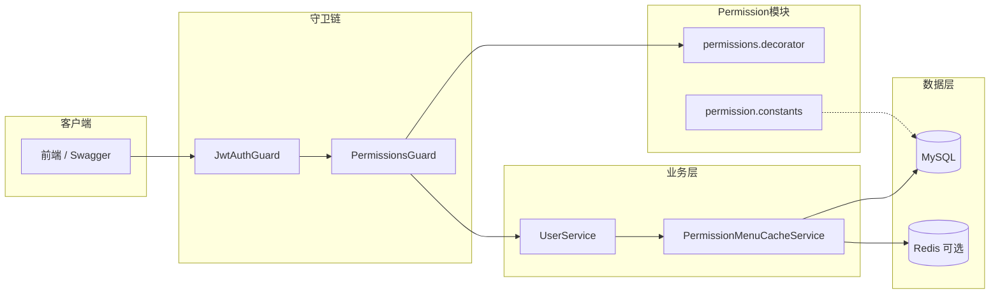
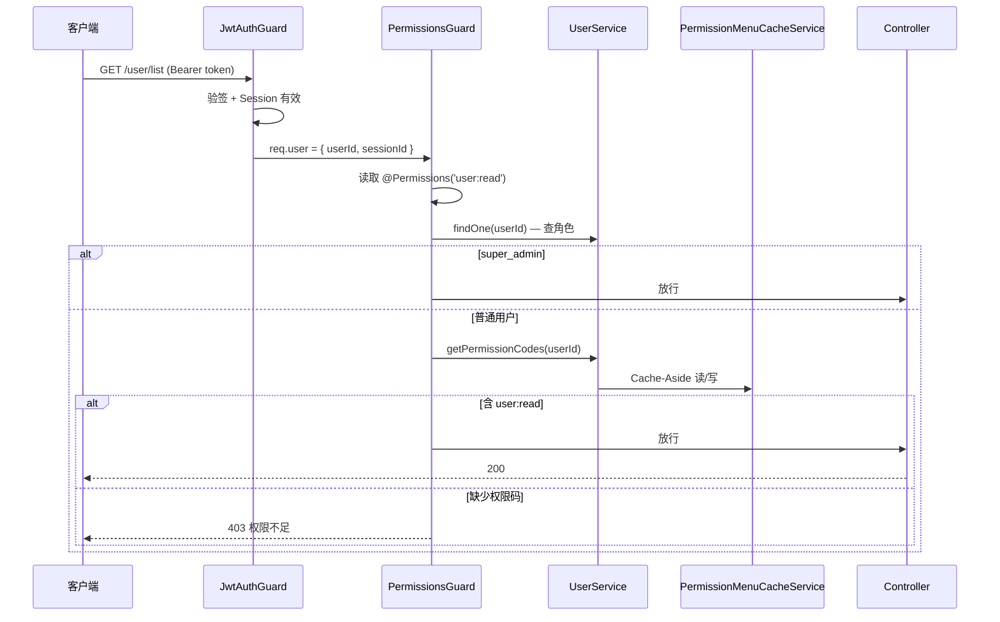
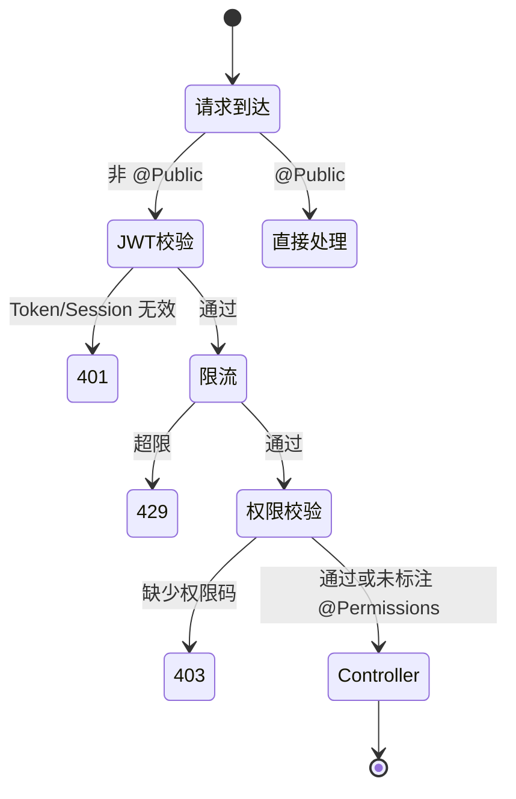

# 权限管理（RBAC）

本文梳理 `apps/back` 中**基于角色的访问控制（RBAC）**的完整实现：权限码定义、菜单与按钮模型、`PermissionsGuard` 校验链路、Redis 缓存及与前端协作方式。

> 延伸阅读：
>
> - [邮箱密码登录](../邮箱密码登录.md) — JWT 身份认证、`JwtAuthGuard` 与全局守卫执行顺序
> - [docs/plan/rbac-plan.md](../../../plan/rbac-plan.md) — RBAC 方案设计与演进记录

---

## 1. 整体架构

本项目采用 **用户 → 角色 → 菜单/按钮** 的三层 RBAC 模型，接口级权限与前端按钮/路由共用同一套 `menu.code`：

| 层次       | 模块 / 类                               | 职责                                             |
| ---------- | --------------------------------------- | ------------------------------------------------ |
| 权限码定义 | `permission.constants.ts`               | `PERMISSIONS` 常量 + `menuList` 种子菜单树       |
| 路由标注   | `@Permissions()` / `@SkipPermissions()` | 声明接口所需权限码或跳过校验                     |
| 全局守卫   | `PermissionsGuard`                      | 比对用户权限码，不足则 **403**                   |
| 权限查询   | `UserService`                           | 聚合用户全部 BUTTON 类型 `code`                  |
| 菜单可见性 | `UserService.getAccessibleMenuTree`     | 聚合 DIRECTORY/MENU 类型可见菜单树               |
| 缓存层     | `PermissionMenuCacheService`            | Redis Cache-Aside，降低高频查库                  |
| 数据模型   | `User` / `Role` / `Menu`                | 多对多关联：`user_roles`、`role_menus`           |
| 种子同步   | `seeds/menu` + `seeds/role`             | 将 `menuList` 写入库，`super_admin` 绑定全量菜单 |



**设计要点：**

- **身份认证与权限校验分离**：401（未登录）由 `JwtAuthGuard` 负责；403（已登录但无权限）由 `PermissionsGuard` 负责。
- **菜单与权限统一建模**：`MenuType.BUTTON` 的 `code` 既是接口权限码，也是前端按钮显隐依据；`DIRECTORY` / `MENU` 控制侧边栏路由可见性。
- **单一数据源**：`permission.constants.ts` 中的 `PERMISSIONS` 与 `menuList` 由种子脚本同步到数据库，避免代码与库不一致。
- **`super_admin` 豁免**：拥有该角色的用户跳过所有 `@Permissions()` 校验（仍须通过 JWT 鉴权）。

---

## 2. RBAC 数据模型

### 2.1 实体关系

```
User ──(user_roles)──> Role ──(role_menus)──> Menu
```

| 关联表       | 含义                  |
| ------------ | --------------------- |
| `user_roles` | 用户拥有哪些角色      |
| `role_menus` | 角色拥有哪些菜单/按钮 |

### 2.2 菜单类型 `MenuType`

| 类型      | 枚举值      | `code` 字段 | 用途                                    |
| --------- | ----------- | ----------- | --------------------------------------- |
| 目录      | `directory` | 通常为空    | 纯父节点，无路由                        |
| 菜单页    | `menu`      | 通常为空    | 侧边栏路由；`visible` 控制是否展示      |
| 按钮/操作 | `button`    | **必填**    | 接口权限码；`PermissionsGuard` 据此校验 |

权限码格式：`模块:操作`，全小写，如 `user:create`、`role:assign`。

### 2.3 权限生效链路

**接口访问（PermissionsGuard）：**

```
User → roles → menus(type=BUTTON) → menu.code 集合
  → 与 @Permissions(...) 声明的 code 做 every 比对
```

**侧边栏菜单（GET /auth/me）：**

```
User → roles → menus(type≠BUTTON, visible=true) → id 集合
  → MenuService.findVisibleTree 构建树
```

---

## 3. 权限守卫 `PermissionsGuard`

`PermissionsGuard` 在 `AppModule` 中注册为全局 `APP_GUARD`（第三个执行，位于 `JwtAuthGuard`、`AppThrottlerGuard` 之后）。

### 3.1 处理流程

```
请求进入（已通过 JwtAuthGuard，req.user 含 userId）
  → 读取 @SkipPermissions() metadata
      → skipPermissions === true → 直接放行
  → 读取 @Public() metadata
      → isPublic === true → 直接放行
  → 读取 @Permissions() 声明的 requiredCodes
      → 未标注或数组为空 → 直接放行（仅身份认证，不做权限校验）
  → 查用户角色：UserService.findOne(userId)
      → 角色名含 SUPER_ADMIN_ROLE_NAME → 直接放行
  → 查用户权限码：UserService.getPermissionCodes(userId)
  → requiredCodes.every(code => userCodes.includes(code))
      → 全部命中 → 放行
      → 任一缺失 → 403 ForbiddenException「权限不足，无法访问该资源」
  → 进入 Controller 方法
```

### 3.2 401 与 403 的区别

| HTTP 状态 | 触发守卫           | 含义                                |
| --------- | ------------------ | ----------------------------------- |
| **401**   | `JwtAuthGuard`     | 未登录、Token 无效或 Session 已失效 |
| **403**   | `PermissionsGuard` | 已登录，但不具备接口所需权限码      |

### 3.3 时序图



---

## 4. 装饰器 `@Permissions` / `@SkipPermissions`

定义于 `apps/back/src/permission/permissions.decorator.ts`。

### 4.1 `@Permissions(...codes)`

标注接口所需的权限码，支持传入多个（**AND 关系**，必须全部拥有）：

```typescript
import { PERMISSIONS } from '@/permission/permission.constants';
import { Permissions } from '@/permission/permissions.decorator';

@Post()
@Permissions(PERMISSIONS.USER_CREATE)
create(@Body() dto: CreateUserDto) { ... }
```

### 4.2 `@SkipPermissions()`

跳过权限校验，通常加在 Controller 类上。与 `@Public()` 不同：

| 装饰器               | JWT 鉴权   | 权限校验 |
| -------------------- | ---------- | -------- |
| `@Public()`          | 跳过       | 跳过     |
| `@SkipPermissions()` | **仍执行** | 跳过     |

典型用法：`AuthController` 整体 `@SkipPermissions()`，认证接口自身再通过 `@Public()` 或 JWT 守卫控制。

### 4.3 放行规则汇总

| 条件                             | PermissionsGuard 行为 |
| -------------------------------- | --------------------- |
| `@SkipPermissions()`             | 放行                  |
| `@Public()`                      | 放行                  |
| 未标注 `@Permissions()`          | 放行                  |
| 用户角色含 `super_admin`         | 放行                  |
| 用户权限码包含全部 requiredCodes | 放行                  |
| 否则                             | **403**               |

---

## 5. Redis 权限缓存

实现于 `apps/back/src/redis/permissionMenuCache/permission-menu-cache.service.ts`，采用 **Cache-Aside** 模式。

### 5.1 缓存 Key

| Key 模式                  | 内容             |
| ------------------------- | ---------------- |
| `fst:user_perms:{userId}` | 权限码 JSON 数组 |
| `fst:user_menus:{userId}` | 可见菜单树 JSON  |

命名空间 `fst` 定义于 `config/redis/constants.ts`，避免多项目共用 Redis 实例时冲突。

### 5.2 读取流程

```
getPermissionCodes / getAccessibleMenuTree
  → Redis GET
      → 命中且 JSON 合法 → 直接返回
      → miss 或脏数据 → 调用 loader 查库 → SET 回填
```

`loader` 由 `UserService` 注入，避免 `PermissionMenuCacheService` 与 `UserService` 循环依赖。

### 5.3 TTL 策略

优先级（秒）：

1. 环境变量 `REDIS_PERMISSION_CACHE_TTL_SECONDS`
2. 解析 `JWT_EXPIRES_IN`（如 `15m` → 900s）
3. 兜底 `900` 秒

### 5.4 降级行为

`REDIS_ENABLED=false`（默认）或 Redis 连接失败时，`RedisService` 空操作，**始终走 loader 查库**，功能不受影响，仅无缓存加速。

---

## 6. 缓存失效

权限/菜单数据变更后**不更新 Redis**，而是**删除**对应 key，下次访问时 Cache-Aside 重建。

| 触发场景                           | 调用方法                     | 影响范围               |
| ---------------------------------- | ---------------------------- | ---------------------- |
| 用户角色变更 `PATCH /user/:id`     | `invalidateUser(userId)`     | 该用户 perms + menus   |
| 用户删除                           | `invalidateUser(userId)`     | 该用户 perms + menus   |
| 角色菜单绑定变更 `PATCH /role/:id` | `invalidateByRoleId(roleId)` | 该角色下所有用户       |
| 角色删除                           | `invalidateByRoleId(roleId)` | 该角色下所有用户       |
| 菜单修改 / 删除 / 排序             | `invalidateByMenuId(menuId)` | 关联到该菜单的所有用户 |

`invalidateByRoleId` / `invalidateByMenuId` 内部通过 QueryBuilder 查出受影响的用户 id 列表，批量 DEL。

---

## 7. 超级管理员 `super_admin`

### 7.1 种子预置

`seeds/role/index.seed.ts` 创建系统内置角色 `super_admin`（名称来自配置 `SUPER_ADMIN_ROLE_NAME`），并绑定**当前全部菜单**。

### 7.2 守卫豁免

`PermissionsGuard` 读取用户角色名，若包含 `SUPER_ADMIN_ROLE_NAME` 则直接 `return true`，不查权限码。

> 注意：豁免仅针对 **PermissionsGuard**；`JwtAuthGuard` 仍正常执行，未登录无法访问业务接口。

### 7.3 与菜单绑定的关系

`super_admin` 绑定全量菜单主要用于**权限管理界面回显**；即使未绑定某个 BUTTON，`PermissionsGuard` 也会放行。生产环境首个管理员账号由 `seeds/admin` 创建并赋予该角色。

---

## 8. 全局守卫与请求顺序

与 [邮箱密码登录 §7](../邮箱密码登录.md#7-全局守卫与请求顺序) 一致，`AppModule` 注册顺序：

```
1. JwtAuthGuard      → 身份认证（401）；@Public() 跳过
2. AppThrottlerGuard → 限流
3. PermissionsGuard  → 按钮权限（403）；@SkipPermissions() / @Public() 跳过
```

端到端请求路径：



---

## 9. 参考文档

1. [NestJS Authorization](https://docs.nestjs.com/security/authorization) — Guard 与 RBAC 模式
2. [NestJS Guards](https://docs.nestjs.com/guards) — 全局守卫、`Reflector` 读取 metadata
3. [邮箱密码登录](../邮箱密码登录.md) — JWT 认证与 Session 失效机制
4. [Reflection and metadata 反射与元数据](https://docs.nestjs.com/fundamentals/execution-context#reflection-and-metadata)
