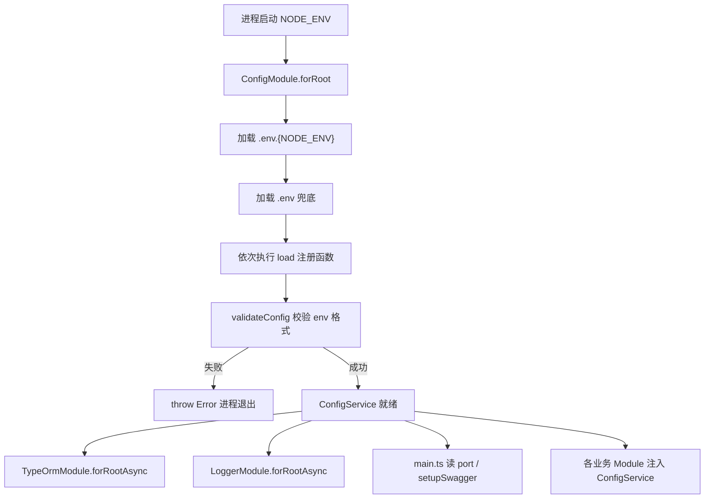

# 环境变量管理

本文梳理 `apps/back` 中 **环境变量加载、校验、分组与消费** 的完整逻辑：`.env` 文件如何被读取、各域配置如何注册到 `ConfigService`、启动时如何校验、业务模块如何通过类型安全的 `getOrThrow` 读取配置。

读完本文，你应能回答：

- 本地开发与生产部署分别该放哪些 env 文件？
- 新增一项环境变量需要改哪些文件？
- `process.env` 与 `ConfigService` 的分工边界在哪里？
- 各配置域（app / auth / database / logger / redis / seeds）有哪些变量、默认值与消费方？

---

## 1. 直觉：配置在应用生命周期中的位置

可以把环境变量想象成「开工前的施工图纸」——在 NestJS 应用 **启动阶段** 一次性读入、校验、结构化，之后各模块只通过 `ConfigService` 查阅，而不再散落读取 `process.env`。

| 概念                               | 类比           | 在本项目中的作用                                         |
| ---------------------------------- | -------------- | -------------------------------------------------------- |
| **`.env` / 系统环境变量**          | 图纸原件       | 操作系统或 dotenv 注入的键值对，值均为字符串             |
| **`ConfigModule.forRoot`**         | 图纸入库系统   | 按优先级加载 env 文件，并执行 `load` 数组中的注册函数    |
| **`registerAs` + `*ConfigKey`**    | 分册目录       | 按业务域（app、auth、database…）把 env 映射为结构化对象  |
| **`validateConfig`**               | 入库质检       | 启动时用 class-validator 校验 env 格式，不合法则进程退出 |
| **`AllConfigType` + `getOrThrow`** | 带索引的查阅台 | 业务代码按 key 取配置，TypeScript 推断出精确类型         |

**核心原则：**

- **启动时校验、运行时只读**：env 只在 `config/**/config.ts` 的 `registerAs` 工厂里读 `process.env`；Service / Guard / Module 统一注入 `ConfigService<AllConfigType>`。
- **按域拆分、集中注册**：每个子目录（`app`、`auth`、`dataBase`…）自洽维护 validator、类型、默认值与 key。
- **先环境专用文件、后通用文件**：同名变量在 `.env.development` 等文件中出现的值，优先于 `.env`（见 `envFilePath` 顺序）。

---

## 2. 启动链路（全局视角）

环境变量不参与 HTTP 请求链路，而是在 **应用 bootstrap 之前** 完成加载，供后续模块工厂（TypeORM、Logger、Redis 等）消费。



全局注册入口在 `AppModule`：

```38:44:apps/back/src/app.module.ts
    ConfigModule.forRoot({
      isGlobal: true, // 全局可用，其他模块无需再 import
      // 数组里会按顺序尝试加载，如果某个变量在多个文件中存在，则以第一个文件中的值为准。

      envFilePath: [`.env.${process.env.NODE_ENV ?? Environment.Development}`, '.env'],
      load: [appConfig, authConfig, dataBaseConfig, loggerConfig, redisConfig, seedsConfig],
    }),
```

**设计要点：**

- **`isGlobal: true`**：任意 Module 可直接注入 `ConfigService`，无需重复 `imports: [ConfigModule]`（动态模块如 `TypeOrmModule.forRootAsync` 仍会显式 import，以满足 inject 依赖）。
- **`envFilePath` 数组顺序**：先 `.env.development` / `.env.production` / `.env.test`，再 `.env`；**前者优先**，便于环境专用覆盖。
- **`load` 顺序**：各 `registerAs` 彼此独立；同一 env 键不会被多个 config 重复映射（按域划分变量名）。

---

## 3. 技术栈分工

| 工具                         | 职责                                                                                    |
| ---------------------------- | --------------------------------------------------------------------------------------- |
| `@nestjs/config`             | `ConfigModule`、`registerAs`、`ConfigService`                                           |
| `class-validator`            | 各域 `EnvironmentVariablesValidator` 声明 env 格式规则                                  |
| `class-transformer`          | `validateConfig` 内 `plainToClass` + `enableImplicitConversion`（如 `"3306"` → `3306`） |
| `validateConfig`（项目工具） | 统一启动校验入口，失败抛错阻止启动                                                      |

自定义校验工具位于 `apps/back/src/utils/config/validate.ts`：

```6:20:apps/back/src/utils/config/validate.ts
function validateConfig<T extends object>(
  config: Record<string, unknown>,
  envVariablesClass: ClassConstructor<T>,
) {
  const validatedConfig = plainToClass(envVariablesClass, config, {
    enableImplicitConversion: true,
  });
  const errors = validateSync(validatedConfig, {
    skipMissingProperties: false,
  });

  if (errors.length > 0) {
    throw new Error(errors.toString());
  }
  return validatedConfig;
}
```

---

## 4. 项目内组织方式

### 4.1 目录结构

```
apps/back/src/config/
├── config.type.ts          # AllConfigType 聚合类型
├── app/
│   ├── config.ts           # registerAs + validator + 默认值
│   └── config.type.ts      # AppConfig、Environment 枚举
├── auth/
├── dataBase/
├── logger/
│   ├── constants.ts        # env 名常量、默认值
│   └── ...
├── redis/
│   ├── constants.ts
│   └── ...
└── seeds/
    ├── config.ts
    ├── config.type.ts
    └── index.ts            # 桶文件 re-export
```

每个域遵循同一模式：

1. **`config.type.ts`** — 导出该域 TypeScript 类型（及枚举）。
2. **`config.ts`** — 定义 `*ConfigKey`、`EnvironmentVariablesValidator`、`registerAs` 工厂。
3. **`constants.ts`（可选）** — env 变量名字符量、业务默认值（logger / redis 使用，避免魔法字符串散落）。

### 4.2 统一类型 `AllConfigType`

`ConfigService` 注入时指定泛型，使 `getOrThrow` 具备完整类型推断：

```14:21:apps/back/src/config/config.type.ts
export type AllConfigType = {
  [appConfigKey]: AppConfig;
  [dataBaseConfigKey]: DataBaseConfigType;
  [authConfigKey]: AuthConfigType;
  [loggerConfigKey]: LoggerConfigType;
  [redisConfigKey]: RedisConfigType;
  [seedsConfigKey]: SeedsConfigType;
};
```

### 4.3 业务侧消费写法

推荐模式（以 `main.ts` 为例）：

```17:19:apps/back/src/main.ts
  const configService = app.get(ConfigService<AllConfigType>);

  const { port } = configService.getOrThrow(appConfigKey, { infer: true });
```

- 使用 **域 key**（如 `appConfigKey`），不要硬编码 `'app'` 字符串。
- **`getOrThrow`**：缺失配置时启动/运行期立刻失败，避免静默 undefined。
- **`{ infer: true }`**：返回类型与 `AllConfigType` 中对应字段一致。

---

## 5. 常见模式：新增一项环境变量

以「给某域增加 `MY_FEATURE_FLAG`」为例，按以下步骤操作（与现有 `app`、`redis` 模块保持一致）：

1. **在对应域的 `config.type.ts`** 增加字段类型。
2. **在 `config.ts` 的 `EnvironmentVariablesValidator`** 增加装饰器规则（`@IsBoolean()`、`@IsOptional()` 等）。
3. **在 `registerAs` 工厂** 中：`validateConfig` → 解析 `process.env` → 写默认值。
4. **若 env 名会多处引用**，在 `constants.ts` 导出常量（参考 logger / redis）。
5. **更新 `apps/back/.env.example`** 注释说明，便于贡献者复制。
6. **业务代码** 通过 `configService.getOrThrow(xxxConfigKey, { infer: true })` 读取，勿直接使用 `process.env`。

布尔值解析惯例（logger / redis / app 中的 Swagger 开关）：

```typescript
const parseBoolean = (value: string | undefined, fallback: boolean): boolean =>
  value !== undefined ? value === 'true' : fallback;
```

即：环境变量中只有字符串 `'true'` 视为真，未设置则用代码中的 fallback。

---

## 6. 边界：env 校验 vs DTO 校验

| 对比项   | 环境变量（`validateConfig`）         | 请求 DTO（`ValidationPipe`）              |
| -------- | ------------------------------------ | ----------------------------------------- |
| 触发时机 | 应用启动、`registerAs` 执行时        | 每个 HTTP 请求进入 Controller 前          |
| 数据来源 | `process.env`、`.env` 文件           | Request Body / Query / Param              |
| 失败后果 | 进程启动失败                         | 422 Unprocessable Entity                  |
| 校验工具 | 各域 `EnvironmentVariablesValidator` | DTO 类上的 class-validator 装饰器         |
| 文档入口 | 本文                                 | [DTO 与管道验证](../dto与管道验证/doc.md) |

两套机制 **共用 class-validator 生态**，但 **validator 类彼此独立**——不要混用 DTO 类去校验 env，也不要在 Controller DTO 里读取 `process.env`。

---

## 7. 本地开发与部署建议

| 场景         | 建议                                                                                                             |
| ------------ | ---------------------------------------------------------------------------------------------------------------- |
| 本地开发     | 复制 `.env.example` → `.env`；可选增加 `.env.development` 覆盖单项                                               |
| 测试 CI      | `NODE_ENV=test`，使用独立 database 或内存策略（按项目 CI 配置）                                                  |
| 生产部署     | 平台注入环境变量；**必须**设置 `JWT_SECRET`、`JWT_REFRESH_SECRET`；默认不开启 Swagger；按需 `REDIS_ENABLED=true` |
| 生产首次种子 | 设置 `RUN_SEEDS=true` 启动一次后关闭（见 `DatabaseModule` 策略）                                                 |
| secrets      | `.env` 已在 `.gitignore`，勿提交；`.env.example` 只放占位符与说明                                                |

---

## 8. 参考文档

1. [NestJS Configuration](https://docs.nestjs.com/techniques/configuration) — `ConfigModule`、`registerAs` 官方说明
2. [项目 `.env.example`](../../../apps/back/.env.example) — 可复制的变量清单与注释
