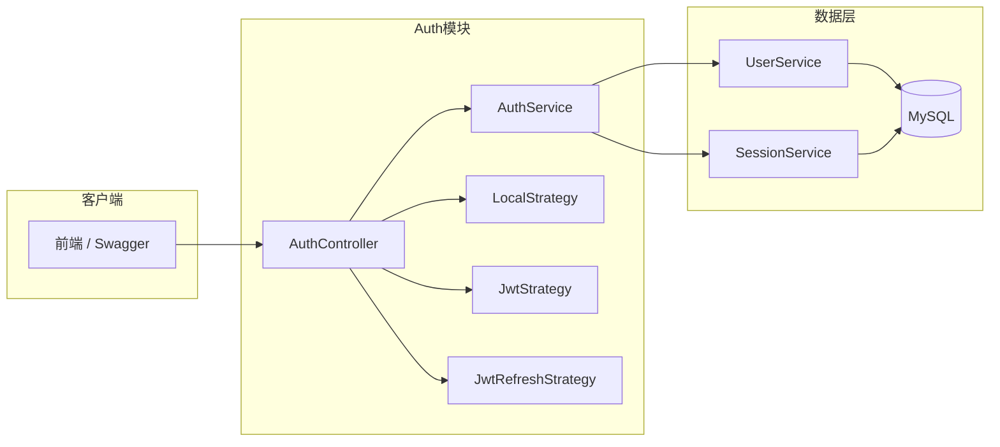
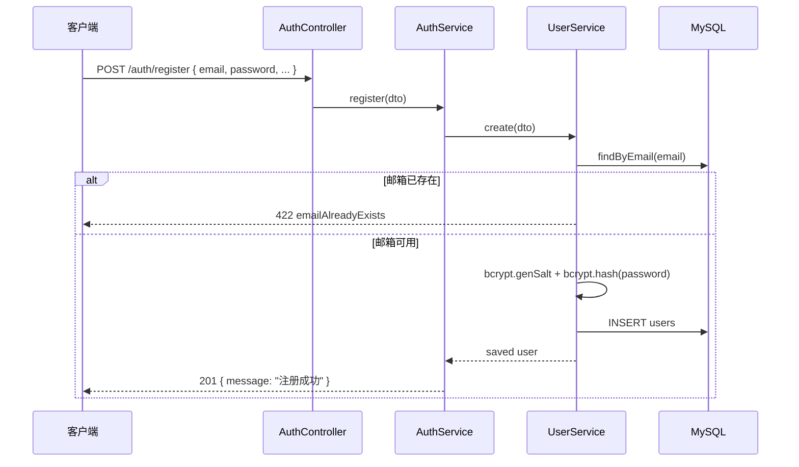
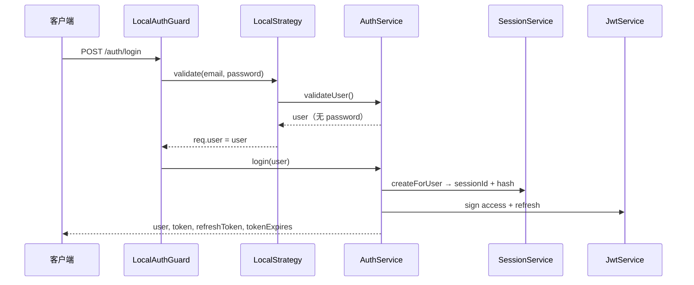
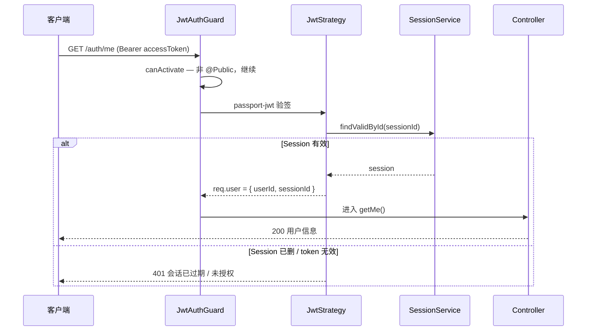
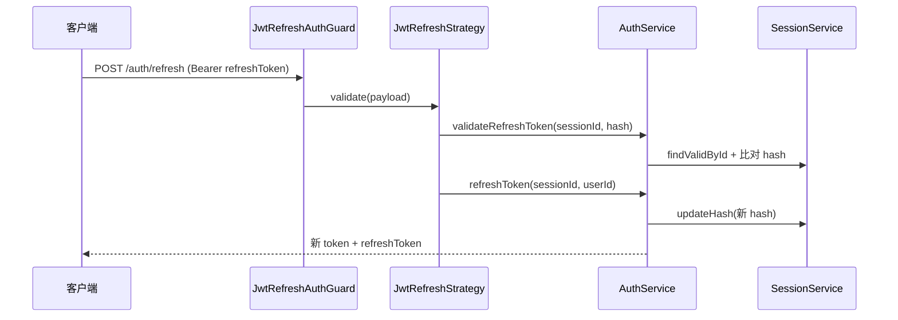
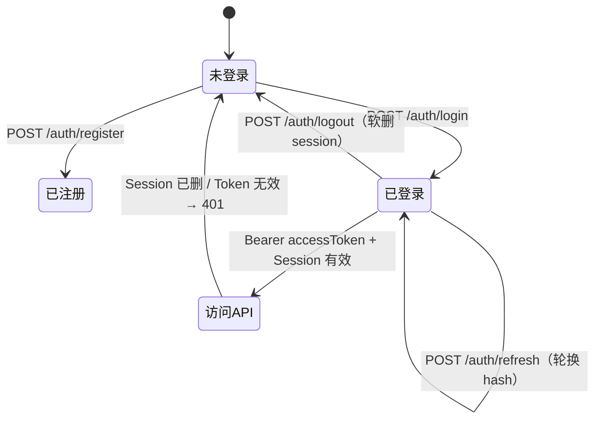

# 邮箱密码登录 / 注册 / 退出

本文梳理 `apps/back` 中**邮箱 + 密码**方式的注册、登录、JWT 鉴权、刷新 Token、退出及获取当前用户的完整实现与请求链路。阅读 [apps/back/README.md](../../../apps/back/README.md) 中的「认证流程简述」时，可跳转至此文档了解细节。

> 延伸阅读：
>
> - [密码加密方案总结](./密码加密方案总结.md) — bcrypt 加盐哈希、登录比对
> - [session-认证方案总结](./session-认证方案总结.md) — JWT + Session 表、hash 轮换、登出失效

---

## 1. 整体架构

本项目采用 **Passport 策略 + JWT + Session 表** 的组合：

| 层次          | 技术                                         | 职责                                    |
| ------------- | -------------------------------------------- | --------------------------------------- |
| 路由入口      | `AuthController`                             | 暴露 `/auth/*` 接口                     |
| 业务逻辑      | `AuthService`                                | 注册、校验凭证、签发 Token、刷新、登出  |
| 本地登录策略  | `LocalStrategy` + `LocalAuthGuard`           | 规范化邮箱密码校验，结果写入 `req.user` |
| Access Token  | `JwtStrategy` + `JwtAuthGuard`（全局）       | 验签 JWT，并查 Session 是否仍有效       |
| Refresh Token | `JwtRefreshStrategy` + `JwtRefreshAuthGuard` | 校验 refresh token 与 Session hash      |
| 会话存储      | `SessionService` + `sessions` 表             | 创建/轮换/软删会话，实现可撤销登录      |
| 用户数据      | `UserService`                                | 创建用户、密码哈希、按邮箱查用户        |



**设计要点：**

- Access Token 携带 `userId`、`sessionId`，**不含** Session hash。
- Refresh Token 额外携带 `hash`，与数据库中的 Session hash 绑定；刷新时轮换 hash，旧 refresh token 立即失效。
- 即使 JWT 未过期，Session 被软删（登出）后，`JwtStrategy` 仍会返回 401。

---

## 2. 注册 `POST /auth/register`

### 2.1 处理流程



---

## 3. 登录 `POST /auth/login`

### 3.1 Passport Local 策略的作用

登录不直接在 Controller 里写「查库 + 比对密码」，而是通过 **Passport Local 策略** 规范化流程：

```
请求体 email/password
  → LocalAuthGuard（AuthGuard('local')）
  → LocalStrategy.validate(email, password)
  → AuthService.validateUser(email, password)
  → 成功：返回值写入 req.user
  → AuthController.login(request.user)
  → AuthService.login(user)
```

`LocalStrategy` 将 passport-local 默认的 `usernameField` 改为 `email`：

```typescript
super({ usernameField: 'email' });
```

### 3.2 登录成功：创建 Session + 签发 Token

`AuthService.login(user)`：

1. `SessionService.createForUser(user.id)`
   - 生成 32 字节随机 `hash`（hex）
   - 插入 `sessions` 表，得到 `sessionId`
2. `getTokensData({ userId, sessionId, hash })` 并行签发：
   - **Access Token**（`JWT_SECRET`，默认过期 `15m`）
     - payload：`{ userId, sessionId }`
   - **Refresh Token**（`JWT_REFRESH_SECRET`，默认过期 `7d`）
     - payload：`{ userId, sessionId, hash }`
3. 返回 `{ user, token, refreshToken, tokenExpires }`



### 3.3 成功响应示例

```json
{
  "user": {
    "id": "uuid",
    "email": "user@example.com",
    "nickname": null,
    "status": "inactive",
    "roles": []
  },
  "token": "eyJhbG...",
  "refreshToken": "eyJhbG...",
  "tokenExpires": "15m"
}
```

> `tokenExpires` 当前返回的是配置字符串（如 `15m`），不是毫秒时间戳。前端可按该配置或 JWT 的 `exp` 字段计算过期时间。

---

## 4. JWT 认证（Access Token）

登录成功后，客户端访问受保护接口（如 `GET /auth/me`、`POST /auth/logout` 及业务 API）时，需在请求头携带 Access Token：

```
Authorization: Bearer <accessToken>
```

全局 `JwtAuthGuard` 在 `AppModule` 中注册为 `APP_GUARD`，**所有路由默认需要 JWT 鉴权**；标记 `@Public()` 的路由（注册、登录、刷新）会跳过。

### 4.1 JwtAuthGuard 处理流程

`JwtAuthGuard` 继承 `AuthGuard('jwt')`，核心逻辑分三步：

```
请求进入
  → canActivate：读取 @Public() metadata
      → 若 isPublic === true → 直接放行（不验 JWT）
      → 否则 → super.canActivate() 触发 passport-jwt
  → passport-jwt / JwtStrategy：
      → 从 Authorization 头提取 Bearer token
      → 用 JWT_SECRET 验签，检查 exp 是否过期
      → 调用 JwtStrategy.validate(payload)
  → handleRequest(err, user)：
      → err 或 user 为空 → 抛出 401「未授权，请先登录」
      → 否则 → 返回 user，写入 req.user
  → 进入 Controller 方法
```

`@Public()` 装饰器通过 `SetMetadata(IS_PUBLIC_KEY, true)` 标记无需鉴权的路由，守卫在 handler 与 class 两层读取 metadata：

```typescript
export const IS_PUBLIC_KEY = 'isPublic';
export const Public = () => SetMetadata(IS_PUBLIC_KEY, true);
```

### 4.2 JwtStrategy 校验 Session

JWT 验签通过后，`JwtStrategy.validate()` 还会查数据库确认 Session 仍有效：

1. 从 payload 取 `sessionId`
2. `SessionService.findValidById(sessionId)` — 不存在或已软删 → **401 会话已过期**
3. 校验通过 → 将 `{ userId, sessionId, ... }` 写入 `req.user`

```typescript
async validate(payload: { sessionId: string }) {
  const session = await this.sessionService.findValidById(payload.sessionId);
  if (!session) {
    throw new UnauthorizedException({ message: '会话已过期', status: 401 });
  }
  return { ...payload };
}
```

**双重失效机制：** JWT 本身有 `exp` 过期时间；即使 token 未过期，Session 被软删（登出、改密下线等）后，`validate()` 仍会拒绝访问。

### 4.3 时序图



### 4.4 典型受保护接口

| 接口                | 从 `req.user` 读取 | 说明                     |
| ------------------- | ------------------ | ------------------------ |
| `GET /auth/me`      | `userId`           | 返回当前用户、权限、菜单 |
| `POST /auth/logout` | `sessionId`        | 软删当前 Session         |
| 其他业务接口        | `userId` 等        | 再走 `PermissionsGuard`  |

---

## 5. 刷新 Token `POST /auth/refresh`

### 5.1 鉴权方式

- 路由标记 `@Public()`，**跳过**全局 Access Token 守卫。
- 方法级 `@UseGuards(JwtRefreshAuthGuard)` 使用 **Refresh Token** 验签。

请求头：

```
Authorization: Bearer <refreshToken>
```

### 5.2 处理流程

1. `JwtRefreshStrategy` 用 `JWT_REFRESH_SECRET` 验签，解析 payload
2. `validate({ hash, sessionId, userId })`：
   - 缺少 `hash` 或 `sessionId` → 422
   - `AuthService.validateRefreshToken()`：
     - `SessionService.findValidById(sessionId)` — Session 不存在或已软删 → 422「会话已过期」
     - `session.hash !== payload.hash` → 422「会话哈希不匹配」（旧 refresh token 或重放攻击）
3. `AuthService.refreshToken()`：
   - 生成新 `hash`，`SessionService.updateHash()` 写入数据库
   - 重新签发 access + refresh Token 对
4. 返回 `{ token, refreshToken, tokenExpires }`（不含 user）



**Hash 轮换的意义：** 每次刷新后旧 refresh token 中的 hash 与库中不一致，无法再次刷新，降低 refresh token 泄露后的风险。

---

## 6. 退出 `POST /auth/logout`

### 6.1 鉴权

- **需要** Access Token（未标记 `@Public()`，走全局 `JwtAuthGuard`）。
- `JwtStrategy.validate()` 会先确认 Session 仍有效，再将 payload 写入 `req.user`。

### 6.2 处理流程

1. 从 `req.user.sessionId` 取当前会话 ID
2. `SessionService.invalidate(sessionId)` — 对 `sessions` 表 **软删除**（设置 `deletedAt`）
3. 返回 `{ status: 200, message: "退出成功" }`

### 6.3 退出后的效果

| Token 类型       | 再次使用时的结果                                       |
| ---------------- | ------------------------------------------------------ |
| 原 Access Token  | `JwtStrategy` 查 Session → 已软删 → **401 会话已过期** |
| 原 Refresh Token | hash 校验或 Session 校验失败 → **422**                 |

客户端仍应删除本地存储的 token；服务端软删 Session 保证即使 token 未过期也无法继续使用。

`SessionService.invalidateAllForUser(userId)` 支持将该用户所有设备一并下线（改密、封号等场景可复用，当前 logout 接口仅作废当前 session）。

---

## 7. 全局守卫与请求顺序

`AppModule` 注册的全局守卫**按注册顺序**执行：

```
1. JwtAuthGuard      → 身份认证（401）；@Public() 跳过
2. AppThrottlerGuard → 限流（登录/注册 10 次/分钟；已登录按 userId）
3. PermissionsGuard  → 按钮权限（403）；AuthController 使用 @SkipPermissions() 整体跳过
```

各接口与守卫的关系：

| 接口             | JwtAuthGuard      | 额外 Guard                               |
| ---------------- | ----------------- | ---------------------------------------- |
| `/auth/register` | 跳过（`@Public`） | —                                        |
| `/auth/login`    | 跳过（`@Public`） | `LocalAuthGuard`                         |
| `/auth/refresh`  | 跳过（`@Public`） | `JwtRefreshAuthGuard`                    |
| `/auth/logout`   | 执行              | —                                        |
| `/auth/me`       | 执行              | —                                        |
| 其他业务接口     | 执行              | `PermissionsGuard` 校验 `@Permissions()` |

---

## 8. 端到端生命周期



**推荐前端流程：**

1. 注册 → 引导用户登录（注册不自动签发 token）
2. 登录 → 持久化 `token`、`refreshToken`
3. 请求 API → 拦截器附加 `Authorization: Bearer ${token}`
4. 401 且 token 过期 → 调 `/auth/refresh` → 更新本地 token → 重试原请求
5. refresh 失败 → 清 token，跳转登录页
6. 用户点退出 → 调 `/auth/logout` → 清本地 token

---

## 9. 参考文档

1. [NestJS Authentication](https://docs.nestjs.com/security/authentication)
2. [NestJS Encryption and Hashing](https://docs.nestjs.com/security/encryption-and-hashing)
3. [NestJS Passport](https://docs.nestjs.com/recipes/passport)

- Local Strategy 将登录流程规范化；默认 `usernameField` 可改为 `email`

4. [passport-jwt Configure Strategy](https://github.com/mikenicholson/passport-jwt#configure-strategy)
