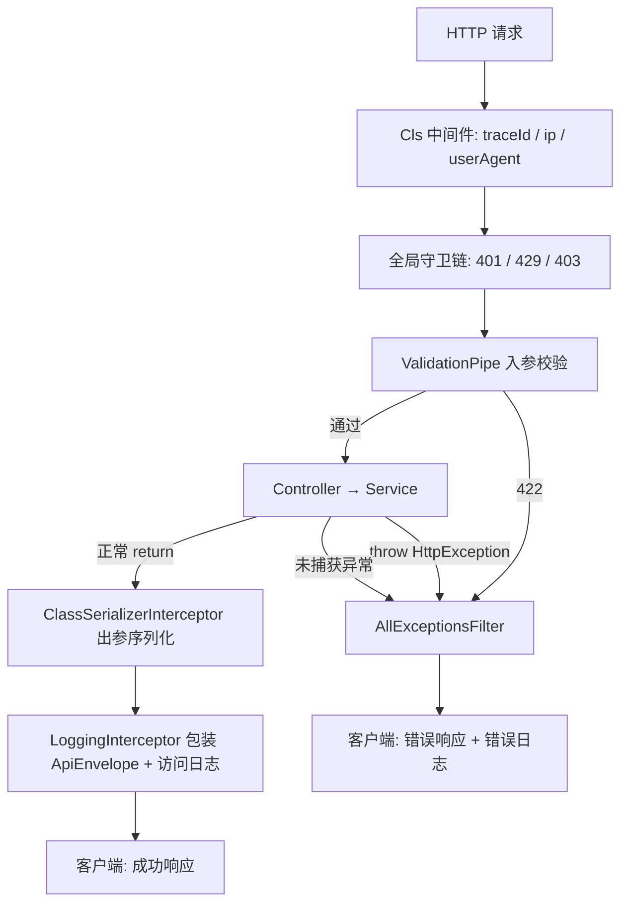
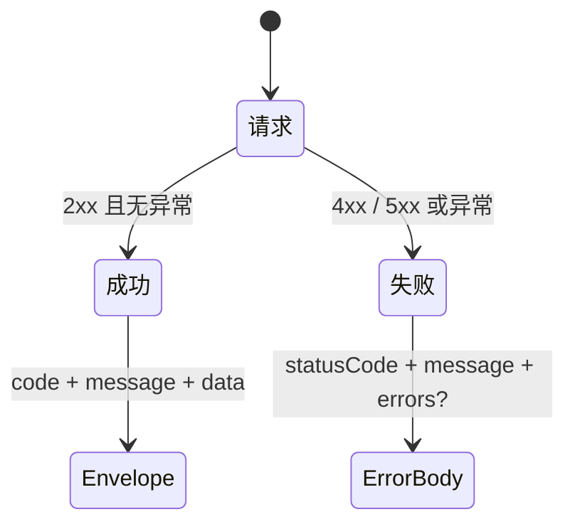

# 统一请求与异常响应

本文梳理 `apps/back` 中 **HTTP 成功响应包装** 与 **异常响应统一化** 的完整逻辑。读完本文，你应能回答：

- 成功时前端收到什么结构？错误时又是什么结构？
- 业务代码应如何抛出预期错误？应使用哪些 NestJS 内置异常类与状态码？
- 管道校验失败、守卫拦截、未捕获异常分别如何返回、如何记日志？
- 成功响应与错误响应在链路中的分工，以及与 `traceId`、出参序列化的关系。

> **适用范围：** 当前实现与本文档**仅覆盖 HTTP 请求/响应**（REST API）。WebSocket、Server-Sent Events（SSE）、文件流等传输方式**尚未**纳入统一 envelope 与异常过滤器，后续接入时需单独设计，见 [§10 待扩展传输方式](#10-待扩展传输方式)。
>
> 延伸阅读：
>
> - [DTO 与管道验证](../dto与管道验证/doc.md) — DTO 规则、`class-validator` 装饰器与 `generateErrors` 细节
> - [权限管理](../权限管理/权限管理.md) — `JwtAuthGuard`（401）、`PermissionsGuard`（403）与守卫链顺序
> - [邮箱密码登录](../邮箱（账号）、密码登录注册功能/邮箱密码登录.md) — 认证失败时的 `UnauthorizedException` / `UnprocessableEntityException` 用法

---

## 1. 核心原则：成功与错误是两套契约

可以把 API 响应想象成「两个出口」：

| 出口         | 负责组件              | 触发条件                             | 响应体形状                                                   |
| ------------ | --------------------- | ------------------------------------ | ------------------------------------------------------------ |
| **成功出口** | `LoggingInterceptor`  | Controller 正常 `return`，无异常抛出 | `{ code, message: 'ok', data }`                              |
| **错误出口** | `AllExceptionsFilter` | 任意环节 `throw` 或未捕获错误        | `{ statusCode, message, errors?, traceId, timestamp, path }` |

**设计要点：**

- **职责分离**：拦截器只包装成功响应；过滤器捕获全部异常，错误体**不会**再套一层 `ApiEnvelope`。
- **预期 vs 非预期**：`HttpException` 子类视为预期错误（4xx），记 `warn`；其余视为 500，记 `error` 并带堆栈。
- **可观测性**：成功访问日志与错误详情日志分工明确；响应头与错误体均携带 `traceId`，便于串联排查。
- **抛错规范**：业务与守卫层应使用 [`@nestjs/common` 内置 HTTP 异常](https://docs.nestjs.com/exception-filters#built-in-http-exceptions)，让过滤器正确解析 `statusCode` 与 `message` / `errors`。

---

## 2. HTTP 请求处理链路（全局视角）

一次 HTTP 请求在本项目中，与「响应形态」相关的环节如下：



**全局注册位置：**

| 机制                         | 注册方式             | 文件                          |
| ---------------------------- | -------------------- | ----------------------------- |
| `ValidationPipe`             | `main.ts` 全局管道   | `apps/back/src/main.ts`       |
| `ClassSerializerInterceptor` | `main.ts` 全局拦截器 | `apps/back/src/main.ts`       |
| `LoggingInterceptor`         | `APP_INTERCEPTOR`    | `apps/back/src/app.module.ts` |
| `AllExceptionsFilter`        | `APP_FILTER`         | `apps/back/src/app.module.ts` |

```21:26:apps/back/src/main.ts
  // dto入参校验
  app.useGlobalPipes(new ValidationPipe(validationOptions));

  // 响应体序列化：
  // 作用： 响应返回客户端前，按 class-transformer 装饰器序列化对象，控制哪些字段能出去。
  app.useGlobalInterceptors(new ClassSerializerInterceptor(app.get(Reflector)));
```

```111:118:apps/back/src/app.module.ts
    {
      provide: APP_INTERCEPTOR,
      useClass: LoggingInterceptor,
    },
    {
      provide: APP_FILTER,
      useClass: AllExceptionsFilter,
    },
```

> `LoggingInterceptor.intercept` 在 `context.getType() !== 'http'` 时直接透传，不参与 WebSocket 等其它上下文，见 [§10](#10-待扩展传输方式)。

---

## 3. 成功响应：`LoggingInterceptor` 与 `ApiEnvelope`

成功时，Controller 只需 `return` 业务数据；`LoggingInterceptor` 在响应发出前统一包装：

```13:18:apps/back/src/common/interceptors/logging.interceptor.ts
/** 成功响应统一 envelope（错误响应由 AllExceptionsFilter 处理） */
export interface ApiEnvelope<T> {
  code: number;
  message: string;
  data: T;
}
```

包装逻辑：

```82:88:apps/back/src/common/interceptors/logging.interceptor.ts
    return next.handle().pipe(
      map(
        (data): ApiEnvelope<unknown> => ({
          code: res.statusCode,
          message: 'ok',
          data,
        }),
      ),
```

### 3.1 成功响应示例

健康检查 `GET /health` 返回 `{ status: 'ok', timestamp: '...' }`，经拦截器后客户端实际收到：

```json
{
  "code": 200,
  "message": "ok",
  "data": {
    "status": "ok",
    "timestamp": "2026-07-03T07:00:00.000Z"
  }
}
```

登录成功时 `data` 为 token、用户信息等业务载荷；注册成功时 Service 可能在 `data` 内再带 `{ status: 201, message: '注册成功' }`——这是**业务层自定义字段**，与 envelope 的 `code`（HTTP 状态码，默认多为 200）是两层含义。若需改变 HTTP 状态码本身，在 Controller 方法上使用 `@HttpCode()`。

### 3.2 访问日志（与错误日志分工）

同一拦截器还负责 HTTP 访问日志（method、url、耗时、ip、userAgent、userId），慢请求超过 `LOG_SLOW_MS` 时以 `warn` 记录。出错时 `tap.error` 会补一条访问日志，**错误详情与堆栈由 `AllExceptionsFilter` 负责**，避免重复。

---

## 4. 错误响应：`AllExceptionsFilter`

`AllExceptionsFilter` 使用 `@Catch()` 捕获**所有**异常，归一化为固定 JSON 结构：

```18:25:apps/back/src/common/filters/all-exceptions.filter.ts
interface ErrorResponseBody {
  statusCode: number;
  message: string | string[];
  errors?: string;
  traceId?: string;
  timestamp: string;
  path: string;
}
```

```46:70:apps/back/src/common/filters/all-exceptions.filter.ts
    const body: ErrorResponseBody = {
      statusCode,
      message,
      errors,
      traceId,
      timestamp: new Date().toISOString(),
      path: request.originalUrl,
    };
    // ...
    if (statusCode >= 500) {
      this.logger.error(/* ... 带 stack */);
    } else {
      this.logger.warn(/* ... */);
    }

    response.status(statusCode).json(body);
```

### 4.1 异常归一化规则

```73:97:apps/back/src/common/filters/all-exceptions.filter.ts
  private normalize(exception: unknown): {
    statusCode: number;
    message: string | string[];
    errors?: string;
  } {
    if (exception instanceof HttpException) {
      const status = exception.getStatus();
      const res = exception.getResponse();

      if (typeof res === 'string') {
        return { statusCode: status, message: res };
      }
      const obj = res as { message?: string | string[]; errors?: string };
      return {
        statusCode: status,
        message: obj.message ?? exception.message,
        errors: obj.errors,
      };
    }

    return {
      statusCode: HttpStatus.INTERNAL_SERVER_ERROR,
      message: '服务器内部错误',
      errors: 'Internal Server Error',
    };
  }
```

| 异常类型                             | HTTP 状态               | `message` 来源                  | 日志级别        |
| ------------------------------------ | ----------------------- | ------------------------------- | --------------- |
| `HttpException` 子类                 | `exception.getStatus()` | 响应体 `message` 或异常默认文案 | 4xx → `warn`    |
| 非 `HttpException`（如运行时 Error） | `500`                   | `'服务器内部错误'`              | `error` + stack |

### 4.2 错误响应示例

**401 未认证**（`JwtStrategy` 会话失效）：

```json
{
  "statusCode": 401,
  "message": "会话已过期",
  "traceId": "550e8400-e29b-41d4-a716-446655440000",
  "timestamp": "2026-07-03T07:00:00.000Z",
  "path": "/auth/me"
}
```

**422 管道校验失败**（字段级 `errors`，见 [§5](#5-管道校验错误validation-optionsts)）：

```json
{
  "statusCode": 422,
  "message": "Unprocessable Entity Exception",
  "errors": {
    "email": ["email must be an email"],
    "password": ["password is not strong enough"]
  },
  "traceId": "...",
  "timestamp": "...",
  "path": "/auth/register"
}
```

**500 未预期错误**：

```json
{
  "statusCode": 500,
  "message": "服务器内部错误",
  "errors": "Internal Server Error",
  "traceId": "...",
  "timestamp": "...",
  "path": "/user/xxx"
}
```

---

## 5. 管道校验错误：`validation-options.ts`

入参格式校验由全局 `ValidationPipe` 完成，选项集中在 `apps/back/src/utils/validate/validation-options.ts`。校验失败时通过 `exceptionFactory` 抛出 `UnprocessableEntityException`，并交给 `AllExceptionsFilter` 输出统一错误体。

```23:35:apps/back/src/utils/validate/validation-options.ts
const validationOptions: ValidationPipeOptions = {
  whitelist: true, // 静默删掉 DTO 里没有的字段，只把合法字段交给 Controller
  transform: true, // 自动转成 DTO 实例
  forbidNonWhitelisted: true, // 一旦发现多余字段，直接报错，请求不会进入 Controller
  errorHttpStatusCode: HttpStatus.UNPROCESSABLE_ENTITY,
  exceptionFactory: (errors: ValidationError[]) => {
    console.log(errors);
    return new UnprocessableEntityException({
      status: HttpStatus.UNPROCESSABLE_ENTITY,
      errors: generateErrors(errors),
    });
  },
};
```

`generateErrors` 将 `class-validator` 的 `ValidationError[]` 转为 **`{ 字段名: 错误信息[] }`**，并递归处理嵌套 DTO / 数组元素：

```9:19:apps/back/src/utils/validate/validation-options.ts
function generateErrors(errors: ValidationError[]) {
  return errors.reduce(
    (accumulator, currentValue) => ({
      ...accumulator,
      [currentValue.property]:
        (currentValue.children?.length ?? 0) > 0
          ? generateErrors(currentValue.children ?? [])
          : Object.values(currentValue.constraints ?? {}),
    }),
    {},
  );
}
```

| 选项                   | 值     | 与响应的关系                          |
| ---------------------- | ------ | ------------------------------------- |
| `errorHttpStatusCode`  | `422`  | 校验失败 HTTP 状态为 422              |
| `forbidNonWhitelisted` | `true` | 多余字段也走同一套 422 + `errors`     |
| `exceptionFactory`     | 自定义 | 将字段错误放入 `errors`，供过滤器透传 |

> DTO 装饰器写法、`whitelist` / `transform` 的完整说明见 [DTO 与管道验证](../dto与管道验证/doc.md#4-全局验证配置validation-optionsts)。

---

## 6. 如何抛出业务错误：内置 HTTP 异常

**应使用** NestJS [`@nestjs/common` 内置 HTTP 异常类](https://docs.nestjs.com/exception-filters#built-in-http-exceptions)，它们均继承 `HttpException`，过滤器能正确解析状态码与响应体。

### 6.1 本项目常用异常与状态码

| 异常类                         | 状态码 | 典型场景（本项目）                                 |
| ------------------------------ | ------ | -------------------------------------------------- |
| `BadRequestException`          | 400    | 请求语义错误（可按需使用）                         |
| `UnauthorizedException`        | 401    | JWT 无效、会话过期（`JwtStrategy`）                |
| `ForbiddenException`           | 403    | 权限不足（`PermissionsGuard`）                     |
| `NotFoundException`            | 404    | 资源不存在（如用户、角色、菜单）                   |
| `ConflictException`            | 409    | 唯一约束冲突（如权限码、系统菜单删除）             |
| `UnprocessableEntityException` | 422    | 管道校验失败、业务字段错误（邮箱已注册、密码错误） |
| （非 HttpException）           | 500    | 未捕获异常，由过滤器兜底                           |

限流由 `AppThrottlerGuard` 抛出 **429 Too Many Requests**（NestJS Throttler 内置行为）。

### 6.2 推荐写法

**① 简单文案**——适合 404、403 等单条提示：

```typescript
throw new NotFoundException(`用户 ${id} 不存在`);
throw new ForbiddenException('权限不足，无法访问该资源');
```

**② 带 `message` 对象**——适合 401 等需自定义文案：

```37:40:apps/back/src/auth/strategies/jwt.strategy.ts
      throw new UnauthorizedException({
        message: '会话已过期',
        status: HttpStatus.UNAUTHORIZED,
      }); // 或 ForbiddenException
```

**③ 带字段级 `errors`**——适合 422 业务校验，与管道校验结构一致，便于前端统一展示：

```39:44:apps/back/src/auth/auth.service.ts
      throw new UnprocessableEntityException({
        status: HttpStatus.UNPROCESSABLE_ENTITY,
        errors: {
          email: '账号密码错误',
        },
      });
```

管道校验的 `errors` 值为**字符串数组**；业务层常用**单个字符串**，前端可按字段聚合展示。

### 6.3 不应做的事

| 不推荐                                    | 原因                                           |
| ----------------------------------------- | ---------------------------------------------- |
| `throw new Error('...')` 表达预期业务失败 | 会变成 500，且文案对外暴露为「服务器内部错误」 |
| 手动 `response.status().json()`           | 绕过过滤器，破坏统一格式与日志                 |
| 随意自定义非标准 HTTP 状态码              | 应优先使用上表内置异常对应的标准码             |

---

## 7. 出参序列化：`ClassSerializerInterceptor`

成功响应在进入 `LoggingInterceptor` 之前，会先经过 `ClassSerializerInterceptor`（`main.ts` 全局注册）。它按实体/DTO 上的 `class-transformer` 装饰器（如 `@Exclude()`）过滤敏感字段。

例如 `User` 实体的 `password` 标注了 `@Exclude()`，序列化后不会出现在 `data` 中。这与 **入参** `ValidationPipe` + `class-validator` 是不同方向：

| 对比项   | 入参 ValidationPipe | 出参 ClassSerializerInterceptor                 |
| -------- | ------------------- | ----------------------------------------------- |
| 触发时机 | Controller 执行前   | Controller 返回后、Envelope 包装前              |
| 主要工具 | `class-validator`   | `class-transformer`（`@Exclude`、`@Expose` 等） |
| 失败后果 | 422 + `errors`      | 不抛错，仅控制输出字段                          |

---

## 8. `traceId` 与日志串联

每个 HTTP 请求进入时，`ClsModule` 中间件写入 `traceId`（优先透传 `x-request-id`，否则生成 UUID），并写入响应头：

```52:59:apps/back/src/app.module.ts
        setup: (cls, req, res) => {
          // 链路追踪 ID：优先透传上游/网关的 x-request-id，否则生成
          const incoming = req.headers[TRACE_ID_HEADER];
          // 同一请求的所有日志带相同 ID，可串联排查。
          const traceId = (typeof incoming === 'string' && incoming.trim()) || randomUUID();
          cls.set(LOG_CLS_TRACE_ID, traceId);
          // 将 traceId 设置到响应头，供下游/网关消费。
          res.setHeader(TRACE_ID_HEADER, traceId);
```

`AllExceptionsFilter` 从 CLS 读取同一 `traceId` 写入错误体；Winston 日志格式化也会附带该 ID。前端排查时可用响应头或错误体中的 `traceId` 在后端日志中检索完整链路。

---

## 9. 前端对接要点（HTTP）



| 字段   | 成功（`ApiEnvelope`） | 错误（`ErrorResponseBody`）      |
| ------ | --------------------- | -------------------------------- |
| 状态   | `code`（HTTP 状态码） | `statusCode`                     |
| 提示   | 固定 `'ok'`           | 异常 `message`（可为字符串数组） |
| 载荷   | `data`                | 无；可选 `errors`（字段错误）    |
| 追踪   | 响应头 `x-request-id` | 响应头 + 体中 `traceId`          |
| 元信息 | 无                    | `timestamp`、`path`              |

建议前端：**以 HTTP 状态码或成功体/错误体的区分字段作为分支依据**；422 时统一读取 `errors` 做表单提示。

---

## 10. 待扩展传输方式

当前 `apps/back` **未**对以下传输方式做统一响应/异常约定，本文 §2–§9 均**不适用**：**可以使用自定义装饰器，在其它请求方式中把对应不支持的请求过滤掉**

| 传输方式                      | 当前状态 | 说明                                                                                                   |
| ----------------------------- | -------- | ------------------------------------------------------------------------------------------------------ |
| **WebSocket**                 | 未接入   | 无 Gateway；`LoggingInterceptor` 对非 `http` 上下文直接 `return next.handle()`，不会包装 `ApiEnvelope` |
| **SSE（Server-Sent Events）** | 未接入   | 长连接流式推送需单独约定事件格式与断线重连                                                             |
| **文件流 / 二进制下载**       | 未统一   | 若直接 `StreamableFile` 或写 raw body，不应再套 JSON envelope                                          |
| **GraphQL / gRPC 等**         | 未接入   | 各自有独立的错误模型，不宜复用 HTTP 过滤器                                                             |

后续若接入 WebSocket 或流式接口，建议单独评估：

1. 是否沿用 `{ code, message, data }` 作为**单帧消息**格式，还是采用协议层原生帧（如 WS `JSON.stringify` 自定义 `type` 字段）；
2. 异常是走 HTTP 握手阶段（仍由 `AllExceptionsFilter` 处理），还是在连接内以业务错误消息下发；
3. 是否为 WS 单独注册 `WsExceptionFilter`，并与 HTTP 过滤器共享 `traceId` / 日志规范。

在方案落地前，贡献者请勿假设非 HTTP 接口会自动获得与 REST 相同的响应结构。

---

## 11. 与相邻模块的边界

| 环节     | 文档                                                              | 失败状态           | 响应经手                                            |
| -------- | ----------------------------------------------------------------- | ------------------ | --------------------------------------------------- |
| 身份认证 | [邮箱密码登录](../邮箱（账号）、密码登录注册功能/邮箱密码登录.md) | 401                | `AllExceptionsFilter`                               |
| 权限校验 | [权限管理](../权限管理/权限管理.md)                               | 403                | 同上                                                |
| 限流     | Throttle 模块                                                     | 429                | 同上                                                |
| 入参格式 | [DTO 与管道验证](../dto与管道验证/doc.md)                         | 422                | 同上                                                |
| 业务规则 | 各 Service                                                        | 422 / 404 / 409 等 | 同上                                                |
| 成功数据 | 各 Controller                                                     | 2xx                | `ClassSerializerInterceptor` → `LoggingInterceptor` |

管道校验与 Service 业务校验**共用 422**，且 `errors` 均为「字段 → 提示」结构，便于前端一套逻辑处理；语义上仍应区分「格式不对」（DTO）与「业务不满足」（Service）。

---

## 12. 参考文档

1. [NestJS Exception Filters — Built-in HTTP exceptions](https://docs.nestjs.com/exception-filters#built-in-http-exceptions) — 内置异常类与标准状态码
2. [NestJS Exception Filters](https://docs.nestjs.com/exception-filters) — 过滤器机制
3. [NestJS Interceptors](https://docs.nestjs.com/interceptors) — 拦截器与响应变换
4. [NestJS Validation Pipe](https://docs.nestjs.com/techniques/validation) — 全局校验管道
5. [NestJS Serialization](https://docs.nestjs.com/techniques/serialization) — `ClassSerializerInterceptor` 与 `@Exclude`
6. [NestJS WebSockets Exception Filters](https://docs.nestjs.com/websockets/exception-filters) — 后续接入 WS 时可参考
7. [项目内：DTO 与管道验证](../dto与管道验证/doc.md) — 入参校验细节
8. [异常处理和统一响应（Moment 资料）](https://github.com/lcllpz/nest/blob/main/moment%E5%A4%A7%E4%BD%AC%E7%9A%84%E8%B5%84%E6%96%99/docs-main/nestjs/8.%20%E5%BC%82%E5%B8%B8%E5%A4%84%E7%90%86%E5%92%8C%E7%BB%9F%E4%B8%80%E5%93%8D%E5%BA%94.md) — 设计背景参考
