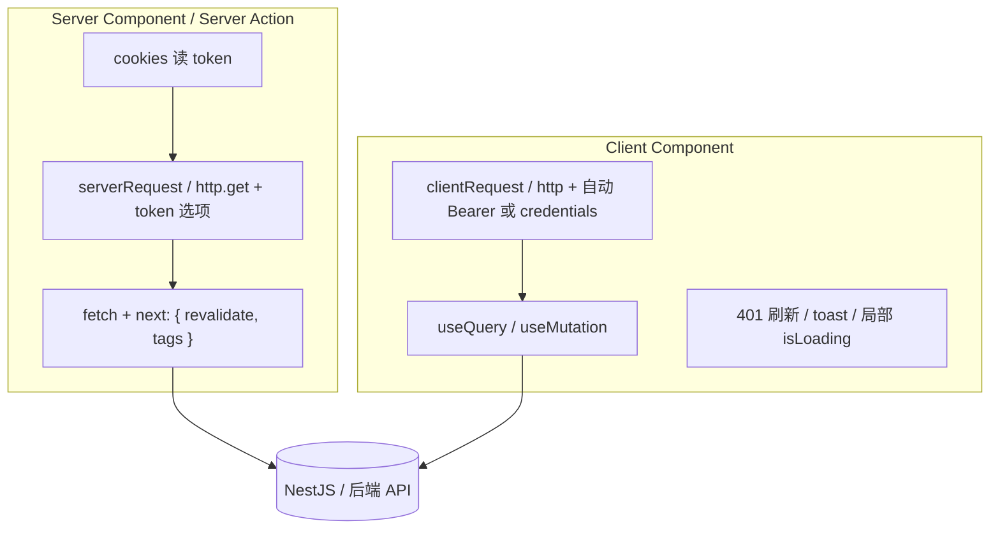

# 三项目 Next.js 对比与本仓库结构规范

> 对比对象：`otherProjects/DocFlow`、`otherProjects/boilerplate/extensive-react-boilerplate`、`otherProjects/creator-lane-ai/apps/frontend`  
> 目标：沉淀本仓库（Full-Stack-Template）的目录约定，并回答传输层、Token、RSC/Client 边界与横切能力（401、刷新、取消、错误、Loading）怎么落地。

---

## 一、三项目速览

| 维度        | DocFlow                                                   | extensive-react-boilerplate                                                         | creator-lane-ai frontend                                              |
| ----------- | --------------------------------------------------------- | ----------------------------------------------------------------------------------- | --------------------------------------------------------------------- |
| 形态        | Turbo monorepo，主应用在 `apps/DocFlow`                   | 单仓 Next App Router                                                                | Monorepo 子应用 `apps/frontend`                                       |
| Next        | 16.1.5                                                    | 16.2.0                                                                              | 16.2.x                                                                |
| 传输层      | **原生 fetch**（`client.ts` / `server.ts`）               | **原生 fetch**（`useFetch` Hook）                                                   | **原生 fetch**（`ClientRequest` 类）                                  |
| axios       | 未使用（`package.json` 有 ofetch 依赖，业务层未检出使用） | 未使用                                                                              | 未使用                                                                |
| 状态层      | TanStack Query                                            | TanStack Query                                                                      | TanStack Query（部分场景）+ Zustand                                   |
| Token 存储  | **Cookie**（`auth_token`、`refresh_token` 等，JS 可读）   | **js-cookie** 单 key `auth-token-data`（JSON：token / refreshToken / tokenExpires） | **HttpOnly Cookie 会话**（`withCredentials: true`，不靠 JS 读 token） |
| 路由守卫    | `src/proxy.ts`（Next 16 proxy，校验 cookie 过期）         | Client HOC `withPageRequiredAuth`                                                   | `AuthProvider` + 公开路径判断                                         |
| Server 取数 | 有独立 `serverRequest`（无鉴权/刷新）                     | 几乎全 Client 页面                                                                  | 营销页等 RSC 不请求 API；业务请求在 Client                            |

**共同结论：三个项目都选 fetch，没有用 axios；差异在「封装形态」和「Token 放 Cookie 还是仅 Session Cookie」。**

---

## 二、各项目目录结构（职责）

### 2.1 DocFlow（`apps/DocFlow/src`）

```text
src/
├── app/                    # App Router 页面（dashboard、rooms、auth 等）
├── components/             # UI 与业务组件
├── extensions/             # Tiptap 扩展
├── hooks/                  # useUserQuery 等 React Query 封装
├── providers/              # QueryProvider、AuthProvider（Client）
├── services/
│   ├── request/            # ★ 核心：client.ts + server.ts + types
│   ├── auth/               # authApi
│   ├── organization/       # 领域 Service 类 + request 调用
│   └── …                   # 其他领域 API
├── utils/
│   ├── auth/cookie.ts      # saveAuthData / getCookie / clearAuthData
│   └── constants/          # routes、http
├── proxy.ts                # 路由级鉴权（cookie 是否存在/过期）
└── styles/
```

**特点：** 请求层按 **Client / Server 拆文件**；领域层用 **Service 类** 包业务 URL；横切能力（401 刷新、队列、SSE）集中在 `client.ts`。

### 2.2 extensive-react-boilerplate（`src`）

```text
src/
├── app/[language]/         # 多语言路由；多数 page-content 为 Client
├── components/             # 表单、表格、对话框等
└── services/
    ├── api/
    │   ├── use-fetch.ts    # ★ 统一 fetch：语言头、Bearer、过期前刷新
    │   ├── config.ts
    │   ├── wrapper-fetch-json-response.ts
    │   └── services/       # auth.ts、users.ts…（返回 useXxxService Hook）
    ├── auth/               # AuthProvider、cookie 读写、页面守卫 HOC
    ├── react-query/        # QueryClient、Provider、query-key-factory
    └── i18n、social-auth…
```

**特点：** API 以 **`useFetch` + `useXxxService`** 暴露（必须在 Client 组件/hook 里用）；没有独立的 server 请求模块。

### 2.3 creator-lane-ai frontend（`src`）

```text
src/
├── app/                    # layout（AuthProvider）、页面
├── components/             # auth-provider、UI
├── extensions/             # 编辑器相关
├── services/
│   ├── request.ts          # ★ ClientRequest（fetch 封装）
│   ├── auth.ts             # 登录/登出/me，withCredentials + CSRF
│   └── agent.ts            # 流式 SSE 直接用 fetch
├── stores/                 # Zustand（若存在）
└── lib/
```

**特点：** 会话走 **Cookie + credentials**；`request.ts` **不实现 401 自动刷新**；错误多返回 `{ data, error }` 而非 throw。

---

## 三、请求方案怎么实现的？

### 3.1 都用 fetch，封装形态不同

| 项目         | 入口                              | 封装要点                                                                            |
| ------------ | --------------------------------- | ----------------------------------------------------------------------------------- |
| DocFlow      | `clientRequest` / `serverRequest` | 类封装；`{ data, error, status }`；Client 带 Sentry、重试、401 队列刷新、SSE/stream |
| boilerplate  | `useFetch()`                      | Hook 包装 fetch；返回原生 `Response`，再 `wrapperFetchJsonResponse` 解析            |
| creator-lane | `clientRequest`（默认导出）       | 类封装；`RequestResult`；超时/重试/Abort；**无** 401 刷新                           |
| **本仓库**   | `http` / `request()`              | 薄封装；`RequestError` throw；`next.revalidate/tags`；可选 `token` 参数             |

### 3.2 DocFlow Client 层（最完整）

- `Authorization: Bearer ${getCookie('auth_token')}`
- 401 → `refreshAccessToken()` → 失败队列重放 → 仍失败则 `clearAuthData` + 跳转登录
- `signal` / `createCancelToken()` 支持取消
- `errorHandler` per-request + Sentry

### 3.3 boilerplate

```ts
// use-fetch.ts 核心行为
// 1. 注入 x-custom-lang、Content-Type、Authorization: Bearer token
// 2. tokenExpires 距过期 < 60s → 先 POST refresh，再发业务请求
// 3. 返回原生 fetch Response（401 不在此统一重试，由业务/AuthProvider 处理）
```

登录写入（`sign-in/page-content.tsx`）：

```ts
setTokensInfo({ token, refreshToken, tokenExpires });
// → js-cookie 存 AUTH_TOKEN_KEY = "auth-token-data"
```

`AuthProvider` 启动时 `GET /v1/auth/me`，**401 则 logOut()**。

### 3.4 creator-lane

- 业务 API：`clientRequest.get/post(..., { withCredentials: true })`
- 登录后依赖 **服务端 Set-Cookie**，浏览器自动带 cookie，**不在 Header 里手写 Bearer**
- CSRF：先 `GET /security/csrf-token`，再带 `X-CSRF-Token`
- 流式：`agent.ts` 直接用 `fetch` + `AbortSignal`

### 3.5 本仓库（`apps/front/src/services/request.ts`）

- `token` 显式传入（Server）或 `getClientToken()` 读 **非 httpOnly** 的 `token` cookie
- `credentials: 'include'` 同源带 cookie
- **尚未实现**：401 刷新队列、全局 toast、React Query 层统一 onError

---

## 四、fetch 场景下 Token 怎么管、怎么带？

| 策略                        | 代表项目            | 登录后存哪                                      | 怎么带到请求                                                             |
| --------------------------- | ------------------- | ----------------------------------------------- | ------------------------------------------------------------------------ |
| **可读 Cookie + Bearer**    | DocFlow             | `saveAuthData` → `auth_token`、`refresh_token`… | Client：`getCookie` → `Authorization`；Proxy：读 `auth_token` 做路由守卫 |
| **js-cookie JSON + Bearer** | boilerplate         | `auth-token-data`                               | `useFetch` 读 `getTokensInfo()` → Bearer；过期前 proactive refresh       |
| **HttpOnly Session Cookie** | creator-lane        | 服务端 Set-Cookie（JS 不读 token）              | `credentials: 'include'` + CSRF 头                                       |
| **本仓库（当前）**          | Full-Stack-Template | 约定 cookie 名 `token`（可 httpOnly）           | 显式 `options.token` 或可读 cookie → Bearer；httpOnly 时靠 `credentials` |

**选型建议（本仓库）：**

- 与 NestJS 同源部署：优先 **httpOnly cookie + credentials**，Server 用 `cookies()` 转发或 BFF Route Handler，避免 XSS 偷 token。
- 需要跨域纯 API：Bearer + **短期 access + refresh**（参考 DocFlow 的刷新队列或 boilerplate 的过期前刷新）。
- Server Component 调后端：**必须** `(await cookies()).get('token')` 传入 `usersApi.xxx(_, { token })`，不能依赖 `document.cookie`。

---

## 五、Client Component vs Server Component：请求怎么分？



| 能力       | Server                                              | Client                                | 说明                                                             |
| ---------- | --------------------------------------------------- | ------------------------------------- | ---------------------------------------------------------------- |
| 发 HTTP    | `serverRequest` / `http` + `token` from `cookies()` | `clientRequest` / `http` / `useFetch` | Server **不要**用 `useFetch`、不要读 `document.cookie`           |
| Next 缓存  | ✅ `next.revalidate` / `tags`                       | ❌ 无意义                             | 仅 Server fetch                                                  |
| 401 / 刷新 | 一般 **redirect 或抛错**，不做队列                  | ✅ 适合集中处理                       | DocFlow 全在 client；本仓库建议在 Client 传输层或 Query 全局处理 |
| 取消       | `signal`（请求结束即失效）                          | `AbortSignal` + Query `signal`        | boilerplate `useInfiniteQuery` 已传 `signal`                     |
| 错误提示   | 少用 toast；用 `error.tsx` / redirect               | toast / sonner / react-toastify       | 按交互发生在哪侧                                                 |
| Loading    | 无 hook；用 `loading.tsx` / Suspense                | `isLoading` / `isPending` / Skeleton  | **局部 loading 主要在 Client**                                   |

**三项目实践：**

- **DocFlow：** 明确 `serverRequest`（无 token 刷新）与 `clientRequest`（全功能）；RSC 可直调 `serverRequest`，交互页用 React Query + `clientRequest`。
- **boilerplate：** 页面多为 Client，`useGetUsersService` 只能在 Client；Server 仅 metadata/i18n。
- **creator-lane：** 业务请求几乎全在 Client；RSC 负责静态/营销 UI。

---

## 六、401、刷新 Token、取消、错误提示、局部 Loading — 是否都需要？

**不是每个请求都要全套；按「会话形态 + 请求发生位置」裁剪。**

| 能力              | 是否建议有              | 放哪一层                                      | 三项目情况                                                                                    |
| ----------------- | ----------------------- | --------------------------------------------- | --------------------------------------------------------------------------------------------- |
| **401 处理**      | ✅                      | Client 传输层或 AuthProvider                  | DocFlow：自动刷新+跳登录；boilerplate：/me 401 登出；creator-lane：靠 cookie 会话，未统一 401 |
| **Refresh token** | 有 refresh 方案时 ✅    | 仅 Client（或 BFF）                           | DocFlow：401 触发 + 队列；boilerplate：过期**前** 60s 刷新；creator-lane：未在 request 层实现 |
| **取消请求**      | 搜索/切页/重复提交时 ✅ | `AbortSignal` → fetch / Query                 | 三者均支持 signal；Query 内置取消过时 query                                                   |
| **错误提示**      | 用户触发的写操作 ✅     | Mutation `onError` 或传输层可选 toast         | DocFlow：`errorHandler` + sonner；boilerplate：表单字段错误 + ToastContainer                  |
| **局部 Loading**  | 列表/按钮级 ✅          | **TanStack Query**（`isLoading`/`isPending`） | 三项目均用 Query 管 UI loading，而非在 fetch 封装里全局 spinner                               |

### 6.1 推荐处理矩阵（本仓库）

| 场景                   | 401/刷新                                                                      | 取消                    | 错误                                                  | Loading                       |
| ---------------------- | ----------------------------------------------------------------------------- | ----------------------- | ----------------------------------------------------- | ----------------------------- |
| Server 预取列表（RSC） | 失败 → `redirect('/login')` 或展示空态                                        | 通常不需要              | `error.tsx`                                           | `loading.tsx`                 |
| Client `useQuery`      | 传输层 401 一次刷新；仍 401 → 清 cookie + `router.push('/login')`             | `queryFn` 里传 `signal` | 全局 `QueryCache.onError` 可选；列表用 `isError` 内联 | `isLoading` / Skeleton        |
| Client `useMutation`   | 同左                                                                          | 可选 AbortController    | `onError` → toast                                     | `isPending` 禁用按钮          |
| Server Action 写操作   | 后端返回 401 → Action 返回 `{ ok: false, code: 'UNAUTHORIZED' }`，Client 跳转 | —                       | 返回 message 给表单                                   | `useTransition` / `isPending` |

### 6.2 本仓库后续可借鉴的增量（非必须一次做完）

1. **Client 401 + refresh**（参考 DocFlow `executeWithRetry` + 刷新队列）。
2. **Server token**（已有 `options.token`，在 RSC 示例里写清 `cookies()` 用法）。
3. **Query 全局**（可选）：

```ts
// query-client.ts 示意
new QueryClient({
  defaultOptions: {
    queries: {
      retry: (count, err) =>
        err instanceof RequestError && err.status === 401 ? false : count < 2,
    },
  },
  queryCache: new QueryCache({
    onError: (err) => {
      /* 非 401 再 toast */
    },
  }),
});
```

4. **proxy/middleware**：参考 DocFlow `proxy.ts` 做路由级 cookie 校验（本仓库 `apps/front/src/proxy.ts` 仍为占位）。

---

## 七、本仓库推荐结构（沉淀版）

在现有 `docs/前端请求方案选型.md` 与 `apps/front/src/services` 基础上，建议固定为：

```text
apps/front/src/
├── app/                         # RSC 页面；需要交互的子树再拆 Client 组件
├── components/                  # UI；带状态的加 'use client'
├── lib/                         # cn、纯工具，无请求
├── hooks/                       # 跨领域 UI hooks（可选）
├── services/
│   ├── request.ts               # 传输层：fetch 薄封装（Server + Client 共用）
│   ├── query-client.ts
│   ├── query-provider.tsx
│   ├── index.tsx
│   └── <domain>/                # 如 users/
│       ├── types.ts
│       ├── api.ts               # 纯函数，可 await；Server 传 { token }
│       ├── queries.ts           # queryKey + queryOptions
│       └── hooks.ts             # useQuery / useMutation（仅 Client）
├── stores/                      # 仅 UI 态（侧边栏、主题），不存 token
└── proxy.ts                     # 路由守卫（cookie / 重定向）
```

**分层口诀（与三项目对齐）：**

1. **传输层**只关心 URL、Header、Body、错误类型、Next 缓存选项。
2. **api.ts** 只映射 REST 路径，可被 RSC `await`。
3. **queries.ts / hooks.ts** 只管缓存与组件状态。
4. **Token** 不进 Zustand；Server 用 `cookies()`，Client 用 cookie/credentials 或传输层注入。
5. **401/刷新/跳登录** 放在 Client 传输层或 AuthProvider，不要散落在每个页面。

---

## 八、对照本仓库现状

| 项         | 现状                             | 建议                                                   |
| ---------- | -------------------------------- | ------------------------------------------------------ |
| 传输层     | ✅ `request.ts` fetch 薄封装     | 保持                                                   |
| 领域分层   | ✅ `users/api + queries + hooks` | 新模块复制模板                                         |
| Token      | ✅ 支持 `token` + cookie 读取    | 文档化 Server 用法；选定 httpOnly 或 Bearer 一种主路径 |
| 401/刷新   | ❌ 未实现                        | 有 refresh 接口时借鉴 DocFlow                          |
| 路由守卫   | ⚠️ proxy 占位                    | 借鉴 DocFlow                                           |
| 错误/toast | ❌ 未统一                        | Mutation 局部 + 可选 QueryCache                        |
| Loading    | ✅ Query hooks                   | 保持 `isLoading` / `isPending`                         |

更细的 fetch vs TanStack Query 选型见：[前端请求方案选型.md](./前端请求方案选型.md)。

---

## 九、参考文件索引

| 项目         | 关键路径                                                                                                        |
| ------------ | --------------------------------------------------------------------------------------------------------------- |
| DocFlow      | `apps/DocFlow/src/services/request/client.ts`、`server.ts`、`utils/auth/cookie.ts`、`proxy.ts`                  |
| boilerplate  | `src/services/api/use-fetch.ts`、`src/services/auth/auth-tokens-info.ts`、`src/services/auth/auth-provider.tsx` |
| creator-lane | `apps/frontend/src/services/request.ts`、`services/auth.ts`、`components/auth-provider.tsx`                     |
| 本仓库       | `apps/front/src/services/request.ts`、`users/*`、`docs/前端请求方案选型.md`                                     |
