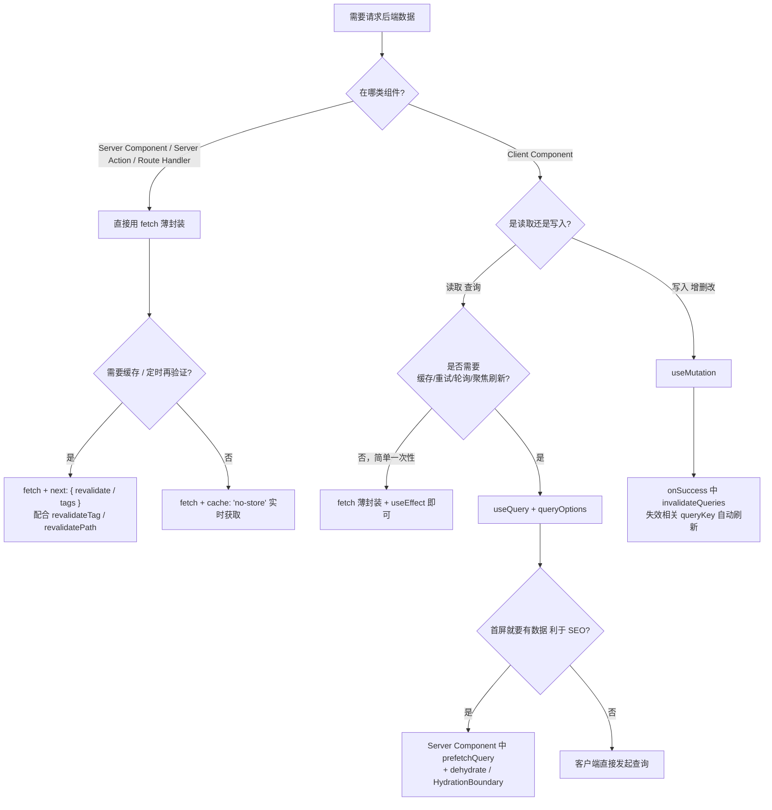

# 前端请求方案选型笔记

> 适用项目：Next.js 16（App Router）+ React 19 前端 / NestJS 后端（本仓库）
> 主题：前端如何请求后端接口，以及服务端状态如何管理。

---

## 一、核心认知：两层不同的问题

很多人纠结「用 fetch 还是 axios」，其实把两件事混在一起了。请求数据实际上分两层：

| 层级   | 解决的问题                                                   | 可选方案                 |
| ------ | ------------------------------------------------------------ | ------------------------ |
| 传输层 | 怎么把数据**拿回来**（发请求、收响应）                       | `fetch` / `axios`        |
| 状态层 | 拿回来的数据怎么**管理**（缓存、loading、error、刷新、重试） | `TanStack Query` / `SWR` |

一句话记忆：

> **fetch/axios = 怎么把数据拿回来；TanStack Query/SWR = 数据拿回来后怎么管理。**
> 两者是**配合关系**，不是二选一。

---

## 二、fetch vs axios

### 结论

> **App Router 项目：以原生 `fetch` 为主，按需薄封装；只有特定场景才用 axios。**

### 为什么 Next.js 时代 fetch 地位变了

Next.js（尤其 App Router）对原生 `fetch` 做了**深度增强**，这是 axios 享受不到的：

```ts
fetch('https://api.example.com/data', {
  next: { revalidate: 60 }, // ISR 增量静态再生成
  next: { tags: ['posts'] }, // 按 tag 重新验证缓存
  cache: 'force-cache', // 请求级缓存控制
});
```

`revalidateTag` / `revalidatePath` 等核心特性**只对 fetch 生效**。在 Server Component / Server Action 里用 axios，等于放弃 Next.js 一半的数据层能力。

### 对比表

| 维度               | 原生 fetch           | axios             |
| ------------------ | -------------------- | ----------------- |
| 体积               | 0（内置）            | ~13KB             |
| Next.js 缓存集成   | ✅ 原生支持          | ❌ 不支持         |
| 拦截器 interceptor | ❌ 需手动封装        | ✅ 内置           |
| 自动 JSON 解析     | ❌ 要 `.json()`      | ✅ 自动           |
| 超时控制           | 需 `AbortController` | ✅ `timeout` 配置 |
| 错误处理           | 4xx/5xx 不会 reject  | ✅ 自动 reject    |
| 上传进度           | ❌ 不支持            | ✅ 支持           |
| 老浏览器兼容性     | 一般                 | 更好              |

### 按场景选择

- **App Router（推荐）**
  - Server Component / Server Action / Route Handler → **必须用 fetch**，享受缓存与再验证。
  - Client Component → fetch 薄封装，配合 TanStack Query / SWR。
- **Pages Router（老项目）**
  - 没有 fetch 增强红利，axios 的拦截器（统一 token、错误处理、loading）体验更顺手，用 axios 合理。

### fetch 薄封装示例

```ts
async function request<T>(url: string, options?: RequestInit): Promise<T> {
  const res = await fetch(`${process.env.NEXT_PUBLIC_API_URL}${url}`, {
    ...options,
    headers: { 'Content-Type': 'application/json', ...options?.headers },
  });
  if (!res.ok) throw new Error(`请求失败: ${res.status}`);
  return res.json();
}
```

### 关于 axios 拦截器这个「杀手锏」

axios 常被选用是因为拦截器能统一处理：自动注入 JWT、401 自动刷新 token / 跳登录、统一错误弹窗。
但在 Next.js 中要注意：**axios 拦截器在 Server 端访问不到浏览器的 localStorage / document**，SSR 场景下 token 注入会比较别扭。这些需求用 fetch 薄封装 + TanStack Query 同样能优雅实现。

---

## 三、TanStack Query 与 SWR 是什么

它们是 React 生态的**服务端状态管理库**，不替代 fetch/axios，而是在其之上解决：

- 🔄 loading 状态　❌ error 状态　💾 缓存（避免重复请求）
- 🔁 失败重试　♻️ 数据过期自动刷新　🪟 窗口聚焦自动更新　🗑️ 缓存失效重取

否则每个组件都要写一堆 `useState` + `useEffect`，啰嗦且易出 bug。

| 库                                     | 简介                                                                                  |
| -------------------------------------- | ------------------------------------------------------------------------------------- |
| **TanStack Query**（旧名 React Query） | 功能最强大的服务端状态管理库，TanStack 团队维护                                       |
| **SWR**                                | Vercel（Next.js 官方）出品的轻量请求库，名字来自 HTTP 缓存策略 Stale-While-Revalidate |

### 用库前后对比

不用库：

```tsx
function UserProfile() {
  const [user, setUser] = useState(null);
  const [loading, setLoading] = useState(true);
  const [error, setError] = useState(null);

  useEffect(() => {
    setLoading(true);
    fetch('/api/user')
      .then((res) => res.json())
      .then(setUser)
      .catch(setError)
      .finally(() => setLoading(false));
  }, []);

  if (loading) return <div>加载中...</div>;
  if (error) return <div>出错了</div>;
  return <div>{user.name}</div>;
}
```

用 TanStack Query：

```tsx
import { useQuery } from '@tanstack/react-query';

function UserProfile() {
  const {
    data: user,
    error,
    isLoading,
  } = useQuery({
    queryKey: ['user'],
    queryFn: () => fetch('/api/user').then((res) => res.json()),
  });

  if (isLoading) return <div>加载中...</div>;
  if (error) return <div>出错了</div>;
  return <div>{user.name}</div>;
}
```

用 SWR：

```tsx
import useSWR from 'swr';

const fetcher = (url) => fetch(url).then((res) => res.json());

function UserProfile() {
  const { data: user, error, isLoading } = useSWR('/api/user', fetcher);

  if (isLoading) return <div>加载中...</div>;
  if (error) return <div>出错了</div>;
  return <div>{user.name}</div>;
}
```

---

## 四、TanStack Query vs SWR 怎么选

### 一句话结论

> **业务复杂、写操作多（增删改查、后台管理系统）→ TanStack Query；
> 项目偏读取展示、追求轻量、贴 Next.js 生态 → SWR。**

### 关键差异

1. **写操作（Mutation）—— 最大分水岭**
   - TanStack Query 有专门的 `useMutation`，把增删改做成一等公民：

     ```tsx
     const mutation = useMutation({
       mutationFn: (newUser) =>
         fetch('/api/users', { method: 'POST', body: JSON.stringify(newUser) }),
       onSuccess: () => {
         queryClient.invalidateQueries({ queryKey: ['users'] }); // 改完自动刷新列表
       },
     });
     mutation.mutate({ name: '张三' });
     ```

   - SWR 没有独立 mutation 概念，写操作靠 `mutate` 手动处理，复杂场景（乐观更新 + 回滚）要自己写较多代码。

2. **体积与复杂度**

   |          | TanStack Query | SWR        |
   | -------- | -------------- | ---------- |
   | 体积     | ~13KB          | ~4KB       |
   | API 数量 | 多（功能全）   | 少（精简） |
   | 上手速度 | 稍慢           | 很快       |

3. **调试工具**：TanStack Query 自带强大 Devtools（可视化所有缓存与查询状态），SWR 较弱。

4. **高级功能**：分页、无限滚动、并行 / 依赖查询、预取、乐观更新，TanStack Query 方案更成熟现成。

### 决策清单

**选 TanStack Query：** 后台管理 / SaaS / 复杂业务、大量增删改、需要乐观更新 / 分页 / 无限滚动、看重 Devtools 与生态成熟度。

**选 SWR：** 内容展示 / 读取为主（博客、官网、看板）、追求轻量、想快速上手、深度绑定 Vercel / Next.js 生态。

---

## 五、本项目（Next.js 16 App Router + NestJS）的推荐方案

```
App Router 的 Server Component 取数据    →  原生 fetch（享受缓存 / revalidate）
客户端交互 / 增删改查 / 实时数据         →  TanStack Query
```

**理由：** NestJS 提供完整 RESTful CRUD 接口，TanStack Query 的 `useQuery` + `useMutation` + `invalidateQueries` 组合拳与 REST 后端天然契合，能优雅处理「改完数据后自动刷新列表」这类高频需求。

### 补充：App Router 的第三个选项

很多原本要靠客户端库的场景，可用 **Server Actions + `revalidatePath` / `revalidateTag`** 在服务端解决，客户端库需求减少。但只要有**客户端实时交互**（搜索、轮询、乐观更新），TanStack Query 仍是最佳拍档。

### 注意事项

- TanStack Query / SWR 基于 React Hook，**只能在 Client Component 用**；Server Component 直接 fetch。
- 本仓库已落地「Server 端 fetch + Client 端 TanStack Query」方案，代码在 `apps/front/src/services`（见第七节）。

---

## 六、App Router 数据请求决策流程图

> 拿到一个「要请求后端数据」的需求时，按下图判断该用哪种方式。



**配套口诀：**

- 能在**服务端**取的，就在服务端用 `fetch` 取（更快、利于 SEO、可缓存）。
- 需要**客户端交互/缓存**的读，用 `useQuery`。
- 所有**写操作**用 `useMutation`，写完 `invalidateQueries` 让列表自动刷新。
- 首屏数据想兼顾「服务端预取 + 客户端可继续交互」→ `prefetchQuery` + `HydrationBoundary`。

---

## 七、本项目已落地的代码结构（apps/front/src/services）

```text
src/services/
├─ request.ts          # fetch 薄封装：http.get/post/put/patch/delete
│                      #   - 统一 baseURL（NEXT_PUBLIC_API_BASE_URL）
│                      #   - 自动 JSON 序列化/解析、params 拼接
│                      #   - 非 2xx 抛出 RequestError(status, message, data)
│                      #   - 保留 Next.js 的 next: { revalidate, tags } 选项
├─ query-client.ts     # getQueryClient()：isServer 单例（官方推荐写法）
├─ query-provider.tsx  # 'use client' QueryProvider + Devtools，已接入 app/layout.tsx
├─ index.tsx           # 统一出口（barrel）
└─ users/              # 业务领域示例（可按此模板复制出 posts/orders 等）
   ├─ types.ts         # User / CreateUserDto / UpdateUserDto / UserListQuery
   ├─ api.ts           # usersApi：纯接口函数，Server / Client 均可调用
   ├─ queries.ts       # userKeys（queryKey 工厂） + userQueries（queryOptions）
   └─ hooks.ts         # useUsers / useUser / useCreateUser / useUpdateUser / useDeleteUser
```

**分层职责：**

| 层           | 文件               | 职责                                      | 可在哪用               |
| ------------ | ------------------ | ----------------------------------------- | ---------------------- |
| 传输层       | `request.ts`       | 封装 fetch，统一错误/序列化/缓存选项      | Server + Client        |
| 接口层       | `users/api.ts`     | 定义「调哪个后端接口」，不含 React 逻辑   | Server + Client        |
| 缓存配置层   | `users/queries.ts` | queryKey 与 queryOptions，预取/查询共用   | Server（预取）+ Client |
| 业务 Hook 层 | `users/hooks.ts`   | useQuery / useMutation 封装，给组件直接用 | 仅 Client              |

**用法示例：**

```tsx
// Client Component：查询 + 创建
'use client';
import { useUsers, useCreateUser } from '@/services';

function UserList() {
  const { data: users, isLoading } = useUsers({ page: 1 });
  const createUser = useCreateUser();

  if (isLoading) return <div>加载中...</div>;
  return (
    <>
      <ul>
        {users?.map((u) => (
          <li key={u.id}>{u.name}</li>
        ))}
      </ul>
      <button onClick={() => createUser.mutate({ name: '张三', email: 'a@b.com' })}>
        新增（成功后列表自动刷新）
      </button>
    </>
  );
}
```

```tsx
// Server Component：直接 fetch（接口函数）取数，利于首屏 / SEO
import { usersApi } from '@/services';

export default async function Page() {
  const users = await usersApi.list({ page: 1 });
  return (
    <ul>
      {users.map((u) => (
        <li key={u.id}>{u.name}</li>
      ))}
    </ul>
  );
}
```

> 环境变量：在 `apps/front/.env.local` 配置 `NEXT_PUBLIC_API_BASE_URL=http://localhost:3000`（指向 NestJS 后端，按实际端口调整）。

---

## 八、速查总结

| 问题           | 推荐                                                 |
| -------------- | ---------------------------------------------------- |
| 传输层用什么   | App Router → fetch（薄封装）；老项目重拦截器 → axios |
| 状态层用什么   | 复杂业务 → TanStack Query；轻量展示 → SWR            |
| Server 端取数  | 永远用 fetch                                         |
| Client 端取数  | fetch / axios + TanStack Query / SWR                 |
| 本项目最终建议 | Server 端 fetch + Client 端 TanStack Query           |
