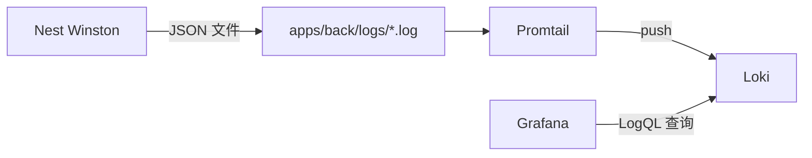

# 日志方案规划（Logging）

本文结合本仓库 `apps/back`（NestJS + winston）的现状，说明一个正式后端项目的日志体系应包含哪些能力，并给出可落地的分阶段开发计划书。

> 适用范围：应用运行日志（Application Log）。注意与本项目已有的「审计日志」`AuditModule` 区分，两者定位不同（见 §1.3）。

---

## 1. 正式项目的日志应该包含什么

### 1.1 日志分级（Log Level）

| 级别      | 用途                                                  | 生产是否输出     |
| --------- | ----------------------------------------------------- | ---------------- |
| `error`   | 影响功能的错误、异常、外部依赖失败                    | 是               |
| `warn`    | 可恢复的异常、降级、限流、重试、不合预期但不致命      | 是               |
| `info`    | 关键业务里程碑（启动、登录、下单、定时任务开始/结束） | 是               |
| `http`    | HTTP 访问日志（请求/响应）                            | 是（可单独控制） |
| `debug`   | 调试细节、变量快照、分支判断                          | 否（仅开发）     |
| `verbose` | 更细的链路追踪信息                                    | 否               |

要点：级别可通过环境变量动态配置；生产默认 `info`，开发默认 `debug`（本项目已实现）。

### 1.2 必备能力清单

1. **结构化输出（JSON）**：生产环境输出 JSON，便于被 ELK / Loki / Datadog 采集与检索。
2. **请求链路追踪（traceId / requestId）**：同一请求的所有日志带相同 ID，可串联排查。
3. **上下文信息**：时间戳、级别、模块（context）、服务名、环境、PID、主机名。
4. **HTTP 访问日志**：method、url、status、耗时、IP、UserAgent、userId（脱敏后）。
5. **错误日志完整性**：错误堆栈、错误类型、关联请求上下文。
6. **敏感信息脱敏**：password、token、authorization、cookie、身份证、手机号、银行卡等。
7. **日志切割与保留（rotation/retention）**：按天/大小切割，自动压缩与过期清理。
8. **多输出（transports）**：控制台（开发友好）、文件（错误/全量分离）、远程采集（生产）。
9. **未捕获异常兜底**：`uncaughtException`、`unhandledRejection` 落盘并告警。
10. **性能与异步写入**：日志不阻塞主流程，I/O 异步，避免高频日志拖垮性能。
11. **采样与限流**：高频重复日志可采样，避免日志风暴与磁盘打满。
12. **可观测性对接**：与 APM/告警（Sentry、Prometheus、钉钉/飞书告警）联动。
13. **统一调用规范**：禁止裸 `console.log`，统一走 LoggerService。

### 1.3 应用日志 vs 审计日志（重要区分）

| 维度     | 应用日志（本方案）   | 审计日志（已有 `AuditModule`）       |
| -------- | -------------------- | ------------------------------------ |
| 目的     | 排障、监控、可观测性 | 合规、追责、记录「谁对什么做了什么」 |
| 存储     | 文件 / 日志采集系统  | 数据库（可查询、长期保留）           |
| 内容     | 技术细节、堆栈、耗时 | 业务动作、操作人、资源、IP           |
| 读者     | 开发 / 运维          | 管理员 / 安全 / 审计                 |
| 可丢失性 | 可采样、可过期清理   | 不可丢失、需完整                     |

两者并存，不互相替代。本规划只增强「应用日志」，不改动审计模块。

---

## 2. 现状盘点（apps/back）

已具备：

- winston 封装：`logger/create-winston-logger.ts`、`logger/winston-nest-logger.service.ts`
- `LoggerModule.forRootAsync()` 全局注入，`main.ts` 已 `app.useLogger(...)`
- transports：Console（dev 着色）、`error.log`、`combined.log`
- 异常兜底：`exceptions.log` / `rejections.log`
- 按环境分级 + 环境变量覆盖（`LOG_LEVEL` / `LOG_FILE_ENABLED` / `LOG_DIR`）
- 已有 `nestjs-cls`（请求上下文，可复用做 traceId）

待补齐（缺口）：

| 缺口                                | 影响                               | 优先级 |
| ----------------------------------- | ---------------------------------- | ------ |
| 无 traceId/requestId                | 无法串联单次请求的多条日志         | 高     |
| 无 HTTP 访问日志                    | 无法统计接口耗时/错误率            | 高     |
| 无日志切割/保留                     | 日志文件无限增长，磁盘风险         | 高     |
| 无敏感信息脱敏                      | 合规与安全风险（密码/token 明文）  | 高     |
| `formatMessage` 用 `JSON.stringify` | 循环引用会抛错，日志本身成为故障点 | 中     |
| 异常过滤器未统一接入日志            | 错误日志格式不统一、上下文缺失     | 中     |
| 无远程采集出口规范                  | 生产排障依赖登录服务器看文件       | 低     |

---

## 3. 目标架构

```
请求进入
  └─ ClsMiddleware：生成/透传 traceId（复用现有 CLS）
       └─ LoggingInterceptor：记录 HTTP 访问日志（method/url/status/耗时）
            └─ Controller / Service：业务日志（自动带 traceId）
       └─ AllExceptionsFilter：统一错误日志 + 标准错误响应

winston Logger
  ├─ format：timestamp + traceId + 脱敏 + (dev: 着色 printf / prod: json)
  ├─ Console transport
  ├─ DailyRotateFile：app-%DATE%.log（全量，按天切割+压缩+保留）
  ├─ DailyRotateFile：error-%DATE%.log（仅 error）
  ├─ exceptionHandlers / rejectionHandlers
  └─ (生产可选) 远程 transport：Loki / ELK / Sentry
```

---

## 4. 分阶段开发计划

### 阶段一：基础健壮性与可用性（高优先级）

**目标**：日志可在生产长期稳定运行，能串联单次请求。

1. **引入日志切割**
   - 依赖：`pnpm --filter @full-stack-template-monorepo/back add winston-daily-rotate-file`
   - 改造 `createFileTransports`：用 `DailyRotateFile` 替换 `transports.File`
   - 新增配置项：`LOG_MAX_SIZE`（如 `20m`）、`LOG_MAX_FILES`（如 `14d`）、`LOG_ZIPPED_ARCHIVE`（默认 true）
   - 文件名：`app-%DATE%.log`、`error-%DATE%.log`

2. **traceId 链路追踪**
   - 复用 `nestjs-cls`：在 `ClsModule.setup` 中生成 `traceId`（优先取请求头 `x-request-id`，否则 `crypto.randomUUID()`）
   - 在 winston 自定义 format 中从 CLS 读取 traceId 注入每条日志
   - 在响应头回写 `x-request-id`，方便前端/网关关联

3. **`formatMessage` 健壮化**
   - 用安全序列化（处理循环引用，如 `safe-stable-stringify` 或自定义 replacer）
   - 对象类型保留为结构化 meta，而非强转字符串，利于 JSON 检索

**验收**：

- 日志按天切割、自动压缩、过期清理生效
- 同一请求的多条日志带相同 traceId，响应头含 `x-request-id`
- 传入循环引用对象不再导致日志崩溃

---

### 阶段二：HTTP 访问日志与统一异常日志（高优先级）

**目标**：接口可观测，错误日志统一且带完整上下文。

4. **HTTP 访问日志拦截器** `LoggingInterceptor`
   - 记录：method、url、statusCode、耗时(ms)、ip、userAgent、userId
   - 慢请求阈值告警（如 >1s 用 `warn`）
   - 全局注册（`APP_INTERCEPTOR`）

5. **统一异常过滤器** `AllExceptionsFilter`
   - 捕获所有异常，输出标准错误响应体 + 写 `error` 日志（含 traceId、堆栈、请求信息）
   - 区分预期异常（HttpException，记 `warn`/`info`）与非预期异常（记 `error`）
   - 全局注册（`APP_FILTER`）

**验收**：

- 每个请求产生一条访问日志，含状态码与耗时
- 抛出异常时错误日志含 traceId、堆栈、method/url，响应体格式统一

---

### 阶段三：安全与合规（高优先级）

**目标**：日志不泄露敏感信息。

6. **敏感字段脱敏**
   - 维护脱敏字段清单：`password`、`token`、`accessToken`、`refreshToken`、`authorization`、`cookie`、`phone`、`idCard`、`bankCard` 等
   - 在 winston format 层统一对 message/meta 做深度遍历脱敏（值替换为 `***`）
   - 可复用 `audit.service.ts` 中 `sanitizeAuditSnapshot` 的思路，抽成通用 `redact` 工具

**验收**：登录、改密、带 token 的请求日志中，敏感字段全部被掩码。

---

### 阶段四：生产可观测性增强（中/低优先级，可选）

7. **远程日志采集**
   - 方案 A：文件 → Filebeat/Promtail → ELK/Loki（推荐，应用零侵入）
   - 方案 B：winston transport 直推（如 `winston-loki`），需评估稳定性与背压

#### 7.1 本仓库落地计划：远程日志采集（本机 Loki 栈）

> 状态：已落地。代码与配置在 [`deploy/observability/`](../../deploy/observability/)，操作说明见同目录 [`README.md`](../../deploy/observability/README.md)。

##### 选定方案

- **架构**：方案 A（文件 → Promtail → Loki → Grafana）
- **部署**：本机 `docker-compose` 自托管
- **应用侧**：不改 Winston、不加 `winston-loki`；仅保证 `LOG_FILE_ENABLED=true` 且日志落到 `apps/back/logs/`



| 环节                      | 作用                                                                                                                |
| ------------------------- | ------------------------------------------------------------------------------------------------------------------- |
| **Nest Winston**          | 应用内日志库：按级别写结构化 JSON（含 `traceId`、脱敏），业务代码只关心「打日志」，不关心谁来采集                   |
| **apps/back/logs/\*.log** | 本地落盘缓冲：按日切割的 `app-*.log` / `error-*.log` 等；采集挂了也不影响 Nest 进程                                 |
| **Promtail**              | 采集 Agent：tail 日志文件、解析 JSON、打低基数标签（`job`/`level`/`service`），推送到 Loki；背压与重试由 Agent 承担 |
| **Loki**                  | 日志存储与索引：按标签索引（不全文索引），资源占用相对 ELK 更小，提供 LogQL 查询 API                                |
| **Grafana**               | 可视化与检索 UI：连接 Loki 数据源，在 Explore 中用 LogQL 查日志、按 `traceId` 串联请求                              |

为何不直推（方案 B）：`winston-loki` 会把网络 I/O / 背压带回业务进程；Agent 采集失败不影响应用，更贴近正式项目。

##### 目录与新增文件

在仓库根目录新增可观测栈（不污染 `apps/back`）：

```text
deploy/observability/
  docker-compose.yml
  loki/loki-config.yml
  promtail/promtail-config.yml
  grafana/provisioning/datasources/loki.yml
  README.md
```

| 文件                                        | 作用                                                                |
| ------------------------------------------- | ------------------------------------------------------------------- |
| `docker-compose.yml`                        | 编排 Loki(3100)、Promtail、Grafana(3000)                            |
| `loki/loki-config.yml`                      | 单节点 filesystem 存储、保留策略（约 14d，与 `LOG_MAX_FILES` 对齐） |
| `promtail/promtail-config.yml`              | 挂载并 tail `../../apps/back/logs`，JSON 解析，打标签后推 Loki      |
| `grafana/provisioning/datasources/loki.yml` | 预置 Loki 数据源，打开 Grafana 即可查                               |
| `README.md`                                 | 启动、验收、常用 LogQL                                              |

##### Promtail 采集要点

- 采集路径（容器内）：`/var/log/back/*.log`（compose 把宿主机 `apps/back/logs` 挂进去）
- 匹配：`app-*.log`、`error-*.log`（含 `exceptions` / `rejections`）
- pipeline：无需 `docker`/`cri`；用 `json` stage 解析已有字段（`level`、`service` 等）
- 静态标签：`job=back`、`app=full-stack-template`；从 JSON 提取 `level`、`service` 作标签（控制基数，**避免把 `traceId` 打成标签**）
- Loki 地址：`http://loki:3100/loki/api/v1/push`
- 现有文件日志已是 JSON（`create-winston-logger.ts` 的 `jsonFormat`），Promtail 可直接解析

##### 应用侧改动（极小）

- **代码**：无需改 Logger / Interceptor
- **环境**：`LOG_FILE_ENABLED=true`（采集前提）；`.env.example` 已注明远程采集依赖文件日志
- **文档**：本小节 + [`deploy/observability/README.md`](../../deploy/observability/README.md) + [`apps/back/README.md`](../../apps/back/README.md) 日志章节入口

##### 使用与验收

1. 启动后端并产生日志（访问任意 API）
2. 仓库根目录执行：

```bash
docker compose -f deploy/observability/docker-compose.yml up -d
```

3. 打开 Grafana http://localhost:3000（默认 `admin`/`admin`）
4. Explore → Loki，用 LogQL 验收：
   - `{job="back"}`
   - `{job="back"} |= "error"` 或 `| json | level="error"`
   - `{job="back"} | json | traceId="<某次请求的 x-request-id>"`

##### 约束与注意

- Windows + Docker Desktop：相对路径挂载 `apps/back/logs` 即可；后端在宿主机跑、Promtail 在容器读同一目录
- 未开文件日志时 Promtail 无数据属预期，不是 Loki 故障
- 本次只做日志聚合，不引入 ELK / Sentry（Sentry 仍按下方「错误告警」单独做）
- 不改业务代码路径，采集失败不影响 Nest 进程（正式项目 Agent 采集模型）

8. **错误告警**
   - 接入 Sentry（`@sentry/node`）捕获异常，或在 `AllExceptionsFilter` 中触发钉钉/飞书 webhook 告警

### 远程平台选型对比（免费可用性）

> 三者定位不同、互补而非三选一：Loki/ELK 做「日志聚合查询」，Sentry 做「错误监控/告警」。

| 平台              | 定位              | 开源自托管（免费）        | 官方云免费额度                  | 资源占用 | 个人/学习推荐 |
| ----------------- | ----------------- | ------------------------- | ------------------------------- | -------- | ------------- |
| **Grafana Loki**  | 日志聚合          | ✅ AGPLv3 完全免费        | ✅ Grafana Cloud：50GB/月、14天 | 低       | ⭐⭐⭐⭐⭐    |
| **ELK / Elastic** | 日志聚合+全文检索 | ✅ Basic 基础版免费       | ⚠️ 仅 14 天试用，后续收费       | 高       | ⭐⭐⭐        |
| **Sentry**        | 错误监控/APM      | ✅ self-hosted 免费（重） | ✅ Developer：5000 errors/月    | 中       | ⭐⭐⭐⭐⭐    |

选型建议（本项目体量）：

- **日志聚合用 Loki**：自托管资源占用小（只索引标签、不全文索引），或直接用 Grafana Cloud 免费版。
- **错误告警用 Sentry 云免费版**：接入 `@sentry/node` 即可，报错时拿到堆栈与上下文，体验最好。
- **ELK 暂不引入**：Elasticsearch 吃内存（起步 1~2GB+），运维与学习成本最高，待有大规模全文检索需求再上。
- 一句话：**Loki 管「看日志」，Sentry 管「报错警」，两者免费额度组合即够用；ELK 先放着。**

9. **日志采样/限流**：对高频重复日志做采样，防日志风暴。

10. **健康与指标**：结合 `@nestjs/terminus` / Prometheus 暴露指标（与日志互补）。

---

## 5. 配置项规划（环境变量）

| 变量                 | 说明                   | 默认（dev/prod） |
| -------------------- | ---------------------- | ---------------- |
| `LOG_LEVEL`          | 日志级别               | debug / info     |
| `LOG_FILE_ENABLED`   | 是否写文件             | false / true     |
| `LOG_DIR`            | 日志目录               | logs             |
| `LOG_MAX_SIZE`       | 单文件最大大小（切割） | 20m              |
| `LOG_MAX_FILES`      | 保留时长/数量          | 14d              |
| `LOG_ZIPPED_ARCHIVE` | 切割后压缩归档         | true             |
| `LOG_HTTP_ENABLED`   | 是否记录 HTTP 访问日志 | true             |
| `LOG_SLOW_MS`        | 慢请求阈值(ms)         | 1000             |

> 落地时同步更新 `.env.example` 与 `config/logger/`（`config.ts` / `config.type.ts` / `constants.ts`）。

---

## 6. 落地清单（按文件）

| 文件                                                          | 改动                                       |
| ------------------------------------------------------------- | ------------------------------------------ |
| `package.json`                                                | 新增 `winston-daily-rotate-file`           |
| `config/logger/constants.ts` / `config.ts` / `config.type.ts` | 新增切割/HTTP/慢请求配置项                 |
| `.env.example`                                                | 补充新增环境变量；注明远程采集依赖文件日志 |
| `logger/create-winston-logger.ts`                             | 切割 transport、traceId/脱敏 format        |
| `logger/winston-nest-logger.service.ts`                       | `formatMessage` 健壮化                     |
| `app.module.ts`（ClsModule.setup）                            | 生成/透传 traceId                          |
| `common/interceptors/logging.interceptor.ts`（新增）          | HTTP 访问日志                              |
| `common/filters/all-exceptions.filter.ts`（新增）             | 统一异常日志 + 响应                        |
| `common/logger/redact.ts`（新增）                             | 敏感信息脱敏工具                           |
| `deploy/observability/*`（新增，阶段四）                      | 本机 Loki + Promtail + Grafana 栈          |

---

## 7. 最佳实践与约束

- 禁止裸 `console.log`/`console.error`（审计模块现有 `console.error` 后续可统一收敛到 Logger）。
- 业务代码注入 Logger 时设置 `context`（模块名），便于过滤。
- 不要记录大对象全文（如完整请求体/大数组），按需截断。
- `error` 必须带堆栈；`info` 用于有业务价值的里程碑，避免刷屏。
- 日志是「可观测性」基础设施，改动需保证：不阻塞主流程、失败不影响业务、敏感数据不外泄。

---

## 8. 建议实施顺序

阶段一 → 阶段二 → 阶段三 为「正式项目」的最小完备集，建议优先全部完成；阶段四按部署环境与运维需求逐步引入。

远程日志采集（阶段四 §7.1，方案 A / 本机 Loki 栈）已落地，见上文；错误告警（Sentry）、采样限流、健康指标仍可按需继续。
